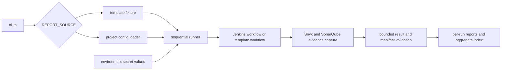
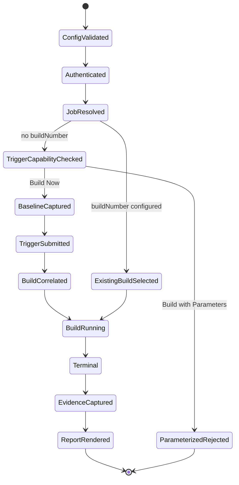

# Current architecture

This document describes the behavior implemented in `src/`, `scripts/`, and
the local fixture files. The [multi-project configuration](./multi-project-configuration.md)
document is the field-level schema guide; the [release gates](./release-gates.md)
document is the command-level validation guide.

## Scope and operating modes

The runner collects rendered Jenkins, Snyk, and SonarQube evidence and writes a
static, normalized vulnerability report. It does not run Snyk or SonarQube
scanners and does not use vendor APIs.

`src/cli.ts` selects the source:

| Mode | Selection | Configuration | Network behavior |
| --- | --- | --- | --- |
| templates | default, or `REPORT_SOURCE=templates` | synthetic document built from checked-in `templates/` | bounded Playwright routes at a synthetic origin; no Jenkins/vendor request |
| jenkins | `REPORT_SOURCE=jenkins` | schema-v1 file at `PROJECTS_CONFIG_PATH`, otherwise legacy env adapter | authorized Jenkins/vendor pages subject to origin policy |

`PROJECTS_CONFIG_PATH` is honored only on the Jenkins path. It is not read by
the default template path. A file-mode configuration cannot be combined with
legacy structural project inputs; the loader rejects that combination rather
than merging or silently choosing one.

The CLI runs one browser process for enabled projects. Projects execute in
configuration order, each in a fresh Playwright context, with one absolute
workflow deadline. A project failure is captured as an outcome so later
projects can continue. The process exits nonzero when any project fails.



## Components

- `src/cli.ts` validates `REPORT_SOURCE`, invokes the selected runner, and
  prints bounded outcome summaries.
- `src/config/` validates schema-v1 documents, adapts legacy variables, and
  resolves secret values only when a project runs. Page modules receive
  normalized config rather than reading environment variables.
- `src/runner.ts` enforces one browser, one report root, sequential execution,
  report-root locking, orphan cleanup, manifest discovery, and aggregate
  publication.
- `src/project/` owns per-project workflow state, deadlines, capture
  orchestration, outcome state, and sanitized failure handling.
- `src/jenkins/` authenticates, resolves one exact job, selects an existing
  build or correlates one UI Build Now submission, and waits for terminal state.
- `src/reports/snyk/` and `src/reports/sonarqube/` classify allowed links,
  navigate only validated origins, capture bounded visible evidence, and
  normalize source-specific results.
- `src/artifacts/` creates immutable run paths, writes validated files, manages
  staging leases and aggregate recovery, and performs bounded orphan cleanup.
- `src/reporting/` renders static HTML/CSS and serves only files below a
  canonical report root.
- `templates/` is a checked-in synthetic input corpus. `docker/jenkins/` is a
  disposable Jenkins publisher fixture, not a production controller.

## Configuration boundary

### Schema-v1 file mode

The root object has `schemaVersion: 1`, `projects`, and optional `defaults`.
There must be one to 50 projects and at least one enabled entry. Each project
requires a unique ID matching lowercase safe path characters, a display name,
an HTTP(S) Jenkins `baseUrl` (or compatibility `jenkinsUrl`), and a relative
`jobPath`.

Optional settings include:

- `enabled`, `buildNumber`, `loginPath`, `triggerMode`, `timeoutMs`, and
  `pollIntervalMs`;
- `browser`, `artifactDir`, typed selector overrides, and shared or per-source
  allowed origins;
- `credentials` or `credentialVariables`, both of which contain variable
  names only; and
- `snyk`/`sonarqube` `reportPath`, `homeUrl`, `projectId`, and
  source-specific allowed origins.

The default values are `loginPath=/login`, `triggerMode=ui`, timeout 300000 ms,
poll interval 1000 ms, Chromium, and report root `reports/`. All enabled
projects must use the same browser and global report root in V1.

`PROJECTS_CONFIG_PATH` must name a regular JSON file no larger than 1 MiB.
The loader parses and validates it before browser launch. Unknown keys,
invalid IDs, duplicate IDs, missing enabled projects, unsafe selectors, invalid
origins, credential values, unsafe paths, and out-of-range numeric settings
are rejected.

### Secret resolution

The document retains only names such as:

```json
{
  "credentials": {
    "usernameVariable": "JENKINS_USERNAME",
    "passwordVariable": "JENKINS_PASSWORD"
  }
}
```

At run time, the corresponding environment values are required for enabled
projects. Values are not copied into normalized configuration, diagnostics,
URLs, screenshots, traces, storage state, or reports. The JSON must never
contain passwords, tokens, cookies, or credential-bearing URLs.

### Legacy adapter

When `PROJECTS_CONFIG_PATH` is absent, Jenkins mode adapts the legacy single
project variables into one schema-v1 project and emits a deprecation
diagnostic. The required legacy values are `JENKINS_BASE_URL`,
`JENKINS_USERNAME`, `JENKINS_PASSWORD`, and `JENKINS_JOB_PATH`. Optional values
include `JENKINS_BUILD_NUMBER`, login/trigger/time settings, browser, artifact
root, selectors, source origins, and archived vendor project IDs.

No `JENKINS_BUILD_NUMBER` means the workflow may submit one UI `Build Now` on a
non-parameterized job. A positive build number selects an existing build and
performs zero trigger actions. Parameterized jobs are detected before
interaction and rejected in V1.

## Per-project workflow



The Jenkins flow authenticates, resolves one exact Pipeline job, then either
opens the configured build or captures a pre-submit baseline and correlates a
new same-origin queue/executable build. Queue/build identities and redirects
are revalidated against the configured job and origin. It never clicks a
parameterized build control.

One `WorkflowDeadline` covers login, job resolution, trigger/correlation,
terminal polling, artifact settlement, and source capture. Nested operations
consume remaining time and do not reset the project timeout. The template
workflow follows the same result boundary while binding a synthetic build
identity marked `TEMPLATE`; that identity is fixture provenance, not Jenkins
execution evidence.

## Evidence capture

Capture starts after an exact terminal build is validated. The terminal Jenkins
page is the discovery boundary unless a configured source destination is
allowed by the project policy.

### Snyk

The adapter selects a configured report or an unambiguous Snyk-shaped report
and summary. It rejects ambiguous, cross-origin, and unsafe artifact links.
Capture is script-safe: JavaScript is disabled where possible, active content
and unrelated request types are blocked, redirects are bounded, and summary
JSON is capped. Only visible report evidence is extracted.

The summary must provide bounded non-negative severity counts. Visible findings
are normalized, deduplicated, ordered, and capped at 500 retained findings.
Summary-only evidence keeps counts with an empty detail list; it never invents
findings. Mismatched counts, parse problems, screenshot failures, missing
evidence, and disallowed links remain warnings or `incomplete` source state.

### SonarQube

The adapter validates project identity and follows the visible sequence:

1. Home/dashboard with one exact non-empty `id` query value;
2. Overall with the same project ID and `codeScope=overall`; and
3. Issues with the same project ID on an `/issues` target.

Overall contributes screenshot/provenance evidence only; its metrics are not
normalized. Issues extraction is limited to Type and Severity facets. Each
facet has bounded entries and counts. One valid facet is retained when the
other is unavailable, but the source remains incomplete. Missing, duplicate,
or malformed project IDs fail closed rather than being replaced with an
expected value.

Both adapters revalidate navigation targets, redirects, and final URLs. Live
URLs must be HTTP(S), credential-free, and inside the Jenkins base context or
an explicitly configured origin. No raw vendor HTML or CSS is copied into the
generated report.

## Result and report contracts

Per-project application results and manifests use schema version 2. The
navigation object has exactly these five keys:
`jenkins-build`, `snyk-report`, `sonarqube-home`, `sonarqube-overall`, and
`sonarqube-issues`. Each target has a local anchor and `found`, `not_found`,
or `incomplete` state; a live URL is included only after policy validation.

Project source states are `found`, `not_found`, or `incomplete`. A project is
`success` only when both configured source captures are found with no warnings;
otherwise a completed workflow is `partial`. A workflow or persistence failure
is `failed`. The aggregate is also schema-v2 data and records current outcomes,
validated historical manifests, ignored unconfigured projects, and warnings.

The static project report escapes all values, validates link schemes, and uses
safe external-link attributes. Its resource policy is restrictive and the HTTP
server adds the CSP response header, including `frame-ancestors 'none'`.

## Artifact lifecycle

`ArtifactPaths` resolves a canonical report root and a non-overlapping staging
root. The default staging root is a sibling `artifacts/` directory. A normal
run is staged, validated, and published into:

```text
reports/
├── index.html
├── aggregate-data.json
├── assets/report.css
└── <project-id>/<build-number>/<run-id>/
    ├── index.html
    ├── data.json
    ├── manifest.json
    └── requested screenshots
```

Project, build, and run IDs are validated before becoming path segments. Run
directories are not reused. Complete publication writes a temporary sibling
and atomically installs the complete directory, retaining rollback safeguards.
The aggregate uses a bounded journal/two-file publication so an interrupted
swap can be recovered.

If a project fails before Jenkins returns a build identity, the runner moves
its bounded failure output to `reports/<project-id>/pre-build/<run-id>/`.
That manifest has no Jenkins identity and normally no build-linked
`index.html`. Failure artifact persistence is best-effort: the runner attempts
to write sanitized failure data, manifest, diagnostics, and available
artifacts, but a write/render/publish failure may leave an incomplete or absent
run directory. The aggregate still reports the project outcome when it can.

The application allowlist covers `data.json`, `manifest.json`, generated
`index.html`, requested screenshots, and an optional `trace.zip` only when a
manifest actually supplies that reference. Playwright test traces are a
separate test-runner concern and are written under `test-results/` according to
the Playwright config; they are not evidence that a report run produced a
vendor trace. In particular, a pre-build failure must not be documented as
having an `index.html` or trace merely because later successful runs have one.

## Locking and cleanup

The private `.report-root-lock` lease covers initialization follow-on work,
browser execution/close, discovery, cleanup, and aggregate publication. Its
owner record contains a random token, PID, hostname, acquisition timestamp,
and expiry. It does not contain a UID. Historical “same-host/same-UID” wording
must therefore be qualified as same-host coordination, not UID isolation or
authorization.

Stale recovery requires an expired same-host owner whose PID is demonstrably
dead. Incomplete claims have the same bounded same-host/dead-PID checks.
Foreign-host, malformed, live-owner, and symlinked locks fail closed. This is
not a distributed lock, and distributed filesystems or uncoordinated
foreign-host writers are outside V1.

Startup and post-run cleanup inspect only the exact configured report/staging
roots. It enforces age, lease, entry, byte, and removal budgets; refuses
symlink traversal; and recognizes only safe project/run/build and temporary
names. Active, malformed, oversized, symlinked, foreign, out-of-root, and
ambiguous candidates are preserved with bounded warnings.

Caller-managed root permissions are an operational compatibility choice, not
an authorization boundary. A same-host process that can modify the root can
race publication. Sensitive deployments need a trusted, isolated report root.

## Report server

`src/reporting/report-server-cli.ts` defaults to root `reports`, host
`127.0.0.1`, port `4173`, and LAN disabled. `REPORT_ROOT` takes precedence over
`ARTIFACT_DIR`; flags override environment values:

```text
--root <dir>       REPORT_ROOT (or ARTIFACT_DIR)
--host <host>      REPORT_HOST
--port <port>      REPORT_PORT
--allow-lan        REPORT_ALLOW_LAN=1
```

The server requires a canonical root containing the generated aggregate
`index.html`. A non-loopback host requires explicit `--allow-lan` or
`REPORT_ALLOW_LAN=1`; `0.0.0.0` binds all IPv4 interfaces. It is read-only,
unauthenticated, limited to GET/HEAD, rejects traversal/dot-prefixed internal
paths and symlinks, and sends CSP and no-sniff headers. It does not list
directories. There is no authentication layer.

`npm run serve:report` first builds the launcher and then starts this server;
it does not generate a report. Run `npm run report` first and serve the same
root.

## Disposable Jenkins fixture

`docker-compose.yml` builds the pinned local Jenkins image and maps:

```text
127.0.0.1:${JENKINS_PORT:-8080}  ->  container port 8080
```

`JENKINS_PORT` changes only the host port. The controller is loopback-bound.
`docker-compose.webkit.yml` is a separate pinned Playwright browser service and
publishes no ports.

JCasC/Job DSL seeds:

- `playwright-vulnerability-report`, a parameterized control with
  `FIXTURE_VARIANT` values `pass`, `failed`, `empty`, and `malformed`; and
- `playwright-vulnerability-report-build-now`, a non-parameterized job for the
  supported Build Now path.

The parameterized variants use the same compact publisher corpus. `failed`
archives reports before failing, `empty` removes publisher directories, and
`malformed` substitutes malformed publisher files. The Build Now job has no
variant selector and uses the normal corpus. Neither job runs real scanners or
contacts a vendor service. `docker compose down` stops the controller while
retaining `jenkins_home`; `docker compose down -v` intentionally discards its
history and resets the fixture.

## Test and release boundary

The deterministic release order is dependency installation/browser
provisioning, type-check, production build, unit tests, then generated-report
browser tests. The Compose-backed WebKit gate runs the same release sequence in
the pinned Ubuntu image after its own `npm ci --ignore-scripts` step; its
container already supplies the requested browser.

Historical docs recorded different unit-test snapshots (including 121, 143,
152, 157, and 160) as the code changed. Those numbers are not current release
evidence and are intentionally not repeated as present facts. Run the commands
in [release-gates.md](./release-gates.md) to obtain current counts. The present
documentation update does not claim a live Jenkins or browser execution.
