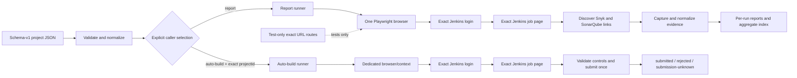

# Current architecture

This document describes the implemented schema-v1 configuration, report and
target-branch Jenkins auto-build workflows, the local SecretStore backend, the
loopback control secrets API, and the Phase 04 credential-management UI.
Phase 03 adds per-run SecretStore environment injection and redaction to
control runs. Phase 04 adds a CSRF-aware modal that discovers referenced
variable names, displays presence only, persists replacements, and wipes
password inputs. Phase 3 adds an offline build-page fixture and exact routes
so the auto-build path can be exercised without live side effects. Phase 01
adds validated local persistence; Phase 02 exposes guarded presence-only
`GET`, `PUT`, and `DELETE /api/secrets` operations. The report command remains
report-only; auto-build is an explicit library boundary and is not inferred
from URLs, selectors, CLI names, or environment.

The runner collects bounded Jenkins, Snyk, and SonarQube evidence and writes a
static normalized vulnerability report. Runtime navigation uses the exact URLs
in the project configuration. Tests may fulfill those exact URLs with
test-only Playwright routes; unmatched network requests are blocked.

See [system architecture](./system-architecture.md) for the component view,
[multi-project configuration](./multi-project-configuration.md) for the
field-level contract, and [release gates](./release-gates.md) for commands and
validation boundaries.

## Scope and operating modes

Production and tests use the same schema-v1 configuration shape:

| Source mode | Configuration | Page behavior |
| --- | --- | --- |
| runtime | schema-v1 project JSON passed with `--config` | real HTTP(S) navigation |
| test | schema-v1 test project JSON plus checked-in `templates/` | exact configured/discovered URLs fulfilled by test-only routes |

Project execution mode is independent of source mode:

| Execution mode | Selection boundary | Side effect |
| --- | --- | --- |
| `report` | all enabled projects normalized as `report` | capture publisher evidence and publish immutable reports |
| `auto-build` | one exact enabled project normalized as `auto-build` | submit one validated parameterized Jenkins form; do not capture reports |

`runType` is an explicit project-only discriminator. An omitted value
normalizes to `report`; it is never inferred and does not itself trigger a
build. The report CLI selects report projects only. A caller that intentionally
selects an auto-build project must invoke the separate auto-build runner.

The project JSON supplies exact Jenkins `loginUrl` and `jobUrl`, a project
`runType`, credential environment-variable names, selectors, source-origin
policy, browser, timeout, and artifact root. The job page is the
report-discovery boundary. Snyk report and summary links and the SonarQube home
link are discovered from that page; SonarQube Overall and Issues links are
followed from the validated home page.

The report CLI runs one browser process for selected report projects. Projects
execute in configuration order, each in a fresh Playwright context, with one
absolute capture deadline. A project failure is captured as an outcome so later
projects can continue. The auto-build runner owns its own one-project browser
and context.



## Components

- `src/cli.ts` requires one schema-v1 project JSON and invokes the report
  runner. It has no auto-build command or template/runtime source switch.
- `src/config/` validates schema keys, exact HTTP(S) URLs, project-only
  `runType`, credential references, source origins, selectors, and bounded
  runtime settings. Normalization defaults an omitted `runType` to `report`.
- `src/config/project-run-selection.ts` owns the explicit
  `selectReportProjects` and `selectAutoBuildProject` boundaries. Selection is
  pure and has no browser or Jenkins side effect.
- `src/config-selectors.ts` owns selector parsing and immutable defaults,
  including the build link and submit-button selectors.
- `src/config.ts` exposes the loader, normalized contracts, `RunType`, and
  selection helpers from the public configuration surface.
- `src/browser-launcher.ts` centralizes browser choice and environment-driven
  launch options (`PLAYWRIGHT_EXECUTABLE_PATH`, headless flags, and action
  delay) shared by report and auto-build callers.
- `src/runner.ts` enforces one browser for sequential report projects, one
  report root, report-root locking, cleanup, manifest discovery, and aggregate
  publication. `runFromConfig` filters out auto-build projects.
- `src/project/project-workflow.ts` contains the direct report workflow and
  the separate login/job/trigger auto-build workflow.
- `src/project/auto-build-runner.ts` owns one-project auto-build execution,
  fresh context/page creation, absolute deadline handling, redacted outcomes,
  and bounded resource cleanup. It does not allocate report artifacts.
- `src/jenkins/auth.ts` authenticates and opens the exact configured job page.
  `src/jenkins/url-identity.ts` validates exact job and `/build` action
  identities, including nested and repeatedly encoded `job/` segments.
- `src/jenkins/locators.ts` maps configured selectors to Playwright locators
  and reads candidate hrefs without trusting them. `build-trigger-validation.ts`
  enforces structural containers, control counts, class tokens, form method,
  and exact action URL. `build-trigger.ts` performs one guarded submission.
- `src/reports/snyk/` and `src/reports/sonarqube/` validate allowed links,
  handle SonarQube login redirects when required, capture bounded visible
  evidence, and normalize source-specific results.
- `src/artifacts/` creates immutable report paths, writes validated files,
  manages staging leases and aggregate recovery, and performs bounded cleanup.
- `src/reporting/` renders static HTML/CSS and serves only files below a
  canonical report root.
- `src/reporting/report-server-control.ts` validates the Host header for every
  control request, dispatches API paths, and carries the optional
  `ControlRouterContext.secretStore` dependency.
- `src/reporting/control-page/control-page.html`, `.css`, and `.js` implement
  the Credentials dialog, dynamic presence state, guarded save/clear actions,
  and input cleanup without rendering secret values.
- `src/reporting/report-server-control-api.ts` remains the config/run handler
  facade and re-exports `handleSecretsApi`; the implementation lives in
  `report-server-control-secrets-api.ts`.
- `src/reporting/report-server-control-secrets-api.ts` implements the
  presence-only `/api/secrets` GET/PUT/DELETE contract, bounded JSON parsing,
  key/value validation, and SecretStore updates.
- `src/reporting/report-server-control-security.ts` centralizes control
  security headers plus Host, Origin, Fetch Metadata, timing-safe CSRF, and
  mutation content-type gates.
- `src/reporting/report-server-run-manager.ts` owns the single-active-run
  lifecycle and carries the optional `SecretStore` dependency into execution.
- `src/reporting/report-server-run-executor.ts` snapshots stored secrets,
  builds the per-run environment, dispatches report/auto-build executors, and
  redacts control-run logs and result diagnostics.
- `src/templates/template-report-fixture.ts` is the public template facade; it
  re-exports the supported loader, response, route, types, and size-boundary API.
- `src/templates/template-fixture-types.ts` defines the fixture, response, route
  miss/recorder, file-identity, read-budget, artifact-link, and Sonar route contracts.
- `src/templates/template-fixture-file-io.ts` resolves a canonical template root
  and performs descriptor/no-follow, identity, symlink, and byte-budgeted reads.
- `src/templates/template-fixture-html.ts` owns bounded HTML parsing, URL checks,
  canonical/form/link rewrites, artifact selection, and exact fixture matching.
- `src/templates/template-fixture-sonarqube.ts` validates SonarQube identities
  and rewrites dashboard/issues links for the synthetic fixture origin.
- `src/templates/template-fixture-build-validation.ts` derives the build link
  from `#side-panel` and validates build canonical, form, sticker, and button controls.
- `src/templates/template-fixture-loader.ts` reads and validates the nine saved
  inputs, derives build/report/Sonar destinations, and assembles the fixture.
- `src/templates/template-fixture-routes.ts` fulfills exact fixture URLs and
  records sanitized default-deny route misses.
- `templates/jenkins-template/template-build.html` is the minimal saved-origin
  build-detail page used for canonical/action and DOM-contract validation.
- `templates/` is the checked-in browser fixture corpus. Test-only routes map
  exact URLs from saved pages to those files and abort unmatched network.

## Configuration boundary

### Schema-v1 file mode

The root object has `schemaVersion: 1`, `projects`, and optional `defaults`.
There must be one to 50 projects and at least one enabled entry. Each project
requires a unique safe ID, display name, exact Jenkins `loginUrl`, and exact
Jenkins `jobUrl`; it may also set project-only `runType`.
Login and job URLs must share one canonical Jenkins origin and base context.

The runtime command receives the JSON path explicitly:

```text
npm run report -- --config config/<projects>.json
```

The file is validated before browser launch. Unknown keys, duplicate IDs,
missing enabled projects, unsafe selectors, invalid or credential-bearing URLs,
unsafe paths, embedded secret values, and out-of-range settings are rejected.
Legacy structural keys such as `baseUrl`, `jobPath`, `captureFrom`, and
`buildNumber`, plus structural environment inputs such as `REPORT_SOURCE`,
`PROJECTS_CONFIG_PATH`, and legacy `JENKINS_*` project settings, are rejected.

### Run mode and selector contract

`runType` accepts exactly `'report'` or `'auto-build'`. Missing input is
normalized to `'report'`, preserving existing schema-v1 documents as report
projects. `runType` is deliberately absent from `ProjectConfigDefaults`, so
`defaults.runType` is rejected as an unknown key. No environment setting is
read for mode selection; do not use environment configuration to mass-enable
auto-build.

Selection happens on normalized projects:

| Helper | Contract |
| --- | --- |
| `selectReportProjects(projects)` | Returns a frozen list containing only enabled projects with `runType === 'report'`; disabled and auto-build entries never enter the report set. It fails when no enabled report project exists. |
| `selectAutoBuildProject(projects, projectId)` | Requires an exact, non-empty project ID and returns one project only when it is enabled and `runType === 'auto-build'`; missing, disabled, and report projects fail closed. |

The helpers are exported by `src/config.ts`. They do not rewrite modes,
derive branch identity, or submit a Jenkins request. `runFromConfig` passes
only `selectReportProjects(...)` to the report executor. The explicit
`runAutoBuildProject(...)` boundary accepts one selected project and is the
only Phase 2 path that reaches the Jenkins build trigger.

All selector fields are available under `defaults.selectors` and
`projects[*].selectors`; project values override defaults. The normalized
defaults are:

| Selector | Kind | Value | Name | Required |
| --- | --- | --- | --- | --- |
| `authLandmark` | `role` | `link` | `Manage Jenkins` | `true` |
| `sonarqubeReport` | `testId` | `sonarqube-report` | — | `true` |
| `snykReport` | `testId` | `snyk-report` | — | `true` |
| `buildParametersLink` | `role` | `link` | `Build with Parameters` | `true` |
| `buildSubmitButton` | `role` | `button` | `Build` | `true` |

`buildParametersLink` and `buildSubmitButton` must remain required. Omitting
`required` defaults it to `true`; an explicit `required: false` override is
rejected for either field. Their Jenkins search scopes (`#side-panel` and
`#bottom-sticker`, respectively) remain runtime code rather than configurable
CSS. Selector values do not change the configured `jobUrl` or branch identity.

### Credential and control-plane implementation map

| Path | Responsibility |
| --- | --- |
| `src/types.ts` | Defines `RunType` and the complete selector shape. |
| `src/config/*` | Validates, normalizes, and selects project run contracts; environment helpers keep mode out of legacy configuration. |
| `src/config-selectors.ts` | Defines selector kinds, parsing, and build-control defaults. |
| `src/config.ts` | Re-exports config types, loader, and selection helpers. |
| `src/jenkins/runner-config.ts` | Carries required build selectors into Jenkins runner configuration. |
| `config/projects.example.json` | Shows explicit enabled report and disabled auto-build project entries. |
| `src/reporting/report-server-constants.ts` | Defines the fixed secret filename and 1 MiB secret-file/body boundaries. |
| `src/reporting/report-server-secret-store.ts` | Canonical, atomic, locked local secret persistence and validated read/list/update/delete operations. |
| `src/reporting/report-server-control-security.ts` | Applies control security headers and Host/Origin/Fetch Metadata/CSRF/content-type gates. |
| `src/reporting/report-server-control-secrets-api.ts` | Implements the modular presence-only secrets API handler. |
| `src/reporting/report-server-control-api.ts` | Owns config/run handlers and re-exports the secrets handler as the API facade. |
| `src/reporting/report-server-control.ts` | Validates Host, routes `/api/secrets`, and carries the optional `SecretStore` context dependency. |
| `src/reporting/report-server.ts` | Creates the `SecretStore` in loopback control mode and exposes it on `ReportServerHandle`. |
| `src/reporting/report-server-run-manager.ts` | Owns the single-active-run lifecycle and carries the optional `SecretStore` dependency. |
| `src/reporting/report-server-run-executor.ts` | Reads one SecretStore snapshot, merges the run environment, dispatches the selected executor, and redacts control-run output. |
| `tests/unit/report-server-secret-store.spec.ts` | Exercises persistence and control-server wiring. |
| `tests/unit/control-secrets-api.spec.ts` | Exercises endpoint presence, patch/delete semantics, filtering, and persistence. |
| `tests/unit/control-secrets-security.spec.ts` | Exercises redaction, validation, method/content-type handling, and security gates. |

### Secret resolution

The JSON retains only names such as:

```json
{
  "credentials": {
    "usernameVariable": "JENKINS_USERNAME",
    "passwordVariable": "JENKINS_PASSWORD"
  }
}
```

At run time, the corresponding environment values are required for each
enabled project. Values are not copied into normalized configuration,
diagnostics, URLs, screenshots, traces, storage state, or reports. The JSON
must never contain passwords, tokens, cookies, or credential-bearing URLs.

Phase 01 adds a separate local `SecretStore` backend for control-plane
credential persistence. `createSecretStore(configRoot)` canonicalizes an
existing, non-symlinked directory and fixes the target to
`config/secrets.local.json`; callers cannot choose a filename or path. A
missing or empty file reads as an empty map. Existing content must be a JSON
object no larger than `MAX_SECRET_FILE_BYTES` (1 MiB), with keys matching
`/^[A-Za-z_][A-Za-z0-9_]{0,127}$/`, excluding `__proto__`, `prototype`, and
`constructor`, and string values.

`readSecrets()` and `listSecretNames()` return frozen snapshots. Mutations use
`putSecret`, `putSecrets`, `deleteSecret`, or `deleteSecrets`; each validates
names and values, reads the latest map under an in-memory write lock, sorts
keys, and serializes deterministic JSON. Writes create an exclusive sibling
temporary file with mode `0o600`, write and sync it, close it, then rename it
over the fixed target. A failed rename removes the temporary file and leaves
the previous target in place. Windows does not enforce POSIX mode bits as an
ACL boundary, so directory ACLs remain the protection boundary there.

Control mode initializes one store alongside `ConfigStore` and exposes it on
the server handle and router context. Phase 02 routes `/api/secrets` through
the dedicated handler described below.

### Control-run environment injection (Phase 03)

`executeControlRun` reads one `SecretStore` snapshot at execution start and
creates a new environment object with `{ ...env, ...storedSecrets }`. Stored
values therefore take precedence over the caller-supplied environment, while
neither the caller object nor `process.env` is mutated. The merged object is
used for config normalization and passed as `runtimeEnvironment` to either
the report executor or the auto-build executor. Direct CLI/library callers
without a control run continue to resolve credentials from their supplied
environment.

All non-empty values from the snapshot form the control-run redaction set.
`addLog` messages, report warnings, caught error messages/stacks, and
auto-build `jobUrl`/`buildPageUrl` result fields are redacted before they are
stored in the control run record. The local report URL is generated only from
the validated report-relative path. Downstream auto-build execution also
clears its mutable resolved credential copy during cleanup.

### Control secrets API contract

`handleControlRequest` rejects an invalid Host before dispatching an API route.
`handleSecretsApi` returns a presence map and never serializes secret values:

| Request | Input and gates | Result |
| --- | --- | --- |
| `GET /api/secrets` | Exact bound Host; optional `keys=NAME_A,NAME_B` filter | `200 { "secrets": { "NAME_A": true } }` for stored names |
| `PUT /api/secrets` | Host, same-origin Origin, accepted Fetch Metadata, CSRF token, JSON content type, and ≤1 MiB JSON object | `200` full post-update presence map |
| `DELETE /api/secrets?name=NAME` | Same mutation gates and valid query name | `200` full post-delete presence map |
| `DELETE /api/secrets` | Same gates and `{ "name": "NAME" }` or `{ "names": ["NAME"] }` JSON body | `200` full post-delete presence map |

PUT accepts a single `{ "name": "NAME", "value": "VALUE" }` object or a
non-empty `{ "secrets": { "NAME": "VALUE" } }` patch. A null patch value or
`action: "delete"` removes a key. Filtered GET responses include each valid
requested key with `true` or `false`; unfiltered responses include sorted
stored names with `true`. Invalid keys/values/bodies return `400`; invalid
mutation security returns `403`; wrong content type returns `415`; an absent
store returns `503`; unsupported methods return `405` with `Allow`. Every API
response uses `Cache-Control: no-store`.

### Test configuration

Tests load the same schema-v1 shape with non-routable fixture URLs. The
test-only router reads nine checked-in files below `templates/`, derives the
build detail URL from the unique saved Jenkins link, derives Snyk and SonarQube
destinations from saved canonical pages, and fulfills only exact synthetic URLs.
Fixture paths are canonical, traversal- and symlink-safe, size-bounded, and
never read from runtime project JSON.

## Phase 3 template fixture and route contract

`loadTemplateReportFixture(env, origin?)` resolves the checked-in template root
(or the optional `TEMPLATES_DIR` override), reads nine bounded files, and fails
before browser startup when a saved identity or DOM contract drifts. The
per-file limit is 4 MiB and the cumulative fixture limit remains 16 MiB.

Build identity is derived, never hand-constructed:

1. `extractSidePanelBuildLink` requires exactly one `Build with Parameters`
   anchor in the saved Jenkins `#side-panel`, then validates its approved
   origin, same-job `/build` path, and optional `delay=0sec` query.
2. `validateBuildTemplate` requires one canonical URL matching that discovered
   build page, one `POST` form with the same exact `/build` action, one
   `#bottom-sticker`, and one `Build` submit button with all required Jenkins
   class tokens.
3. The loader rewrites only the selected job anchor and validated build form
   action to the synthetic fixture origin; unrelated saved links remain untouched.

The route sequence is:

```text
GET loginUrl -> POST loginActionUrl -> GET jobUrl -> GET buildPageUrl
-> POST buildActionUrl -> 303 Location: jobUrl -> GET jobUrl
```

`templateResponse` matches all nine fixture URLs exactly, including query and
fragment identity. `installTemplateReportRoutes` permits only `GET`/`HEAD` for
those responses plus the exact Jenkins login actions, the same-origin
SonarQube `/sessions/new` authentication path, and exact build-action `POST`.
The build `POST` returns `303` with only the exact job URL; form data is neither
read nor reflected. Every other method or URL aborts, and the recorder retains
at most 32 sanitized method/origin/path misses. Report mode never follows the
build anchor, so its request sequence remains report-only.

The focused unit and E2E contracts are
`tests/unit/template-build-fixture.spec.ts` and
`tests/e2e/template-auto-build.spec.ts`; they prove fixture drift rejection,
exact build redirect, one build `POST`, and no Snyk/SonarQube capture in
auto-build mode.

## Per-project workflow

### Report workflow

The report path submits credentials only to the configured Jenkins login
destination, validates the final authenticated page, opens the exact
configured job page, discovers publisher links once, and captures evidence
from those destinations. It never searches for another job, opens a build
page, submits a form, inspects queues or build identities, polls terminal
status, or accepts a build-number override.

### Auto-build workflow

The auto-build path reuses the same credential resolution, login validation,
exact job navigation, and one absolute `WorkflowDeadline`, then:

1. requires exactly one visible `#side-panel`;
2. resolves the configured **Build with Parameters** locator within that
   container and validates its href as the exact configured job `/build` action;
3. navigates to that validated detail page;
4. requires exactly one visible `#bottom-sticker`, one visible configured
   **Build** button, all three Jenkins class tokens
   (`jenkins-button`, `jenkins-button--primary`, and
   `jenkins-!-build-color`), and exactly one ancestor form;
5. requires form method `POST` and validates the resolved action as the same
   exact job `/build` action;
6. arms request/response observers, clicks once, and returns only the
   configured job URL, validated build-page URL, timestamp, state, and
   optional response status.

The trigger never reads or returns form bodies, parameters, crumb values,
headers, cookies, or response bodies. After a matching POST is observed, a
missing/indeterminate response is `submission-unknown`; it is not retried.
An HTTP response below 400 is `submitted`, while a response at or above 400 is
`rejected`. Failures before a matching POST surface as sanitized
`JenkinsFlowError` values and become `failed-before-submit` at the runner
boundary. Auto-build does not invoke source capture or report persistence.

Every configured, discovered, redirected, and final URL in either path must be
credential-free HTTP(S) and inside its allowed canonical origin. A single
absolute deadline covers the workflow; context/browser cleanup is bounded and
best-effort.

## Evidence capture and result contract

After authentication, capture starts from the exact configured Jenkins job
page. Every configured, discovered, redirected, and final URL must be
credential-free HTTP(S) and inside its allowed canonical origin.

The Snyk adapter selects one exact report link and one unambiguous summary JSON
link from the validated Jenkins job page. The SonarQube adapter follows one
validated dashboard sequence: Home (authenticating through the SonarQube login
page using the project's configured Jenkins credentials if redirected),
Overall with `codeScope=overall`, then Issues for the same project identity.
Tests fulfill these exact browser URLs from the checked-in template files;
runtime opens them normally.

Visible findings are normalized, deduplicated, ordered, and capped. Missing or
malformed evidence, mismatched counts, disallowed links, and screenshot
failures remain warnings or incomplete source state; they are never fabricated
as success. Overall contributes provenance evidence, while Issues extraction is
limited to bounded Type and Severity facets.

The result and manifest record the validated Jenkins job page, capture
timestamp, source navigation, normalized evidence, warnings, and artifacts.
They do not fabricate trigger, queue, build-number override, or terminal
evidence. A project is `success` only when both configured source captures are
found with no warnings; a completed workflow with incomplete evidence is
`partial`; workflow or persistence failure is `failed`.

## Artifact lifecycle

Every project attempt receives an immutable run ID and is staged, validated,
and published under the configured report root:

```text
reports/
├── index.html
├── aggregate-data.json
├── assets/report.css
└── <project-id>/<run-id>/
    ├── index.html
    ├── data.json
    ├── manifest.json
    └── requested screenshots
```

Project and run IDs are validated before becoming path segments. Failure
artifacts use the same project/run identity without fabricating a Jenkins build
folder or status. Persistence is best-effort; the aggregate still records the
outcome when possible. Playwright test traces under `test-results/` are test
evidence, not vendor report evidence.

## Locking, cleanup, and server modes

The private report-root lease coordinates same-host work using token, PID,
hostname, acquisition timestamp, and expiry. It is not a distributed lock or
an authorization boundary. Stale recovery requires an expired same-host owner
whose PID is demonstrably dead; malformed, live-owner, foreign-host, and
symlinked locks fail closed.

Cleanup inspects only configured canonical report/staging roots, enforces
bounded age/entry/byte/removal budgets, refuses symlink traversal, and
preserves active, malformed, oversized, or ambiguous entries with warnings.

### Report Server (`npm run serve:report`)

`npm run serve:report` builds the launcher and serves an existing aggregate
under `reports/` by default (`127.0.0.1:4173`). It does not generate reports.
`REPORT_ROOT`, `REPORT_HOST`, `REPORT_PORT`, and explicit LAN opt-in control
serving only; the server is read-only, unauthenticated, and limited to
GET/HEAD below the canonical root.

### Control Server (`npm run serve:control`)

`npm run serve:control` builds and launches the interactive loopback control
dashboard (`127.0.0.1:4173`). It exposes:

- Safe config discovery (`GET /api/configs`) and atomic updates
  (`PUT /api/config`) with ETag and schema validation;
- Single-mode execution (`POST /api/run`) for `report` or `auto-build` runs;
- Run status and live logs (`GET /api/run`);
- Local immutable report links (`GET /reports/...`); and
- Presence-only credential status and guarded updates/deletes under
  `GET`/`PUT`/`DELETE /api/secrets`.

Control mode initializes `SecretStore` against the configured `configRoot`.
The secrets endpoint reads and writes only the fixed `secrets.local.json`
target. It returns `{ "secrets": { "<name>": true } }` for stored names;
`GET /api/secrets?keys=A,B` reports each requested valid name as `true` or
`false`. PUT accepts a single name/value or a non-empty secrets object; null
values and `action: "delete"` remove entries. DELETE accepts a `name` query or
JSON `name`/`names` body.

Control mode is restricted strictly to loopback (`127.0.0.1` / `localhost`) and
refuses LAN binding. The router checks the exact Host before dispatch. Every
mutation additionally requires an exact same-origin HTTP(S) Origin, accepted
`Sec-Fetch-Site`/`Sec-Fetch-Mode` values, the generated CSRF token, and
`application/json` (except bodyless DELETE). Bodies are capped at the 1 MiB
control limit. All responses set `Cache-Control: no-store`; secret values
never appear in API success or error responses.

The page's **Credentials** dialog derives a deduplicated, sorted key list from
the active configuration, then calls the filtered presence GET. It renders
blank password inputs with **Configured**/**Missing** badges. Save sends only
non-empty trimmed values through the CSRF-bearing JSON PUT; clear sends a
CSRF-bearing bodyless DELETE for one key. Successful save/clear and every
dialog close wipe input values, so the browser retains no submitted or
unsaved plaintext. Status text and API responses contain names/presence only.

When `POST /api/run` starts a control run, the run executor reads the current
SecretStore snapshot and merges it over the supplied base environment without
mutating `process.env`. It passes that `runtimeEnvironment` to both report and
auto-build executors. Control logs, warnings, errors, and auto-build result
URLs are redacted with all non-empty stored values before persistence.

## Test and release boundary

The deterministic order is `npm ci`, `npm run install:browsers`, `npm run typecheck`, `npm run build`,
`npm run test:unit`, `npm run test:e2e:templates`, `npm run test:control`, `npm run test:report`, and `npm run test:release:webkit`. `npm run test:release` is the shorthand for typecheck,
build, unit, template, control, generated-report, and WebKit gates. Template tests use exact-URL
test-only routes and checked-in fixtures; they do not claim live Jenkins or
vendor execution. Runtime smoke validation requires an authorized project
JSON and injected credentials and is never part of the deterministic suite.

Phase 2, Phase 3, and Phase 03 focused unit coverage is in
`tests/unit/jenkins-build-trigger.spec.ts`,
`tests/unit/auto-build-runner.spec.ts`, `tests/unit/template-build-fixture.spec.ts`,
and the report-selection assertions in `tests/unit/sequential-runner.spec.ts`.
Phase 03 run-environment coverage is in
`tests/unit/control-run-executor-secrets.spec.ts`; its fixture helpers are in
`tests/unit/control-run-executor-fixture.ts`. It proves SecretStore injection
for report and auto-build runs, stored-over-base environment precedence,
non-mutation of the base environment, and redaction of logs, warnings, errors,
and manager-level run output.
Control config/run/UI coverage is in `tests/unit/control-config-api.spec.ts`,
`tests/unit/control-run-api.spec.ts`, and `tests/e2e/control-page.spec.ts`.
Phase 02 secrets coverage is in `tests/unit/control-secrets-api.spec.ts` and
`tests/unit/control-secrets-security.spec.ts`; it proves presence-only GET
responses, filtering, single/batch PUT, deletion, persistence, redaction,
Host/Origin/Fetch Metadata/CSRF gates, bounded JSON validation, content-type
handling, and method/store-availability errors without contacting a live
Jenkins controller.

