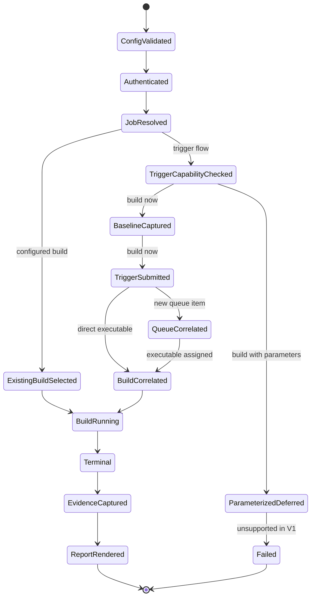
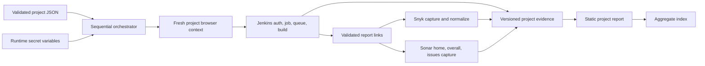

# Jenkins Playwright vulnerability-report runner architecture

## Approved onboarding scope (2026-08-20)

The approved reviewer decision for this handoff covers Phase 1 and Phase 2.
Phase 1 covers the TypeScript/Playwright bootstrap, shared configuration and
result contracts, redaction helpers, and unit coverage. Phase 2 covers the
deterministic local Jenkins fixture, its pinned controller/plugin setup, the
JCasC-seeded job, and fixture report artifacts.

Phases 1–2 remain the approved onboarding baseline. The original single-project
Phases 3–5 design is superseded by the replanned target below; later implemented
boundaries are called out by phase. At the initial Phase 7 handoff, broader
live-vendor, remote-contract, direct-host WebKit, and artifact-lifecycle work
was not claimed complete. The current continuation below supersedes that local
lifecycle/lock boundary; remote/live and direct-host WebKit remain out of scope.

## Replanned target scope (2026-08-24)

One validated JSON configuration lists one or more projects. Each enabled
project identifies its Jenkins base URL and job path, optional existing build,
non-secret credential-variable names, and explicit allowed SonarQube/Snyk
origins. The runner processes projects sequentially by default. Every project
gets a fresh browser context, absolute workflow deadline, run-scoped trigger
state, artifact directory, normalized evidence model, and static HTML report.

The saved pages under `templates/jenkins-template`, `templates/snyk-template`,
and `templates/sonarqube-template` are also the explicit offline input for the
default `npm run report` command. That mode loads bounded regular files,
serves the snapshots through bounded Playwright context routes at a synthetic
origin, follows the same Snyk/SonarQube capture flow, and writes normalized
evidence, counts, findings, facets, screenshots, and an aggregate index. It
does not contact a Jenkins job or a vendor host and never copies the captured
HTML/CSS into the generated report. Set `REPORT_SOURCE=jenkins` to opt into
the existing live collector when an authorized non-production endpoint and
secret store exist.

The generated Jenkins/project report shell provides links to Jenkins, Snyk,
SonarQube home, SonarQube overall, and SonarQube issues when validated evidence
exists. The snapshots also carry a passive relative-link navigation bar for
the template-only Playwright fixture check; that check remains separate from
the report-generation path.

Snyk capture includes the visible `Snyk test report` section, a screenshot,
severity totals, and at most 500 evidence-derived detailed findings with
explicit truncation metadata.
SonarQube capture starts at a validated home page, follows a user-visible
Overview/Overall action, captures the overall page, follows Issues, and
extracts only Type and Severity facet data. Overall metrics are not normalized
in V1; the Overall page is screenshot evidence only. Project identity and
origin are revalidated across each transition, and generated CSS/structure
fallbacks are diagnostic only, never the primary navigation contract.

## Implemented baseline and revised boundary

Phase 1 finalization covers the TypeScript/Playwright bootstrap, shared
configuration contract, result types, redaction helpers, and configuration
unit coverage. The Jenkins fixture, page modules, runner, and browser E2E
specs are later-phase consumers of this contract, not Phase 1 deliverables.

For each configured project, the revised target logs in with a fresh
Playwright browser context, resolves one exact Pipeline job, selects one
existing build or submits at most one correlated build, waits for a terminal
state, then captures Jenkins/Snyk/SonarQube evidence and renders one offline
report. A lightweight aggregate index links all per-project results.

The local fixture models publisher output with deterministic HTML/JSON
artifacts. It does not run real SonarQube or Snyk scanners. Live external pages
are navigated only when their canonical origins are explicitly configured.
API-token triggering, scanner execution, vendor APIs, and parallel project
execution remain out of scope.

## Per-project state machine



Any state may fail with a redacted diagnostic and failure-focused artifacts.
The absolute deadline applies to the entire project workflow, not separately
to each operation. Existing-build selection records zero trigger actions.
Trigger flow records the pre-submit build/queue baseline and accepts only a
new same-origin queue item or executable build correlated to this run. A
`Build with Parameters` control is detected before interaction and returns an
explicit unsupported result; it is never clicked or submitted in V1.

## Component and data flow



The configuration boundary loads project JSON, normalizes Jenkins job paths,
validates unique safe project IDs, bounds durations, and compiles per-project
locator/origin policy. Normalized project config retains only credential
environment-variable names. Secret values are resolved separately from the
runtime environment for enabled projects and are never added to normalized
project config. Page modules consume immutable project config and do not parse
configuration files or environment variables directly.

`src/types.ts` owns versioned config/result contracts, project/run identity,
report states, build correlation, capture metadata, and the narrow
`BuildTrigger` boundary. Jenkins, Snyk, SonarQube, and renderer modules remain
separate so fixture selectors cannot leak into orchestration or output HTML.

## Multi-project configuration contract

`PROJECTS_CONFIG_PATH` selects file mode and points to a regular JSON file under
1 MiB. The root schema is exactly version 1: `schemaVersion: 1`, one to 50
`projects` with at least one enabled entry, and optional `defaults`. Every
project requires a unique lowercase safe `id`, display `name`, one Jenkins
`baseUrl`/`jenkinsUrl`, and relative `jobPath`. Optional fields cover an
existing build number, login path, credential-variable names, source-specific
allowed origins, and selector overrides. Standard `JENKINS_USERNAME` and
`JENKINS_PASSWORD` references remain the fallback. The file contains variable
names only; embedded secret values and credential-bearing URLs are rejected.

File mode and legacy mode are mutually exclusive: if `PROJECTS_CONFIG_PATH` is
set, any legacy project/configuration input is rejected rather than merged or
silently preferred. When it is unset, the deprecated legacy environment inputs
are adapted into one schema-v1 project and emit a deprecation diagnostic. New
orchestration operates only on the normalized list. Sequential execution is
the only initial scheduling mode; later bounded parallelism requires a separate
design because it changes Jenkins queue correlation and resource guarantees.

Each project writes immutable evidence under a sanitized stable ID, exact build
identity, and safe run ID: `reports/<project-id>/<build-number>/<run-id>/`.
Every run folder contains `index.html`, normalized `data.json`, `manifest.json`,
and requested Snyk/SonarQube screenshots. Repeated runs never overwrite prior
evidence. The aggregate `reports/index.html` is rebuilt atomically from run
manifests, links exact run folders, and reports partial-project failures without
hiding successful projects.

The default report command resolves this output as the project-local
`reports/` directory when run from the repository root. `serve:report` is an
optional read-only static viewer for that directory: it binds to loopback by
default and requires explicit `--allow-lan` together with a non-loopback host
for a trusted-LAN preview. `0.0.0.0` binds every IPv4 interface.
The viewer has no authentication, does not list directories, refuses
traversal and symlink paths, and never follows paths outside the canonical
configured report root. Playwright's `test-results/` remains a separate test
runner output directory.

The accepted V1 scheduling invariant is sequential project execution within one
runner/browser process, with a fresh context per project. After canonical report
and staging roots are initialized, a private `reportRoot/.report-root-lock`
lease serializes concurrent same-host, same-UID invocations through browser
close, discovery, and aggregate publication. The lock has bounded
wait/heartbeat leases, crash-safe owner publication, and stale recovery for
expired same-host dead-PID or incomplete initial claims; foreign-host,
malformed, and symlinked locks fail closed. Distributed filesystems and
uncoordinated multi-host writers remain outside V1.

A failure before Jenkins returns a build identity is published under an
explicit `pre-build` run location with a sanitized diagnostic and no fabricated
Jenkins identity. Complete-run publication stages and replaces the whole run
directory. Startup and post-run cleanup inventory only the exact configured
report/staging roots, removes old bounded orphan staging/publication temporary
directories without following symlinks, and preserves ambiguous publication
backups.

## Phase 3 orchestration and artifact guarantees

Phase 3 implements the replanned sequential runner. The browser is launched
once, while each enabled project is executed in order with a new Playwright
context and a fresh run identity. A project failure is converted to a bounded
failure outcome so later projects still execute; browser cleanup and aggregate
writing happen after the project loop. The aggregate includes both outcomes
from the current invocation and validated historical manifests discovered under
the report root, while manifests for projects outside the current configuration
are reported as ignored.

The sequential project runner remains the V1 execution model. Atomic aggregate
staging and rollback are now paired with the report-root lease, so concurrent
same-host invocations sharing a report root wait or fail closed instead of
publishing concurrently. Multi-host/distributed locking is not claimed.

Run directories are allocated beneath a canonical report root whose path
components are real directories and never symlinks. The caller controls
permissions for the global roots and their descendants; path traversal,
symlinked directories, and unsafe artifact identities are still rejected.
Project IDs, build numbers, and run IDs are validated before they become path
segments. Manifest and result writes use temporary files followed by atomic
renames. Discovery rejects symlinked directories and follows only safe artifact
names; it opens manifests and referenced files without following symlinks,
checks file-size/count budgets, and verifies that `manifest.json`, `data.json`,
the project/run identity, build number, build URL, state, screenshots, and
trace references agree. Persisted warnings, status, diagnostics, and URLs are
bounded, redacted, and policy-validated before they are exposed to the
aggregate report.

The Phase 3 release gate is type-checking, production compilation, the complete
unit suite, and the Compose-backed Playwright E2E suite. The E2E gate covers
sequential project isolation, continuation after a project failure, repeat-run
history, exact build identity, and the existing Jenkins fixture. Later phases
may add broader vendor-page and report-rendering coverage; this section does
not claim those later capabilities are complete.

## Phase 04 Snyk evidence pipeline (implemented 2026-08-24)

Phase 04 extends terminal-build capture with a bounded, evidence-only Snyk
adapter. Capture starts only after the exact terminal Jenkins build has been
validated. It uses no Snyk API or scanner and returns normalized evidence plus
a local screenshot reference; HTML rendering remains a later-phase concern.

### Validated artifact classification and canonicalization

- Candidate links are collected only from the exact terminal Jenkins page and
  are bounded to 256 entries. A configured Snyk report destination is preferred;
  otherwise only one unambiguous Snyk-shaped report and one summary are eligible.
- `source-link-classifier.ts` uses accessible text/ARIA/title and URL host/path
  signals. It accepts `snyk-results.html` and
  `snyk-sca-results-summary.json`, ignores unrelated artifacts, rejects
  ambiguous candidates, and rejects links outside the configured Jenkins or
  explicit Snyk origins.
- Jenkins artifact variants ending in `/*fingerprint*/` or `/*view*/` are
  canonicalized to the artifact URL before it is retained. Configured and
  observed URLs, redirects, the final report URL, and the summary URL are
  revalidated by the project origin policy. External evidence also requires a
  configured project identity.

### Script-safe capture and bounded visible extraction

The capture page disables JavaScript through CDP before navigation, falling
back to a new JavaScript-disabled context when CDP is unavailable. Every page
request is checked against the origin policy; fonts, images, media, scripts,
workers, and WebSockets are aborted. Summary JSON is fetched as bounded page
evidence with at most five redirects and a 1 MiB body limit.

Readiness uses the accessible `Snyk test report` heading first, exact visible
text second, and the configured selector last; the selected strategy is
recorded. Extraction reads only visible cards and summary labels. Semantic
`data-snyk-test` evidence is preferred, with `.card--vuln` as a diagnostic
fallback. Card extraction is capped at 2,000 visible cards, fields are clipped,
and paths/references are bounded before normalization. No raw vendor HTML is
persisted.

### Summary/detail normalization and local provenance

The summary parser accepts only a complete `severity_counts` object with
bounded non-negative integer totals. Summary-only evidence preserves totals and
an empty detail list; it never invents findings. HTML findings are normalized to
bounded text, paths, and safe HTTP(S) references, deduplicated (merging
complementary fields), deterministically ordered, and capped at the fixed 500
unique-finding limit. The result records `totalObserved`, `retainedCount`,
`truncated`, and `omittedCount`. Summary/detail severity mismatches remain
visible as warnings and make the source `incomplete`.

Each capture records the sanitized source URL, title, timestamp, readiness/card
selector strategy, and fixed 1,440×900 viewport. A successful report-section
capture writes `snyk-test-report.png` under the run directory and records its
safe local path and SHA-256 hash in capture metadata; the safe filename is also
recorded in the run manifest.

### Partial-state behavior and review boundary

An absent eligible report with no classification warning is `not_found`.
Ambiguous or unallowlisted links, navigation/identity/parse problems, summary
mismatches, or screenshot failures produce `incomplete`; valid evidence and
warnings are retained whenever possible. These typed source outcomes let the
project continue to other publishers and persist a partial result instead of
fabricating success. A workflow or persistence failure remains a project
failure.

At Phase 04 implementation time, Cycle-3 P1/P2 review findings were explicitly
deferred; the later Phase 7 audit and V1 acceptance below supersede that
historical boundary. Their implementation follow-ups remain tracked in the
[Phase 04 plan](../plans/260824-0023-jenkins-multi-project-vulnerability-reporting/phase-04-snyk-evidence-capture-and-normalization.md).

## Phase 05 SonarQube navigation and bounded facets (implemented 2026-08-25)

Phase 05 is a focused SonarQube adapter. `sonarqube-capture.ts` owns the
home → overall → issues state flow, source finalization, and retention of
earlier evidence when a later step is incomplete. The boundary is split so
browser actions, identity checks, facet extraction, and pure normalization do
not collapse into one capture module:

- `sonarqube-capture-steps.ts` handles rendered home identity, the visible
  Overview/Overall transition, and Overall screenshot/provenance capture.
- `sonarqube-issues-capture-step.ts` handles project-scoped Issues navigation,
  rendered identity, Type/Severity extraction, and the facet-only screenshot.
- `sonarqube-capture-step-types.ts` contains shared step input/result shapes;
  `sonarqube-capture-support.ts` contains route policy, metadata, screenshots,
  and bounded failure helpers.
- `sonarqube-locators.ts` and `sonarqube-facet-locators.ts` provide
  deadline-aware semantic locator ladders. `sonarqube-project-identity-locators.ts`
  keeps identity matching scoped and exact. `sonarqube-url-identity.ts`
  centralizes exact query-value and credential-free-authority checks.
- `sonarqube-source-link-classifier.ts` selects a configured or observed
  SonarQube home, while `sonarqube-issue-facets.ts` performs the pure
  Type/Severity-only normalization.

### SonarQube identity, origin, and navigation guarantees

Home discovery uses links from the exact terminal Jenkins page or a configured
home destination. The validated Home/Overview identity must remain on the
project dashboard path (`/dashboard`) with the expected project ID; the visible
Overview/Overall action then validates the Overall state. Issues is a separate
visible project-navigation step with its own `/issues` path and project-identity
validation. URLs are never synthesized as the entry path. The candidate and
every final page/request are checked against the Jenkins base context or the
project's explicit SonarQube origins. External redirects, blocked requests,
home HTTP error responses, login bounces, and wrong-project pages fail closed.

The Home/Overview page must be a project dashboard with one non-empty `id`
query value. If a project ID is configured, it must equal that URL identity.
Rendered project identity is matched exactly in the scoped project
header/navigation, or by a same-origin credential-free dashboard link with the
expected `id`. Overall requires the same exact project ID and
`codeScope=overall`; Issues independently requires the same exact project ID on
an `/issues` target. Missing, empty, or duplicate query values are rejected by
the shared exact-value check, so duplicate `id` parameters cannot be accepted
by taking the first value.

Navigation and capture live URLs are policy-validated HTTP(S) references with
no username or password authority. Browser credentials remain ephemeral and
are not included in navigation targets or persisted capture metadata,
diagnostics, or report data.

### Facet-only and partial evidence behavior

Overall contributes screenshot/provenance metadata only; its measures are not
normalized. Issues extraction reads only Type and Severity facet controls
inside their identified groups. Issue rows, descriptions, rules, paths,
assignees, tags, and source details are outside the SonarQube evidence model.
Semantic facet/data-property locators are preferred; generated structure is a
scoped diagnostic fallback.

Each facet is capped at 64 entries. Labels are trimmed to 128 characters and
counts must be bounded non-negative integers (at most 10,000,000); duplicate
labels are ignored with a warning. Type and Severity are captured
independently: if one facet is unavailable, the other valid facet remains in
the partial result, warnings are retained, and the Issues/source state is
`incomplete`. The Issues screenshot is attempted only when both facet regions
are available; a screenshot failure still preserves the validated Issues URL
and extracted facets while marking the step incomplete. A complete SonarQube
source requires all three navigation targets and no warnings.

## Historical single-project configuration baseline (pre-replanned loader)

`src/config.ts` is the single environment boundary. Required inputs are
`JENKINS_BASE_URL`, `JENKINS_USERNAME`, `JENKINS_PASSWORD`, and
`JENKINS_JOB_PATH`. `JENKINS_LOGIN_PATH` defaults to `/login`;
`JENKINS_TRIGGER_MODE` defaults to `ui` and only `ui` is accepted;
`JENKINS_TIMEOUT_MS` defaults to `300000`; `JENKINS_POLL_INTERVAL_MS` defaults
to `1000`; `PLAYWRIGHT_BROWSER` defaults to `chromium`; and `ARTIFACT_DIR`
defaults to an absolute `reports` path. `test-results/` is reserved for
Playwright test-runner output and is not the application report root. The Phase 7 handoff separately
verifies the active safe-page path in Chromium and Firefox; this historical
baseline is not the current release-gate status.
`JENKINS_BUILD_NUMBER` is
optional: when present it must be a positive integer and selects an existing
build instead of triggering one.

The seven selector inputs are optional overrides:
`JENKINS_TRIGGER_SELECTOR`, `JENKINS_AUTH_LANDMARK`,
`JENKINS_QUEUE_URL_SELECTOR`, `JENKINS_BUILD_STATUS_SELECTOR`,
`JENKINS_BUILD_URL_SELECTOR`, `SONAR_REPORT_SELECTOR`, and
`SNYK_REPORT_SELECTOR`. Each value is JSON for a typed selector with `kind`,
non-empty `value`, optional `name`, and boolean `required`; supported kinds are
`role`, `label`, `testId`, `text`, and `css`. Missing values use defaults.
Report selectors may set `required: false`, making absent publisher output a
normal report state rather than a configuration error.

Legacy compatibility mode also accepts optional `SNYK_PROJECT_ID` and
`SONARQUBE_PROJECT_ID` values. These identify the publisher project inside an
archived report and may differ from `PROJECT_ID`, which identifies the runner
output. Supplying them lets the local archived Snyk/Sonar fixtures remain
complete without weakening project-identity validation.

The authentication and build-page selector overrides
(`JENKINS_AUTH_LANDMARK`, `JENKINS_BUILD_STATUS_SELECTOR`, and
`JENKINS_BUILD_URL_SELECTOR`) are intentionally reserved for Phases 3–4.
Phase 1/2 onboarding should leave these optional overrides unset; the typed
contract remains available for later Jenkins page-markup differences.

Parsing collects invalid or missing-input issues and throws before a browser is
launched. Diagnostics are redacted and bounded; raw credentials and
secret-bearing URL data are not part of the config error contract.

Historical migration note: the replanned configuration loader replaces this as
the orchestration entry point. During migration, these inputs may be normalized
into one project; they must not remain a second execution path.

## Configuration invariants

- Configuration is parsed before a browser is launched.
- Project configuration has `schemaVersion: 1`, at least one enabled project,
  unique safe project IDs, and no embedded credential values.
- Every Jenkins base URL is HTTP(S), canonical, and has no credentials, query,
  or fragment. Job/login paths cannot escape its configured context path.
- Snyk/SonarQube navigation is limited to the Jenkins origin or explicit
  canonical allowed origins for that project; redirects are revalidated.
- SonarQube Home/Overview identity checks require the project dashboard path and
  one exact non-empty project `id`; Overall additionally requires
  `codeScope=overall`, while Issues is independently validated on an `/issues`
  path with the same exact project ID. A configured SonarQube project ID must
  match it, and duplicate `id` query parameters fail closed.
- SonarQube navigation targets and live links are credential-free; URL userinfo
  and credential-like query values are rejected before persistence.
- Allowed origins must be bare HTTP(S) origins. Absolute source URLs may carry
  ordinary application query parameters, but credential-like query keys or
  nested assignments are rejected without echoing their values. Malformed or
  repeatedly encoded traversal/query payloads fail closed.
- Job and login paths reject absolute/network-path forms, queries, fragments,
  control characters, malformed encoding, and raw or encoded traversal.
  Relative report paths must remain within the configured Jenkins base context.
- Credentials are required for UI V1 but are never included in diagnostics,
  traces, screenshots, storage state, or committed files.
- Job paths are relative and encoded per segment; login paths are relative.
- Only `ui` trigger mode is accepted in V1.
- Timeouts, poll intervals, and existing build numbers are positive integers.
- One absolute deadline and the configured poll interval govern each project;
  nested operations consume remaining time instead of resetting the timeout.
- Locator configuration is typed JSON with one of `role`, `label`, `testId`,
  `text`, or `css` kinds. Selector overrides retain default requiredness unless
  explicitly set; report selectors may set `required: false`.
- Authentication requires a positive configured landmark or exact canonical
  job identity. Merely leaving known login paths is insufficient.
- `Build Now` is the only submitted trigger in V1. Parameterized jobs are
  detected before interaction and fail closed with zero click/submit attempts.

## Result invariants

- Replanned project evidence has `schemaVersion: 2`, a stable project ID, and
  one exact validated build number/URL. The aggregate links project results;
  it does not merge their mutable run state.
- Its `navigation` member is an object with exactly five keyed targets:
  `jenkins-build`, `snyk-report`, `sonarqube-home`, `sonarqube-overall`, and
  `sonarqube-issues`. Each target repeats its key, provides a non-empty local
  anchor and a `found`, `not_found`, or `incomplete` state, and may include a
  policy-validated live URL. Missing, extra, or array-shaped targets violate
  the schema-v2 contract.
- Report states are `found`, `not_found`, or `incomplete`.
- Report URLs/text/issue data are normalized, deduplicated, trimmed, capped,
  escaped at render time, and tied to capture source/timestamp metadata.
- The Jenkins template is a fixture/reference. Generated project HTML is a
  compact offline shell with no executable script or third-party resources.
- A terminal exact build is validated before report-link extraction. Snyk and
  SonarQube pages are captured only through the project's origin policy.
- Snyk detail is evidence-derived and capped at 500; summary-only input never
  creates invented findings. SonarQube Overall is screenshot-only, and Issues
  extraction contains only bounded Type and Severity facet data. Missing one
  facet preserves the other as partial evidence and keeps the source
  `incomplete`; it is never promoted to a fabricated complete result.
- Authentication state is ephemeral and no `storageState` is persisted.

## Test, report, and artifact policy

Pure configuration and normalization logic is unit-tested. The isolated
`playwright.unit.config.ts` matches only `tests/unit/**/*.spec.ts`, uses
`test-results/unit`, and never parses Jenkins configuration or requires
Jenkins credentials. The main `playwright.config.ts` matches the repository's
Playwright specs; it parses the complete Jenkins contract when
`tests/e2e/**/*.spec.ts` exists, so a mixed unit/E2E invocation cannot avoid
E2E startup validation. The Compose-backed Playwright flow is the local release
gate added in later phases. CI can run deterministic type/unit checks without
Docker.

Local runs use the HTML reporter; CI uses the blob reporter. Both configs use
the validated core artifact policy: requested report screenshots, normalized
data, and manifests are retained; a trace is retained only on failure or first
retry. Raw vendor HTML and video are not retained. Local runs use zero retries;
CI allows one retry. The configured `ARTIFACT_DIR` controls the main runner
output directory; unit artifacts remain under `test-results/unit`. Recorded
continuation evidence was local/non-CI and completed with zero retries. Its
ignored evidence paths are `playwright-report/index.html`, `test-results/`, and
`.runner-build/`; none is a release input.

Vulnerability reports are separate from Playwright test reports. V1 records
Jenkins build identity plus normalized Snyk/SonarQube evidence, screenshots,
and source links. Static output HTML escapes all values, validates link schemes,
uses `noopener noreferrer` for external navigation, and applies a restrictive
Content Security Policy. When a report is served over HTTP, the serving layer
must also send a CSP response header containing `frame-ancestors 'none'`; an
HTML meta policy cannot enforce that directive. Missing optional publisher output
produces a partial report with warnings, not a fabricated successful section.

### Offline template report mode

The CLI defaults to the checked-in snapshots so a meaningful report can be
generated without the Jenkins pipeline. `npm run report` loads the six bounded
template inputs, derives the SonarQube project identity from the saved
dashboard, serves the pages from bounded Playwright context routes at
`https://templates.invalid`, and runs the same Playwright capture and renderer
used by the live path. The Snyk summary JSON is parsed from the checked-in
file through an in-memory reader, so no loopback server or vendor request is
needed. The result is written under `ARTIFACT_DIR` (default `reports`) with
normalized Snyk summary/detail data, SonarQube Type/Severity facets, source
screenshots, `data.json`, `manifest.json`, and an aggregate `index.html`.
The `report` npm script routes Node/Playwright scratch writes to a unique
project-local, Git-ignored `.report-runtime-*` directory, removes it after
completion when it remains safe and within the bounded cleanup budget, and
boundedly prunes only stale safe directories rather than intentionally using
the host `/tmp` directory. The package scripts disable Node's optional compile
cache for their child processes; when npm itself is quota-constrained before
the script starts, prefix the command with
`NODE_DISABLE_COMPILE_CACHE=1`. Unsafe or over-budget trees are preserved with
a warning.

The synthetic build is marked `TEMPLATE` with an `unknown` trigger capability;
it is provenance for the snapshot run, not evidence that Jenkins executed a
job. The checked-in Snyk summary now matches its six visible cards (critical/high
`2/4`), and its page metadata reports six known vulnerabilities and six
vulnerable dependency paths. The generated template-backed result is therefore
`success` when all captures complete. Mismatched external evidence remains
`partial` with a warning. Set
`REPORT_SOURCE=jenkins` or use `npm run report:jenkins` only for the optional
authorized live collector.

The checked-in template fixture was refreshed on 2026-08-27 so its Snyk page
metadata, six visible cards, and summary JSON agree: six findings total,
critical/high `2/4`, and six vulnerable dependency paths. A clean
template-backed run therefore reaches `success` when the other captures
complete; mismatch handling remains required for arbitrary external reports.

Unit and fixture gates cover sequential project isolation, existing-build
zero-trigger proof,
new queue/build correlation, parameterized detection with zero interaction,
stale/concurrent queue entries, external/cross-origin redirects, exact job identity, Snyk title
and detail capture, SonarQube home-to-overall navigation, and Type/Severity
issues capture despite generated-class changes. The deterministic generated-report
gate covers local links, response-header CSP, escaping/inert HTML, keyboard
traversal, axe WCAG A/AA, responsive widths, and fixed Chromium snapshots. These
fixture/offline checks include Chromium and Firefox fixture coverage; the
pinned WebKit release gate also selects WebKit for the unit suite, including
the template-backed report runner. WebKit coverage uses the digest-pinned
Playwright Ubuntu runner documented in
`docs/release-gates.md`; direct host execution remains unsupported on Linux
hosts missing the browser's required libraries.

Failure evidence is never globally disabled. Keep normalized data, manifest,
last safe URL/status, and trace on failure/first retry. Requested report
screenshots use a bounded three-attempt retry for transient browser protocol
failures and are retained when capture succeeds; a persistent failure remains
`incomplete` with its warning. Raw HTML, extra failure
screenshots, and video are not retained. Redact credentials, cookies, query
secrets, and sensitive headers before persistence.

Sensitive output directories (`playwright/.auth`, `playwright-report`,
`test-results`, `blob-report`, `artifacts`, `reports`, traces, and logs) are
ignored by Git. Authentication state is ephemeral; no `storageState` is
persisted. The local Jenkins volume is reset only when a developer explicitly
runs `docker compose down -v`.

## Local Jenkins fixture (historical Phase 2 baseline; extended in Phase 7)

The deterministic local fixture uses the official
`jenkins/jenkins:2.568.1-lts-jdk21`
image pinned by digest in `docker/jenkins/Dockerfile`. The custom layer adds
only `curl` for the healthcheck and the pinned Configuration as Code, Job DSL,
and Pipeline plugin set required to create one job from source-controlled
configuration. It does not install SonarQube/Snyk scanner plugins or contact
external scanner services.

Compose uses `docker/jenkins` as its build context, so local env files,
credentials, and test output outside that fixture directory cannot enter the
image build context. The Dockerfile copies only source-controlled Jenkins
fixture files, and `docker/jenkins/.dockerignore` filters accidental local
secrets or output placed inside the fixture context.

`plugins.txt` pins the direct plugins and resolved dependency closure, and the
Dockerfile disables latest-version resolution. Docker artifact resolution is
pinned but network-dependent: an image build must reach the image registry,
Debian package repository, and Jenkins plugin repository to fetch those exact
artifacts. The fixture is deterministic once built, but it is intentionally not
an offline image build and does not require external scanner services at
runtime.

Compose injects `JENKINS_USERNAME` and `JENKINS_PASSWORD`; its loopback-bound,
disposable development defaults are `local-admin` and
`local-fixture-password`. CI and non-local runs override both through the
environment. JCasC creates the local admin,
disables the setup wizard for this disposable controller, and seeds
`playwright-vulnerability-report`. The controller healthcheck probes the
unauthenticated `/login` endpoint so a password is not exposed in a process
argument. The fixture-readiness E2E then performs a bounded readiness poll,
browser login, and seeded-job assertion.

Start and inspect the fixture with:

```sh
export JENKINS_USERNAME=local-admin
export JENKINS_PASSWORD='replace-with-a-local-secret'
docker compose up -d --build
docker compose ps
docker compose logs --tail=100 jenkins
```

The named `jenkins_home` volume is intentionally preserved by `docker compose
down`, allowing restart/repeated-build checks. Use `docker compose down -v`
only when an explicit clean reset is required; it removes Jenkins history and
forces JCasC to recreate the controller and job from the checked-in fixture.

The seeded parameterized Pipeline is the fail-closed control. It accepts
`FIXTURE_VARIANT` values `pass`, `failed`, `empty`, and `malformed`; its
`Build with Parameters` control is detected before interaction. A separate
`playwright-vulnerability-report-build-now` Pipeline has no parameters and
exercises the supported Build Now correlation path. Both jobs use the same
compact report fixture corpus: `reports/manifest.json`, semantic Snyk
HTML/JSON, and SonarQube home/Overall/Issues HTML plus JSON. The parameterized
job always archives `reports/manifest.json` and, when the
variant provides them, deterministic SonarQube/Snyk HTML and JSON artifacts.
The `failed` variant archives reports before returning a failed build, which
lets later phases test report extraction independently from build success.

For Docker-compatible development, `npm run test:e2e` supplies loopback
defaults for the disposable fixture: `JENKINS_BASE_URL` is derived from
`JENKINS_PORT` (default `8080`) when an explicit URL is absent,
`JENKINS_USERNAME=local-admin`, `JENKINS_PASSWORD=local-fixture-password`,
and `JENKINS_JOB_PATH=playwright-vulnerability-report`. The dedicated
`npm run test:e2e:build-now` script selects the separate Build Now job. These
defaults are development-only and are overridden by the process environment in
CI or when targeting a non-local controller. The continuation used
`JENKINS_PORT=18080` because an unrelated local service occupied port 8080.
The Compose service injects the same development-only credentials into the
fixture; production and CI credential values remain environment-provided.

`npm run install` provisions Chromium. For a supported Firefox host, install
Firefox explicitly with `npx playwright install firefox`. The WebKit release
gate uses `npm run test:release:webkit`; downloading WebKit with
`npx playwright install webkit` does not make the Fedora host ABI-compatible.
`JENKINS_BASE_URL` may include a context path; the readiness flow resolves
login and job URLs beneath that path, including Jenkins folder-style job paths
such as `folder/job-name`.

## Phase 2 implementation guarantees and review boundary

The Phase 2 workflow uses one immutable `WorkflowDeadline` per project. Page
navigation, trigger submission, queue/build correlation, terminal-state
polling, and report capture consume the same remaining budget and configured
poll interval; nested operations must not reset the timeout. It validates the
configured origin/context path, exact job heading, numeric queue/build paths,
and captures a pre-submit queue/latest-build baseline. Trigger results include
typed state and bounded, redacted diagnostics.

Phase 2 was approved with noted issues after review cycle 3. It is not a
production-security sign-off: correlation can still be ambiguous after an
unrelated navigation and some locator reads are not independently
deadline-bounded. This continuation adds explicit HTTP-status rejection for
login/job entry navigation, rejects query/fragment-bearing queue/build
identity references, and redacts configured secrets from diagnostic URL paths.
The remaining historical boundaries are explicitly accepted below; they are
not described as closed fail-closed guarantees merely because deterministic
gates pass.

## Historical Phase 2/4 production-security audit and V1 acceptance (2026-08-25)

The handoff audit compared the Phase 2/4 review notes, current source, tests,
and commits `c148cbc`/`225cfe9`. The current continuation has focused tests for
login/job HTTP errors, canonical queue/build references, and path-secret
redaction in `tests/unit/jenkins-phase-02.spec.ts`.

Resolved or already evidenced:

No historical Phase 2/4 item is left unclassified: the items below are
resolved or evidenced, and the remaining boundaries are explicitly accepted in
the next block with an owner, acceptance date, and review/expiry date.

- Phase 2 URL-origin/context validation, exact job identity, bounded polling,
  response checks for build navigation/reload, and redacted diagnostics.
- Phase 2 login/job entry HTTP status checks, credential-free canonical
  queue/build references, and configured-secret redaction in diagnostic paths.
- Phase 4 external Snyk identity requirements when configured, output caps,
  bounded links/cards/references, 500-finding normalization, and safe failure
  artifact omission, as covered by the existing source and regression suites.

Explicit V1 production-security acceptance — owner: runner maintainers;
accepted 2026-08-25; review/expiry 2026-09-25 and before remote/live vendor
enablement or untrusted external input:

- UI-only Jenkins response observation cannot prove causality for every
  unrelated same-origin navigation response; ambiguous queue/build evidence
  remains fail-closed where the existing state machine can detect it.
- Some low-level Jenkins DOM reads and final polling errors share the workflow
  deadline but are not independently cancellable; the shared deadline,
  bounded Playwright defaults, and sanitized error chain are the current V1
  containment.
- Snyk links are not fully cryptographically bound to the exact terminal
  build when an explicit configured destination is used, and inferred external
  `homeUrl` identity is not equivalent to a pre-navigation project-identity
  proof.
- Mixed-valid Snyk summary severities may discard valid fields; DOM traversal
  bounds cap retained output but do not cap every underlying `querySelectorAll`
  enumeration.
- Shared-page restoration after an exhausted capture deadline is best effort;
  missing Snyk screenshots remain incomplete evidence and are not recaptured.
- The Snyk capture module remains above the documented 200-line maintainability
  target; this is accepted as a maintainability residual, not a security
  guarantee.

This acceptance is limited to the sequential, same-host, same-UID V1 runner,
explicit origin allowlists, ephemeral credentials, bounded artifacts, and the
opt-in remote gate below. It is not production-security approval for broader
deployment. Reopen every accepted item before enabling remote/live Snyk,
SonarQube, or Jenkins jobs, untrusted forks, or distributed report roots.

## Phase 7 final evidence and accepted residuals (historical 85% / 121-unit handoff, 2026-08-25)

The final deterministic and local-Compose evidence is recorded here; the
[Phase 07 plan](../plans/260824-0023-jenkins-multi-project-vulnerability-reporting/phase-07-fixture-matrix-browser-gates-and-release.md)
remains the historical implementation record.

Handoff status: the scoped local release gate is complete at 85% on commit
`c148cbc`; Phase 7 remains In Progress under conditional signoff. The pinned
WebKit image is
`mcr.microsoft.com/playwright:v1.62.1-noble@sha256:dcc5531e97840b9b5e794f2814476b21571c5124a3fca2267d73041f56e7580e`.

Recorded passing evidence:

- `npm run test:release`: type-check, build, 121 unit tests, and 5 Chromium report tests.
- Focused artifact/runner suite: 36/36 passed; prior warning-focused suite: 38/38. Chromium and Firefox vendor fixtures: 3/3 each, including the default safe-page path.
- `JENKINS_PORT=18080 npm test`: Jenkins E2E 13 passed + 1 expected skip.
- `JENKINS_PORT=18080 npm run test:e2e:build-now`: Build Now 1/1 against the
  live Compose fixture.
- `npm run test:release:webkit`: type-check, build, 121 unit tests, and 5
  WebKit report tests passed in the pinned Ubuntu runner.
- All recorded final runs completed with zero retries; `git diff --check`
  passed.

Direct WebKit launch is unavailable on this Fedora host because `libicu74` and
`libjpeg-turbo8` are unavailable; the supported WebKit gate is the pinned
Ubuntu runner exposed by `npm run test:release:webkit`.

The following were deferred/accepted residuals at the handoff and are retained
as historical context, not as the current continuation status:

- remote/live vendor capture and the optional remote Jenkins contract;
- crash-time/full staging-root enumeration and cleanup;
- cross-process report-root locking (the V1 runner remains sequential).

The sequential single-process invariant remains an accepted V1 deployment
constraint; the current same-host report-root lease is documented below.

The historical Phase 2/4 review findings were not closed by the handoff's local
release evidence; the current continuation's audit and explicit V1 acceptance
below supersede that handoff statement.

## Phase 7 residual continuation closure (2026-08-25)

The local/same-host V1 crash/failure lifecycle, bounded preservation, and
report-root locking residuals are closed within the sequential, same-UID V1
boundary. Distributed filesystems and uncoordinated foreign-host writers
remain outside that closure. Remote/live Snyk/SonarQube capture and the
optional remote Jenkins contract remain opt-in and blocked in this checkout
without an authorized endpoint and trusted CI secret-store access: `git remote -v`
returned no remotes, `gh` was unavailable, the configuration inventory
contained only local Compose/Jenkins files, and the only discovered Jenkins
endpoints were loopback listeners (`:8080` and `:18080`). A redacted
environment audit exposed only Codex/session metadata among relevant names.
The `:18080/login` HTTP 200 probe is local fixture evidence, not
remote-contract evidence. No production job, untrusted fork, remote vendor
page, or hard-coded credential was used.

`ArtifactPaths` now validates canonical real-directory roots whose permissions
are caller-managed and rejects overlap; staging allocations carry expiring
leases; and bounded startup and
post-run reapers inspect only the exact configured report/staging roots. The
reapers enforce safe project/run/build names, age and active-lease checks,
entry/byte/removal budgets, no-follow symlink checks, and lexical containment.
Malformed leases, active or over-budget trees, symlink candidates, and
ambiguous random rollback backups are preserved with bounded warnings. The
reaper also removes an expired, recognized lease whose staging run was already
renamed into publication, closing the crash window between rename and lease
cleanup. Only
recognized, safe, stale, in-budget entries inside the exact configured roots
are deletion candidates; unrestricted recursive or exhaustive root deletion is
not claimed. Orphan lock-recovery directories are quarantined and removed only
inside the report root. Aggregate publication writes a bounded recovery journal
before its two-file swap; startup replays that journal to restore the prior pair
after a process death, or keeps a committed pair while removing leftovers.

`reportRoot/.report-root-lock` now covers root initialization follow-on work,
browser execution and close, discovery, cleanup, and aggregate publication.
The owner record contains a token, PID, hostname, acquisition timestamp, and
heartbeat lease. Recovery is limited to an expired same-host lock whose PID is
demonstrably dead; foreign-host, malformed, live-owner, and symlinked locks
fail closed. This is a same-host/same-UID filesystem lease, not a distributed
lock, and the sequential V1 project policy remains in force inside the lease.

The focused regression command was:

```sh
npx playwright test tests/unit/artifact-lifecycle.spec.ts tests/unit/artifact-paths.spec.ts tests/unit/jenkins-phase-02.spec.ts tests/unit/sequential-runner.spec.ts \
  --config=playwright.unit.config.ts --workers=1
```

It passed 49/49, including SIGKILL staging recovery, interrupted aggregate
publication recovery, bounded cleanup with an outside symlink sentinel,
concurrent-process lock waiting, stale/incomplete-lock recovery, finite-limit
rejection, direct lease traversal rejection, and the historical Phase 2
HTTP/canonical-reference/path-redaction checks, caller-managed non-private
artifact roots, standard Jenkins build markup, queue disappearance recovery,
and concurrent-build rejection. The explicit Phase 2/4
production-security acceptance above remains the policy boundary before
enabling remote/live or untrusted inputs.

The default Jenkins contract reads bounded same-origin queue/build JSON when the
fixture omits optional custom hooks, and a sole newer link under the default
build selector is accepted only when that queue API proves the exact configured
job/build identity. Custom selectors remain authoritative.

Caller-managed permissions are an operational compatibility choice for shared
workspace roots, not an authorization boundary: a same-host writer that can
modify those roots can race publication paths. Security-sensitive deployments
must provide a trusted, isolated report root and retain the same symlink,
containment, identity, lease, and lock protections. This race is an accepted
V1 local/same-host policy boundary, and the legacy `local-build-now: partial`
result is accepted only as incomplete vendor evidence; neither is a
production, remote/live, distributed, or untrusted-fork approval.

Current post-hardening gate evidence, with no command retries:

- `npm run test:release` — type-check, build, 160 unit tests, and 5 Chromium
  report tests.
- `JENKINS_PORT=18080 npm test` — 160 unit tests, 15 E2E tests, and 1 expected
  skip (14 Jenkins-backed tests plus template navigation).
- `JENKINS_PORT=18080 npm run test:e2e:build-now` — Build Now 1/1.
- `env XDG_RUNTIME_DIR=/run/user/$(id -u) npm run test:release:webkit` — 160
  WebKit unit tests and 5 WebKit report tests passed in the unchanged pinned
  Ubuntu image; the container `npm ci --ignore-scripts` step audited 10
  packages with 0 vulnerabilities.
- `git diff --check` — passed.

Generated application evidence is under `reports/index.html`; Playwright
evidence remains under `playwright-report/index.html`, `test-results/`, and
`.runner-build/`. All are ignored and are not release inputs.

The final live-fixture report command exited 0 with `local-build-now: partial`
and published Jenkins build 42 at
`tmp/reports/local-build-now/42/20260825t210326691z-3041b4a9fee125a2/`;
`data.json` records `state: partial` and nested `jenkins.buildNumber: 42` /
`jenkins.status: SUCCESS`. Legacy mode remains partial until a schema-v1
project file declares Snyk/Sonar artifact paths and identities.

The queue-404 recovery is fail-closed: only the exact same-origin queue API
executable tied to the exact configured job is accepted, and the job page is
never scanned as a disappearance fallback. Queue/build API requests disable
redirects and verify the final response URL. The 64 KiB response check rejects
known oversized responses before body acceptance and rejects oversized
buffered responses; because Playwright buffers `APIResponse`, this is an
accepted input/retention bound rather than a hard peak-memory bound.

## Post-review edge hardening (2026-08-26)

The Phase 2/4 audit follow-up also closes the remaining local edge cases. A
present-but-empty or duplicate SonarQube `id` query parameter is rejected
before archived-link canonicalization; it is never replaced with the expected
project ID. Terminal artifact settlement requires every configured publisher,
uses an absolute five-second deadline with a 32-attempt cap, and keeps the
previous optional-publisher behavior when neither publisher is configured.
Semantic Snyk severity rows, findings, and project metadata are accepted only
from visible nodes. The focused edge suite passed 60/60 and the delayed
two-publisher browser regression passed 1/1.

The current final local evidence supersedes the earlier historical build-42
partial snapshot: `npm run test:release` passed with 152 unit and 5 Chromium
report tests; `JENKINS_PORT=18080 npm test` passed with 152 unit, 15 E2E, and 1
expected skip; Build Now passed 1/1; and the pinned Ubuntu WebKit runner passed
152 unit (including the template-backed report runner) plus 5 WebKit report
tests. The loopback report is
`tmp/reports/local-build-now/56/20260826t020350772z-241ee9943873267c/` with
`state: success`. Remote/live and trusted-secret-store access remain explicitly
accepted opt-in boundaries, not release evidence.
