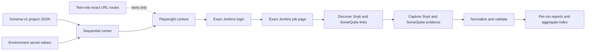

# Current architecture

This document describes the implemented schema-v1 configuration and run
contract. The report command reads one explicit JSON configuration file;
checked-in templates are test fixtures and are not a runtime source mode.
`runType` is a project-only discriminator normalized before an executor is
chosen; it is never inferred from URLs, selectors, CLI names, or environment.

The runner collects bounded Jenkins, Snyk, and SonarQube evidence and writes a
static normalized vulnerability report. Runtime navigation uses the exact URLs
in the project configuration. Tests may fulfill those exact URLs with
test-only Playwright routes; unmatched network requests are blocked.

See [multi-project configuration](./multi-project-configuration.md) for the
field-level contract and [release gates](./release-gates.md) for current
commands and validation boundaries.

## Scope and operating modes

Production and tests use the same schema-v1 configuration shape:

| Mode | Configuration | Page behavior |
| --- | --- | --- |
| runtime | schema-v1 project JSON passed with `--config` | real HTTP(S) navigation |
| test | schema-v1 test project JSON plus checked-in `templates/` | exact configured/discovered URLs fulfilled by test-only routes |


Project run mode is independent of configuration source mode. The only
accepted values are `report` and `auto-build`; an omitted project value
normalizes to `report`. Mode selection is an explicit caller boundary, not a
build trigger.

The project JSON supplies exact Jenkins `loginUrl` and `jobUrl`, a project
`runType`, credential environment-variable names, selectors, source-origin
policy, browser, timeout, and artifact root. The job page is the
report-discovery boundary. Snyk report and summary links and the SonarQube home
link are discovered from that page; SonarQube Overall and Issues links are
followed from the validated home page.

The CLI runs one browser process for enabled projects. Projects execute in
configuration order, each in a fresh Playwright context, with one absolute
capture deadline. A project failure is captured as an outcome so later
projects can continue. The process exits nonzero when any project fails.



## Components

- `src/cli.ts` requires one schema-v1 project JSON and invokes the runner. It
  has no template/runtime source switch.
- `src/config/` validates schema keys, exact HTTP(S) URLs, project-only
  `runType`, credential references, source origins, selectors, and bounded
  runtime settings. Normalization defaults an omitted `runType` to `report`.
- `src/config/project-run-selection.ts` provides the explicit
  `selectReportProjects` and `selectAutoBuildProject` boundaries.
- `src/config-selectors.ts` owns selector parsing and immutable defaults,
  including the build link and submit-button selectors.
- `src/config.ts` exposes the loader, normalized contracts, `RunType`, and
  selection helpers from the public configuration surface.
- `src/runner.ts` enforces one browser, one report root, sequential execution,
  report-root locking, cleanup, manifest discovery, and aggregate publication.
- `src/project/` owns the direct login/job-page/capture workflow, deadlines,
  outcome state, and sanitized failure handling.
- `src/jenkins/` authenticates and opens the exact configured job page without
  triggering builds, inspecting queues/build identities, or polling status.
  `runner-config.ts` carries the authenticated Jenkins selectors, including
  both build controls, to the Jenkins layer.
- `src/reports/snyk/` and `src/reports/sonarqube/` validate allowed links,
  handle SonarQube login redirect authentication when required, capture bounded
  visible evidence, and normalize source-specific results.
- `src/artifacts/` creates immutable run paths, writes validated files, manages
  staging leases and aggregate recovery, and performs bounded cleanup.
- `src/reporting/` renders static HTML/CSS and serves only files below a
  canonical report root.
- `templates/` is the checked-in browser fixture corpus. Test-only routes map
  exact URLs from saved pages to those files and abort unmatched network.

## Configuration boundary

### Schema-v1 file mode

The root object has `schemaVersion: 1`, `projects`, and optional `defaults`.
There must be one to 50 projects and at least one enabled entry. Each project
requires a unique safe ID, display name, exact Jenkins `loginUrl`, and exact
Jenkins `jobUrl`; it may also set project-only `runType`.
Login and job URLs must share one canonical Jenkins origin and base context.

The runtime command receives the JSON path explicitly:

```text
npm run report -- --config config/<projects>.json
```

The file is validated before browser launch. Unknown keys, duplicate IDs,
missing enabled projects, unsafe selectors, invalid or credential-bearing URLs,
unsafe paths, embedded secret values, and out-of-range settings are rejected.
Legacy structural keys such as `baseUrl`, `jobPath`, `captureFrom`, and
`buildNumber`, plus structural environment inputs such as `REPORT_SOURCE`,
`PROJECTS_CONFIG_PATH`, and legacy `JENKINS_*` project settings, are rejected.

### Run mode and selector contract

`runType` accepts exactly `'report'` or `'auto-build'`. Missing input is
normalized to `'report'`, preserving existing schema-v1 documents as report
projects. `runType` is deliberately absent from `ProjectConfigDefaults`, so
`defaults.runType` is rejected as an unknown key. No environment setting is
read for mode selection; do not use environment configuration to mass-enable
auto-build.

Selection happens on normalized projects:

| Helper | Contract |
| --- | --- |
| `selectReportProjects(projects)` | Returns a frozen list containing only enabled projects with `runType === 'report'`; disabled and auto-build entries never enter the report set. It fails when no enabled report project exists. |
| `selectAutoBuildProject(projects, projectId)` | Requires an exact, non-empty project ID and returns one project only when it is enabled and `runType === 'auto-build'`; missing, disabled, and report projects fail closed. |

The helpers are exported by `src/config.ts`. They do not rewrite modes,
derive branch identity, or submit a Jenkins request. Phase 01 defines this
selection boundary and the configuration contract; the report executor still
has no trigger, queue, polling, or build-number behavior.

All selector fields are available under `defaults.selectors` and
`projects[*].selectors`; project values override defaults. The normalized
defaults are:

| Selector | Kind | Value | Name | Required |
| --- | --- | --- | --- | --- |
| `authLandmark` | `role` | `link` | `Manage Jenkins` | `true` |
| `sonarqubeReport` | `testId` | `sonarqube-report` | — | `true` |
| `snykReport` | `testId` | `snyk-report` | — | `true` |
| `buildParametersLink` | `role` | `link` | `Build with Parameters` | `true` |
| `buildSubmitButton` | `role` | `button` | `Build` | `true` |

`buildParametersLink` and `buildSubmitButton` must remain required. Omitting
`required` defaults it to `true`; an explicit `required: false` override is
rejected for either field. Their Jenkins search scopes (`#side-panel` and
`#bottom-sticker`, respectively) remain runtime code rather than configurable
CSS. Selector values do not change the configured `jobUrl` or branch identity.

### Phase 01 implementation map

| Path | Responsibility |
| --- | --- |
| `src/types.ts` | Defines `RunType` and the complete selector shape. |
| `src/config/*` | Validates, normalizes, and selects project run contracts; environment helpers keep mode out of legacy configuration. |
| `src/config-selectors.ts` | Defines selector kinds, parsing, and build-control defaults. |
| `src/config.ts` | Re-exports config types, loader, and selection helpers. |
| `src/jenkins/runner-config.ts` | Carries required build selectors into Jenkins runner configuration. |
| `config/projects.example.json` | Shows explicit enabled report and disabled auto-build project entries. |

### Secret resolution

The JSON retains only names such as:

```json
{
  "credentials": {
    "usernameVariable": "JENKINS_USERNAME",
    "passwordVariable": "JENKINS_PASSWORD"
  }
}
```

At run time, the corresponding environment values are required for each
enabled project. Values are not copied into normalized configuration,
diagnostics, URLs, screenshots, traces, storage state, or reports. The JSON
must never contain passwords, tokens, cookies, or credential-bearing URLs.

### Test configuration

Tests load the same schema-v1 shape with non-routable fixture URLs. The
test-only router reads checked-in files below `templates/`, derives exact Snyk
and SonarQube destinations embedded in saved pages, and fulfills only those
URLs. Fixture paths are canonical, traversal- and symlink-safe, size-bounded,
and never read from runtime project JSON.

## Per-project workflow

The workflow submits credentials only to the configured Jenkins login
destination, validates the final authenticated page, opens the exact
configured job page, discovers publisher links once, and captures evidence
from those destinations. It does not search for another job, trigger builds,
inspect queues or build identities, poll terminal status, or accept an
existing-build/build-number override.

`runType: auto-build` is inert in this report workflow until an explicit
auto-build dispatcher selects it. The field, selector defaults, and helpers do
not add a side effect to `npm run report`; a report dispatcher must pass only
`selectReportProjects(...)` to the report executor.

Every configured, discovered, redirected, and final URL must be credential-free
HTTP(S) and inside its allowed canonical origin. A single absolute deadline
covers login, job navigation, link discovery, source capture, and publication.

## Evidence capture and result contract

After authentication, capture starts from the exact configured Jenkins job
page. Every configured, discovered, redirected, and final URL must be
credential-free HTTP(S) and inside its allowed canonical origin.

The Snyk adapter selects one exact report link and one unambiguous summary JSON
link from the validated Jenkins job page. The SonarQube adapter follows one
validated dashboard sequence: Home (authenticating through the SonarQube login
page using the project's configured Jenkins credentials if redirected),
Overall with `codeScope=overall`, then Issues for the same project identity.
Tests fulfill these exact browser URLs from the checked-in template files;
runtime opens them normally.

Visible findings are normalized, deduplicated, ordered, and capped. Missing or
malformed evidence, mismatched counts, disallowed links, and screenshot
failures remain warnings or incomplete source state; they are never fabricated
as success. Overall contributes provenance evidence, while Issues extraction is
limited to bounded Type and Severity facets.

The result and manifest record the validated Jenkins job page, capture
timestamp, source navigation, normalized evidence, warnings, and artifacts.
They do not fabricate trigger, queue, build-number override, or terminal
evidence. A project is `success` only when both configured source captures are
found with no warnings; a completed workflow with incomplete evidence is
`partial`; workflow or persistence failure is `failed`.

## Artifact lifecycle

Every project attempt receives an immutable run ID and is staged, validated,
and published under the configured report root:

```text
reports/
├── index.html
├── aggregate-data.json
├── assets/report.css
└── <project-id>/<run-id>/
    ├── index.html
    ├── data.json
    ├── manifest.json
    └── requested screenshots
```

Project and run IDs are validated before becoming path segments. Failure
artifacts use the same project/run identity without fabricating a Jenkins build
folder or status. Persistence is best-effort; the aggregate still records the
outcome when possible. Playwright test traces under `test-results/` are test
evidence, not vendor report evidence.

## Locking, cleanup, and report server

The private report-root lease coordinates same-host work using token, PID,
hostname, acquisition timestamp, and expiry. It is not a distributed lock or
an authorization boundary. Stale recovery requires an expired same-host owner
whose PID is demonstrably dead; malformed, live-owner, foreign-host, and
symlinked locks fail closed.

Cleanup inspects only configured canonical report/staging roots, enforces
bounded age/entry/byte/removal budgets, refuses symlink traversal, and
preserves active, malformed, oversized, or ambiguous entries with warnings.

`npm run serve:report` builds the launcher and serves an existing aggregate
under `reports/` by default (`127.0.0.1:4173`). It does not generate reports.
`REPORT_ROOT`, `REPORT_HOST`, `REPORT_PORT`, and explicit LAN opt-in control
serving only; the server is read-only, unauthenticated, and limited to
GET/HEAD below the canonical root.

## Test and release boundary

The deterministic order is `npm ci`, `npm run typecheck`, `npm run build`,
`npm run test:unit`, `npm run test:e2e:templates`, and
`npm run test:report`. `npm run test:release` is the shorthand for typecheck,
build, unit, and generated-report gates. Template tests use exact-URL
test-only routes and checked-in fixtures; they do not claim live Jenkins or
vendor execution. Runtime smoke validation requires an authorized project
JSON and injected credentials and is never part of the deterministic suite.
