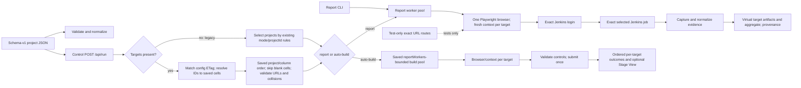

# Current architecture

This document covers schema-v1 configuration, report and Jenkins auto-build
workflows, Stage View monitoring, the loopback Control Page/API and flat
project/job matrix, local SecretStore and credential UI, report management,
the Control-only React final-report viewer/PDF export, and deterministic
verification boundaries. The report command remains report-only. Control
`POST /api/run` accepts legacy project selection or one bounded `targets` batch
of `{ projectId, columnId }` coordinates for either explicit mode. Matrix URLs
come only from the ETag-matched saved configuration; mode is never inferred
from URL, selector, CLI, or environment.

With wait enabled, each build returns an in-memory outcome carrying identity,
terminal result, and stage details when available.

The runner collects bounded Jenkins, Snyk, and SonarQube evidence and writes a
static normalized vulnerability report. Runtime navigation uses the exact URLs
in the project configuration. Tests may fulfill those exact URLs with
test-only Playwright routes; unmatched network requests are blocked.

See [system architecture](./system-architecture.md) for the component view; [report pipeline](./report-pipeline.md) covers
fixtures, aggregate/deletion, and the final-report viewer. [Phase 01](../plans/260925-1729-final-report-pdf-export/phase-01-control-report-viewer.md) documents the control-only React view.
[PDF export](./report-pipeline.md#client-side-pdf-export) shipped and passed Phase 03 verification on 2026-09-26: browser-side jsPDF/AutoTable composition from the validated React report DOM; persisted static report output remains unchanged.
See [multi-project configuration](./multi-project-configuration.md) for field contracts and [release gates](./release-gates.md) for validation.

Phase 01 defined schema-v1 matrix fields and pure legacy projection; Phase 02 added
the flat editor. Phase 03 keeps the saved document as sole editor state: pure
transitions cover projects, columns, cells, selections, and primary URL mirrors.
Clones copy URL cells, reset `selectedJobColumns` to `[]`, and start disabled
and ungrouped; edits sync raw JSON, validation, and dirty state.
schema errors are extracted to `utils/config-document-validation.ts`.
`replacementRevision` increments on successful load/switch or valid raw Apply,
not normal edits or Save acknowledgement. Loads use sequence guards; complete
Saves use `If-Match`; 409/412 preserve unsaved edits. The report CLI still
executes scalar `jobUrl`; the Control matrix API resolves selected coordinates
to distinct virtual targets (see [batch contract](./multi-project-configuration.md#control-batch-matrix-runs-phase-04)).

## Scope and operating modes

Production and tests use the same schema-v1 configuration shape:

| Source mode | Configuration | Page behavior |
| --- | --- | --- |
| runtime | schema-v1 project JSON passed with `--config` | real HTTP(S) navigation |
| test | schema-v1 test project JSON plus checked-in `templates/` | exact configured/discovered URLs fulfilled by test-only routes |

Project execution mode is independent of source mode:

| Execution mode | Selection boundary | Side effect |
| --- | --- | --- |
| `report` | Legacy: enabled projects normalized as `report`; matrix: selected coordinates in this request | capture publisher evidence and publish immutable reports |
| `auto-build` | Legacy: one exact or all enabled auto-build projects; matrix: selected coordinates in this request | submit validated parameterized Jenkins form(s); do not capture reports |

In legacy project selection, `runType` is an explicit project-only discriminator.
An omitted project value normalizes to `report`; it is never inferred and does
not itself trigger a build. Matrix runs instead use the request's single
`runType` for every selected cell while still requiring each source project to
be enabled. The report CLI selects report projects only.

The project JSON supplies exact Jenkins `loginUrl` and `jobUrl`, a project
`runType`, credential environment-variable names, selectors, source-origin
policy, browser, timeout, and artifact root. The job page is the
report-discovery boundary. Snyk report and summary links and the SonarQube home
link are discovered from that page; SonarQube Overall and Issues links are
followed from the validated home page.

The report CLI reads one validated config document, selects enabled report
projects, and runs them through one browser process. A fixed worker pool uses
one to four loops (default one), each with a fresh Playwright context and
absolute capture deadline. Outcomes remain in configuration order even when
completion order differs; a project failure does not stop its siblings.
Each auto-build project gets a dedicated browser and context.


```mermaid
flowchart LR
  Config[Schema-v1 project JSON] --> Validate[Validate and normalize]
  Config --> API[Control POST /api/run]
  API --> Request{Targets present?}
  Request -- no: legacy --> Legacy[Select projects by existing mode/projectId rules]
  Request -- yes --> Resolve[Match config ETag; resolve IDs to saved cells]
  Resolve --> Order[Saved project/column order; skip blank cells; validate URLs and collisions]
  Legacy --> Mode{report or auto-build}
  Order --> Mode
  CLI[Report CLI] --> ReportPool[Report worker pool]
  Mode -- report --> ReportPool
  ReportPool --> Browser[One Playwright browser; fresh context per target]
  Browser --> Login[Exact Jenkins login] --> Job[Exact selected Jenkins job]
  Job --> Capture[Capture and normalize evidence]
  Capture --> Artifact[Virtual target artifacts and aggregate; provenance]
  Mode -- auto-build --> BuildPool[Saved reportWorkers-bounded build pool]
  BuildPool --> BuildBrowser[Browser/context per target]
  BuildBrowser --> Submit[Validate controls; submit once]
  Submit --> BuildResult[Ordered per-target outcomes and optional Stage View]
  TestRoutes[Test-only exact URL routes] -. tests only .-> Browser
```

## Components

- `src/cli.ts` requires one schema-v1 project JSON and invokes the report
  runner. It has no auto-build command or template/runtime source switch.
- `src/config/` validates schema keys, exact HTTP(S) URLs, project-only
  `runType`, credential references, source origins, selectors, and bounded
  runtime settings through the browser-safe shared `assertProjectConfigDocument`
  boundary. Normalization defaults an omitted `runType` to `report`.
- `src/config/project-run-selection.ts` owns `selectReportProjects`,
  `selectAutoBuildProjects`, and `selectAutoBuildProject`. The list selectors
  return frozen, configuration-ordered enabled projects for their mode and
  fail if none remain; all selection is side-effect free.
- `src/config-selectors.ts` owns selector parsing and immutable defaults,
  including the build link and submit-button selectors.
- `src/config.ts` exposes the loader, normalized contracts, `RunType`, and all
  three selection helpers through the public configuration surface.
- `src/browser-launcher.ts` centralizes browser choice and environment-driven
  launch options (`PLAYWRIGHT_EXECUTABLE_PATH`, headless flags, and action
  delay) shared by report and auto-build callers.
- `src/project/report-worker-pool.ts` owns bounded index-claim loops and
  indexed outcomes. `src/runner.ts` owns one browser/report root and holds the
  root lock through settlement and publication; `runFromConfig` uses saved count.
- `src/project/project-workflow.ts` contains the direct report workflow and
  the separate login/job/trigger auto-build workflow.
- `src/project/auto-build-worker-pool.ts` bounds project concurrency and stores
  outcomes in configuration order; `src/project/auto-build-runner.ts` executes
  each project with its own context, deadline, safe outcome, and bounded cleanup.
- `src/jenkins/auth.ts` authenticates and opens the exact configured job page.
  `src/jenkins/url-identity.ts` validates exact job and `/build` action
  identities, including nested and repeatedly encoded `job/` segments.
- `src/jenkins/locators.ts` maps configured selectors to Playwright locators
  and reads candidate hrefs without trusting them. `build-trigger-validation.ts`
  enforces structural containers, control counts, class tokens, form method,
  and exact action URL. `src/jenkins/build-trigger.ts` performs one guarded
  submission; monitoring is in `src/jenkins/stage-view.ts`, parsing in
  `src/jenkins/stage-view-parser.ts`, and contracts in
  `src/jenkins/stage-view-types.ts`.
- `src/reports/snyk/` and `src/reports/sonarqube/` validate allowed links,
  handle SonarQube login redirects when required, capture bounded visible
  evidence, and normalize source-specific results.
- `src/artifacts/` owns immutable report identities, bounded manifest discovery,
  aggregate-index construction/publication/recovery, staging, and cleanup.
- `src/artifacts/report-project-deletion.ts` removes project trees;
  `src/artifacts/report-run-deletion.ts` removes one run, prunes empty projects, and both services lock/rebuild aggregates.
- `src/reporting/project-report-route.ts` is a browser-safe exact matcher for safe project/run report paths shared by the control router and React app.
- `src/reporting/project-report-body-renderer.ts` composes the escaped report body shared by React and static output; the viewer's `ReportExportButton` passes its ready DOM to the separate jsPDF/AutoTable composer documented in [report pipeline](./report-pipeline.md#client-side-pdf-export).
- `src/reporting/report-server-control-reports-api.ts` handles guarded whole-project and per-run `DELETE` endpoints.
- `src/reporting/report-server-control.ts` validates Host, preflights final-
  report indexes, and serves a control shell before static report fallback.
- `src/reporting/control-page/` contains the Control Dashboard React frontend:
  `types/index.ts` re-exports schema contracts; `useConfigManager.ts` owns config
  I/O, sequence-guarded loads, `If-Match` saves, and conflict recovery.
  `useConfigDocumentEditor.ts` owns shared document/raw-JSON/dirty/replacement
  state; schema issue extraction lives in `utils/config-document-validation.ts`.
  Project/default and matrix transition modules own pure edits, dispatched by
  `use-matrix-editor-handlers.ts`; legacy group operations stay isolated in
  `use-legacy-group-handlers.ts`.
  - [`ProjectsJobMatrix`](../src/reporting/control-page/components/organisms/projects-job-matrix.tsx)
    renders one row per project with enabled, ID/name, shared job columns, URL
    cells, fixed per-row target checkboxes, and row actions. Its toolbar adds
    projects/columns and opens defaults; the table scrolls horizontally inside
    the matrix.
  - [`MatrixRow`](../src/reporting/control-page/components/organisms/matrix-row.tsx),
    [`MatrixToolbar`](../src/reporting/control-page/components/organisms/matrix-toolbar.tsx),
    and [`AddColumnDialog`](../src/reporting/control-page/components/organisms/add-column-dialog.tsx)
    compose project and column controls. Column headers rename or confirm
    removal; removal drops matching cells/selections and recomputes `jobUrl`.
  - [`JobColumnHeader`](../src/reporting/control-page/components/molecules/job-column-header.tsx),
    [`ProjectJobCell`](../src/reporting/control-page/components/molecules/project-job-cell.tsx),
    [`ProjectJobSelection`](../src/reporting/control-page/components/molecules/project-job-selection.tsx),
    [`MatrixRowSettings`](../src/reporting/control-page/components/molecules/matrix-row-settings.tsx),
    and [`ConfigDefaultsDialog`](../src/reporting/control-page/components/molecules/config-defaults-dialog.tsx)
    provide column, URL, target, project-settings, and defaults controls.
  - `DashboardPage` supplies matrix, raw JSON, action, and run sections to
    `DashboardLayout`; runs require a clean, valid saved document and selected
    nonblank targets. `ExecutionSection` exposes report/build actions and the
    saved 1–4 Workers selector; credentials and browser settings remain dialogs.
    `ReportManagementPage` and `FinalProjectReportPage` use separate templates;
    `App.tsx` routes views and `ErrorBoundary` wraps them.
  - The clean cutover deleted `ProjectsGrid`, `ProjectCard`, the project-group
    board/column/dialog components, `ConfigFormBuilder`, and
    `ConfigProjectEditor`, with no compatibility aliases. Optional
    `projectGroups`/`groupId` remain schema data, preserved by normal matrix
    edits, but the Dashboard has no group-management UI.
  - The five UI tiers remain atoms → molecules → organisms → templates →
    pages. Shared component/layout contracts live in
    `types/component-contracts.ts`; Vite emits the strict-CSP single JS/CSS
    bundle. Legacy imperative assets (`control-page.js`, `control-page.html`,
    `control-page.css`) were removed in Phase 06.
  - [`ReportExportButton`](../src/reporting/control-page/components/molecules/ReportExportButton.tsx)
    and the final-report page expose the client-side PDF flow; report-management
    tables/dialogs remain separate from the project matrix.
- `src/reporting/report-server-control-page.ts` reads Vite-built assets from
  `.runner-build/reporting/control-page/`, injects the instance CSRF token into
  `index.html`, and provides cached CSS and JS.
- `scripts/copy-report-assets.mjs` stages `report.css` to
  `.runner-build/reporting/report.css` without overwriting Vite outputs.
- `src/reporting/report-server-control-api.ts` parses legacy or strict matrix
  run requests; it rejects request `workerCount` and re-exports `handleSecretsApi`.
- `src/reporting/report-server-control-secrets-api.ts` handles guarded
  presence-only secret operations; `report-server-control-security.ts` centralizes
  Host, Origin, Fetch Metadata, CSRF, and content-type gates.
- `src/reporting/report-server-run-manager.ts` enforces one active run and stores
  target coordinates; `report-server-run-executor.ts` snapshots secrets and
  dispatches legacy or matrix execution.
- `src/reporting/control-run-targets.ts` resolves saved coordinates in order,
  skips blank cells, validates URLs, and creates virtual projects;
  `control-run-targets-validation.ts` parses bounded IDs, while
  `control-run-targets-collision.ts` rejects retained report-history collisions.
- `src/reporting/control-run-matrix-executor.ts` reuses report/build pools with
  saved `reportWorkers` and records ordered per-target outcomes/provenance.
- `src/templates/template-report-fixture.ts` is the public template facade; it
  re-exports the supported loader, response, route, types, and size-boundary API.
- `src/templates/template-fixture-types.ts` defines the fixture, response, route
  miss/recorder, file-identity, read-budget, artifact-link, and Sonar route contracts.
- `src/templates/template-fixture-file-io.ts` resolves a canonical template root
  and performs descriptor/no-follow, identity, symlink, and byte-budgeted reads.
- `src/templates/template-fixture-html.ts` owns bounded HTML parsing, URL checks,
  canonical/form/link rewrites, artifact selection, and exact fixture matching.
- `src/templates/template-fixture-sonarqube.ts` validates SonarQube identities
  and rewrites dashboard/issues links for the synthetic fixture origin.
- `src/templates/template-fixture-build-validation.ts` derives the build link
  from `#side-panel` and validates build canonical, form, sticker, and button controls.
- `src/templates/template-fixture-loader.ts` reads and validates the nine saved
  inputs, derives build/report/Sonar destinations, and assembles the fixture.
- `src/templates/template-fixture-routes.ts` fulfills exact fixture URLs and
  records sanitized default-deny route misses.
- `templates/jenkins-template/template-build.html` is the minimal saved-origin
  build-detail page used for canonical/action and DOM-contract validation.
- `templates/` is the checked-in browser fixture corpus. Test-only routes map
  exact URLs from saved pages to those files and abort unmatched network.

## Configuration boundary

### Schema-v1 file mode

The root has `schemaVersion: 1`, `projects`, optional `defaults`, optional
`reportWorkers` (1–4, default 1), and optional `jobColumns`.
Matrix documents require project `jobs` and `selectedJobColumns`; scalar
`jobUrl` mirrors the first nonblank cell. `reportWorkers` bounds report and
Control API auto-build batches; nested placement is rejected.
There must be 1–50 projects and at least one enabled entry. Each project
requires a unique safe ID, display name, exact Jenkins `loginUrl` and `jobUrl`
on the same canonical Jenkins origin and base context.

`waitForCompletion` is optional in `defaults` and per project; project values
override defaults. If absent from both, normalized default is `true`. It
applies to auto-build only; report workflows ignore it.

The runtime command receives the JSON path explicitly:

```text
npm run report -- --config config/<projects>.json
```

The file is validated before browser launch. Unknown keys, duplicate IDs,
missing enabled projects, unsafe selectors, invalid or credential-bearing URLs,
unsafe paths, embedded secret values, and out-of-range settings are rejected.
Legacy structural keys such as `baseUrl`, `jobPath`, `captureFrom`, and
`buildNumber`, plus structural environment inputs such as `REPORT_SOURCE`,
`PROJECTS_CONFIG_PATH`, and legacy `JENKINS_*` project settings, are rejected.

Project groups are optional schema-v1 presentation metadata in the saved document; membership lives on each project and does not change normalized execution or project order. See [multi-project configuration](./multi-project-configuration.md#optional-project-groups).
### Run mode and selector contract

`runType` accepts exactly `'report'` or `'auto-build'`. Missing input is
normalized to `'report'`, preserving existing schema-v1 documents as report
projects. `runType` is deliberately absent from `ProjectConfigDefaults`, so
`defaults.runType` is rejected as an unknown key. No environment setting is
read for mode selection; do not use environment configuration to mass-enable
auto-build.

Selection happens on normalized projects:

| Helper | Contract |
| --- | --- |
| `selectReportProjects(projects)` | Returns a frozen list containing only enabled projects with `runType === 'report'`; disabled and auto-build entries never enter the report set. It fails when no enabled report project exists. |
| `selectAutoBuildProject(projects, projectId)` | Requires an exact, non-empty project ID and returns one project only when it is enabled and `runType === 'auto-build'`; missing, disabled, and report projects fail closed. |
| `selectAutoBuildProjects(projects)` | Returns a frozen, configuration-ordered list of enabled `auto-build` projects; fails when none remain. |

These helpers are exported by `src/config.ts` and are side-effect free. A legacy
Control `POST /api/run` without `targets` uses them: report selects report
projects; auto-build selects one `projectId` or all enabled auto-build projects.
With `targets`, `control-run-targets.ts` resolves coordinates instead and
applies the request mode to each virtual project. `runFromConfig` still dispatches
only `selectReportProjects(...)`.

All selector fields are available under `defaults.selectors` and
`projects[*].selectors`; project values override defaults. The normalized
defaults are:

| Selector | Kind | Value | Name | Required |
| --- | --- | --- | --- | --- |
| `authLandmark` | `role` | `link` | `Manage Jenkins` | `true` |
| `sonarqubeReport` | `testId` | `sonarqube-report` | — | `true` |
| `snykReport` | `testId` | `snyk-report` | — | `true` |
| `buildParametersLink` | `role` | `link` | `Build with Parameters` | `true` |
| `buildSubmitButton` | `role` | `button` | `Build` | `true` |

`buildParametersLink` and `buildSubmitButton` must remain required. Omitting
`required` defaults it to `true`; an explicit `required: false` override is
rejected for either field. Their Jenkins search scopes (`#side-panel` and
`#bottom-sticker`, respectively) remain runtime code rather than configurable
CSS. Selector values do not change the configured `jobUrl` or branch identity.

### Credential and control-plane implementation map

| Path | Responsibility |
| --- | --- |
| `src/types.ts` | Defines `RunType` and the complete selector shape. |
| `src/config/*` | Validates, normalizes, and selects project run contracts; environment helpers keep mode out of legacy configuration. |
| `src/config-selectors.ts` | Defines selector kinds, parsing, and build-control defaults. |
| `src/config.ts` | Re-exports config types, loader, and selection helpers. |
| `src/jenkins/runner-config.ts` | Carries required build selectors into Jenkins runner configuration. |
| `config/projects.example.json` | Shows explicit enabled report and disabled auto-build project entries. |
| `config/projects.template.json` | Pre-configured runnable schema-v1 document for local template fixture mock server testing. |
| `src/reporting/report-server-constants.ts` | Defines the fixed secret filename and 1 MiB secret-file/body boundaries. |
| `src/reporting/report-server-secret-store.ts` | Canonical, atomic, locked local secret persistence and validated read/list/update/delete operations. |
| `src/reporting/report-server-control-security.ts` | Applies control security headers and Host/Origin/Fetch Metadata/CSRF/content-type gates. |
| `src/reporting/report-server-control-secrets-api.ts` | Implements the modular presence-only secrets API handler. |
| `src/reporting/report-server-control-api.ts` | Owns config/run handlers and re-exports the secrets handler as the API facade. |
| `src/reporting/report-server-control.ts` | Validates Host, routes `/api/secrets`, and carries the optional `SecretStore` context dependency. |
| `src/reporting/report-server.ts` | Creates the `SecretStore` in loopback control mode and exposes it on `ReportServerHandle`. |
| `src/reporting/report-server-run-manager.ts` | Owns the single-active-run lifecycle and carries the optional `SecretStore` dependency. |
| `src/reporting/report-server-run-executor.ts` | Reads one SecretStore snapshot, merges the run environment, dispatches the selected executor, and redacts control-run output. |
| `tests/unit/report-server-secret-store.spec.ts` | Exercises Phase 01 persistence and control-server wiring. |
| `tests/unit/control-secret-store.spec.ts` | Exercises Phase 05 SecretStore lifecycle, atomic-file cleanup, platform permission handling, key/value validation, concurrent writes, and deletion. |
| `tests/unit/control-secrets-api.spec.ts` | Exercises Phase 05 endpoint presence, guarded patch/delete semantics, filtering, persistence, and plaintext-free responses. |
| `tests/unit/control-secrets-security.spec.ts` | Exercises redaction, validation, method/content-type handling, and security gates. |

### Secret resolution

The JSON retains only names such as:

```json
{
  "credentials": {
    "usernameVariable": "JENKINS_USERNAME",
    "passwordVariable": "JENKINS_PASSWORD"
  }
}
```

At run time, the corresponding environment values are required for each
enabled project. Values are not copied into normalized configuration,
diagnostics, URLs, screenshots, traces, storage state, or reports. The JSON
must never contain passwords, tokens, cookies, or credential-bearing URLs.

Phase 01 adds a separate local `SecretStore` backend for control-plane
credential persistence. `createSecretStore(configRoot)` canonicalizes an
existing, non-symlinked directory and fixes the target to
`config/secrets.local.json`; callers cannot choose a filename or path. A
missing or empty file reads as an empty map. Existing content must be a JSON
object no larger than `MAX_SECRET_FILE_BYTES` (1 MiB), with keys matching
`/^[A-Za-z_][A-Za-z0-9_]{0,127}$/`, excluding `__proto__`, `prototype`, and
`constructor`, and string values.

`readSecrets()` and `listSecretNames()` return frozen snapshots. Mutations use
`putSecret`, `putSecrets`, `deleteSecret`, or `deleteSecrets`; each validates
names and values, reads the latest map under an in-memory write lock, sorts
keys, and serializes deterministic JSON. Writes create an exclusive sibling
temporary file with mode `0o600`, write and sync it, close it, then rename it
over the fixed target. A failed rename removes the temporary file and leaves
the previous target in place. Windows does not enforce POSIX mode bits as an
ACL boundary, so directory ACLs remain the protection boundary there.

Control mode initializes one store alongside `ConfigStore` and exposes it on
the server handle and router context. Phase 02 routes `/api/secrets` through
the dedicated handler described below.

### Control-run environment injection (Phase 03)

`executeControlRun` reads one `SecretStore` snapshot at execution start and
creates a new environment object with `{ ...env, ...storedSecrets }`. Stored
values therefore take precedence over the caller-supplied environment, while
neither the caller object nor `process.env` is mutated. The merged object is
used for config normalization and passed as `runtimeEnvironment` to either
the report executor or the auto-build executor. Direct CLI/library callers
without a control run continue to resolve credentials from their supplied
environment.

All non-empty values from the snapshot form the control-run redaction set.
`addLog` messages, report warnings, caught error messages/stacks, and
auto-build `jobUrl`/`buildPageUrl` result fields are redacted before they are
stored in the control run record. The local report URL is generated only from
the validated report-relative path. Downstream auto-build execution also
clears its mutable resolved credential copy during cleanup.

### Control secrets API contract

`handleControlRequest` rejects an invalid Host before dispatching an API route.
`handleSecretsApi` returns a presence map and never serializes secret values:

| Request | Input and gates | Result |
| --- | --- | --- |
| `GET /api/secrets` | Exact bound Host; optional `keys=NAME_A,NAME_B` filter | `200 { "secrets": { "NAME_A": true } }` for stored names |
| `PUT /api/secrets` | Host, same-origin Origin, accepted Fetch Metadata, CSRF token, JSON content type, and ≤1 MiB JSON object | `200` full post-update presence map |
| `DELETE /api/secrets?name=NAME` | Same mutation gates and valid query name | `200` full post-delete presence map |
| `DELETE /api/secrets` | Same gates and `{ "name": "NAME" }` or `{ "names": ["NAME"] }` JSON body | `200` full post-delete presence map |

PUT accepts a single `{ "name": "NAME", "value": "VALUE" }` object or a
non-empty `{ "secrets": { "NAME": "VALUE" } }` patch. A null patch value or
`action: "delete"` removes a key. Filtered GET responses include each valid
requested key with `true` or `false`; unfiltered responses include sorted
stored names with `true`. Invalid keys/values/bodies return `400`; invalid
mutation security returns `403`; wrong content type returns `415`; an absent
store returns `503`; unsupported methods return `405` with `Allow`. Every API
response uses `Cache-Control: no-store`.

### Test configuration

Tests load the same schema-v1 shape with non-routable fixture URLs. The
test-only router reads nine checked-in files below `templates/`, derives the
build detail URL from the unique saved Jenkins link, derives Snyk and SonarQube
destinations from saved canonical pages, and fulfills only exact synthetic URLs.
Fixture paths are canonical, traversal- and symlink-safe, size-bounded, and
never read from runtime project JSON.


## Per-project workflow

### Report workflow

The report path submits credentials only to the configured Jenkins login
destination, validates the final authenticated page, opens the exact
configured job page, discovers publisher links once, and captures evidence
from those destinations. It never searches for another job, opens a build
page, submits a form, inspects queues or build identities, polls terminal
status, or accepts a build-number override.

### Auto-build workflow

The auto-build path reuses the same credential resolution, login validation,
exact job navigation, and one absolute `WorkflowDeadline`, then validates the
scoped **Build with Parameters** link and **Build** form before clicking once.

When `waitForCompletion` is enabled (the default), the trigger snapshots the
latest Stage View run ID before submission. After an accepted POST it returns
to the job page and tracks a newer run (or a fresh in-progress run if there was
no baseline). `stage-view.ts` polls the page until the run reaches `SUCCESS`,
`FAILED`, `UNSTABLE`, or `ABORTED`, logging stage changes along the way.
`stage-view-parser.ts` maps row and cell classes, stage names, and durations;
`stage-view-types.ts` defines the run, status, and stage contracts.

With waiting disabled, an accepted POST returns `submitted` immediately. HTTP
responses at or above 400 are `rejected`; an observed POST without a
determinate response is `submission-unknown`. Pre-POST failures become
sanitized `failed-before-submit` outcomes, and possible side effects are never
retried. A completed `SUCCESS` maps to `succeeded`; other terminal statuses map
to `failed`. A timeout includes any observed build number, current result, and
stage breakdown. Outcomes do not expose form bodies, parameters, crumbs,
headers, cookies, or response bodies, and auto-build does not persist reports.

The matrix settings dialog persists per-project login URL, browser, timeouts,
artifact directory, credential references, enabled state, and
`waitForCompletion`; a separate defaults dialog edits shared defaults.
`ExecutionSection` exposes report/build actions and a saved **Workers** selector
(`reportWorkers`, 1–4). Edits require a valid, clean, ETag-saved document before
execution; the saved count is never sent as request-level `workerCount`.

The Dashboard sends one `POST /api/run` with `targets: [{ projectId, columnId }]`
from selected columns on enabled rows and one `runType`. The API rejects
malformed/duplicate/oversized coordinates, unknown matrix fields, and a
simultaneous `projectId`; URL fields are unsupported and request-level
`workerCount` is rejected.

The executor resolves targets from the saved document in project/column order,
skips blank cells, and rejects an all-blank batch. Each cell becomes virtual
`${projectId}--${columnId}` with source/column provenance. The report CLI stays
scalar-`jobUrl`; matrix targets apply only to Control. No per-cell mode control.

Every configured, discovered, redirected, and final URL in either path must be
credential-free HTTP(S) and inside its allowed canonical origin. Context and
browser cleanup is bounded and best-effort.
Report fixtures, evidence normalization, immutable artifacts, and aggregate
index discovery/publication are detailed in [report pipeline](./report-pipeline.md).

## Locking, cleanup, and server modes

The private report-root lease coordinates same-host work using token, PID,
hostname, acquisition timestamp, and expiry. It is not a distributed lock or
an authorization boundary. Stale recovery requires an expired same-host owner
whose PID is demonstrably dead; malformed, live-owner, foreign-host, and
symlinked locks fail closed.

Cleanup inspects only configured canonical report/staging roots, enforces
bounded age/entry/byte/removal budgets, refuses symlink traversal, and
preserves active, malformed, oversized, or ambiguous entries with warnings.

### Report Server (`npm run serve:report`)

`npm run serve:report` builds the launcher and serves an existing aggregate
under `reports/` by default (`127.0.0.1:4173`). It does not generate reports.
`REPORT_ROOT`, `REPORT_HOST`, `REPORT_PORT`, and explicit LAN opt-in control
serving only; the server is read-only, unauthenticated, and limited to
GET/HEAD below the canonical root.

### Control Server (`npm run serve:control`)

`npm run serve:control` builds and launches the interactive loopback control
dashboard (`127.0.0.1:4173`). It exposes:

- Safe config discovery (`GET /api/configs`) and atomic updates
  (`PUT /api/config`) with ETag and schema validation;
- One active report or auto-build run (`POST /api/run`), either legacy project
  selection or a matrix coordinate batch; status and live logs via `GET /api/run`;
- Ordered per-target report/build outcomes, local report links, and safe
  `GET /reports/...` access;
- Presence-only credential status and guarded updates/deletes under
  `GET`/`PUT`/`DELETE /api/secrets`;
- Direct navigation to the persistent report index (`GET /reports/index.html`);
  and safe whole-project/run report deletion under the guarded DELETE routes.

### Persistent report management and deletion

Control mode exposes whole-project and individual-run endpoints:
`DELETE /api/reports/projects/:projectId` and `/api/reports/projects/:projectId/runs/:runId`.

#### Whole-project HTTP contract
`DELETE /api/reports/projects/:projectId` is available only in loopback control
mode; `serve:report` remains GET/HEAD-only. The router checks Host before
dispatch. Mutation requests also require same-origin `Origin`, accepted
`Sec-Fetch-*` metadata, the CSRF token, and JSON content type when a body is
present. A request may be bodyless or carry an empty JSON object; JSON parsing
uses the shared 1 MiB body limit.

Errors use `{ "error": { "code": "...", "message": "..." } }`.

| Outcome | Status and contract |
| --- | --- |
| Deleted | `200` with `{ success: true, projectId, deletedRunsCount }`. |
| Invalid ID or malformed/non-empty JSON object | `400`; `INVALID_PROJECT_ID` or `INVALID_BODY`. |
| Host or mutation security gate fails | `403`; `FORBIDDEN_HOST` or `FORBIDDEN_MUTATION`. |
| Method other than DELETE | `405 METHOD_NOT_ALLOWED` and `Allow: DELETE`. |
| No validated retained runs for the project | `404 PROJECT_NOT_FOUND`; the directory is not removed. |
| Live/unsafe report-root lock prevents acquisition | `409 REPORT_ROOT_LOCKED`; no project data is removed. |
| Oversized body or unsupported body content type | `413` or `415`. |
| Incomplete discovery, unsafe tree, filesystem, or index failure | `500`; deletion is refused before removal when possible. |

#### Deletion semantics and filesystem safety
`projectId` must match `SAFE_ID` (`/^[a-z0-9][a-z0-9-_]{0,80}$/u`) and occupy
one path segment. The handler decodes it once and rejects encoded separators,
null bytes, double-encoded paths, traversal, `assets`, and dot-prefixed names.
The service verifies the real target directory is a direct child of the
canonical report root and refuses symlinks or non-file/non-directory entries.
The bounded preflight limits the tree to 32 directory levels, 4,096 entries,
and 256 MiB.

The service requires complete manifest discovery and at least one validated
run before deleting the entire `reports/<projectId>/` subtree, including
unvalidated files. `deletedRunsCount` counts validated runs only. Project
configuration, sibling project directories, and shared `reports/assets/`
remain untouched.

#### Locking and aggregate rebuild
`deleteProjectReports()` acquires the canonical `.report-root-lock` through
`ArtifactPaths.acquireReportRootLock({ waitMs: 0 })` before recovery, discovery,
or filesystem changes. This serializes deletion with report operations using
the same lock; a live or unsafe lock returns `409 REPORT_ROOT_LOCKED` without
waiting.

After removal, the service rediscovers manifests and refuses to publish from
incomplete discovery. It calls `buildAggregateIndex` without current outcomes,
so `aggregate-data.json` and `index.html` contain only surviving validated
history; an empty project list is valid. `writeAggregateDataPair` stages and
publishes the pair with its journal/backup rollback and file-size checks.
Removal or refresh failures trigger a best-effort recovery/rebuild. If removal
succeeded but refresh still fails, the API returns `500 REFRESH_FAILED` and
reports that the project was deleted and the index may need recovery.

#### UI confirmation and navigation
The Dashboard **Reports** link opens `/reports/index.html`; the control router
intercepts exact `GET`/`HEAD` before static routing and returns the CSRF-bearing
Vite shell with `CONTROL_CSP`/no-store; `HEAD` preserves HTML length without a
body. The page fetches `/reports/aggregate-data.json` with no-store, independent
of active configuration. Missing/empty inventory shows empty state; invalid
schema shows corrupt-data feedback, while parse/fetch failures show load errors.
Safe local links, warnings, and history remain visible. Per-project tables page
newest-first runs independently by 20. **Delete Reports** opens a labeled Radix
confirmation and sends whole-project deletion only after confirmation.
Each run row's **Delete** opens a labeled confirmation naming project and run
and stating that only that run and its artifacts will be permanently removed.
Cancel/Escape closes without mutation; controls disable in-flight and confirm shows a spinner.
`useDeleteRun` uses the shared CSRF-aware client for
`DELETE /api/reports/projects/:projectId/runs/:runId`. Success and `404` refresh
inventory; `409` offers retry guidance; other errors warn disk state may have changed.
Deleting the last run removes its project from the aggregate inventory.
Whole-project deletion uses its CSRF-aware endpoint and refreshes on success/`404`.
Both deletion flows are control-only. Persisted `reports/index.html` remains
static/scriptless, and `serve:report` plus immutable artifacts remain GET/HEAD-only.

#### Serving modes
`serve:report` remains strictly read-only and unauthenticated (GET/HEAD only).
All deletion operations are restricted to the same-origin, CSRF-gated loopback
Control Server API. Immutable run links for remaining projects remain unchanged.

Control mode initializes `SecretStore` against the configured `configRoot`.
The secrets endpoint reads and writes only the fixed `secrets.local.json`
target. It returns `{ "secrets": { "<name>": true } }` for stored names;
`GET /api/secrets?keys=A,B` reports each requested valid name as `true` or
`false`. PUT accepts a single name/value or a non-empty secrets object; null
values and `action: "delete"` remove entries. DELETE accepts a `name` query or
JSON `name`/`names` body.

Control mode is restricted strictly to loopback (`127.0.0.1` / `localhost`) and
refuses LAN binding. The router checks the exact Host before dispatch. Every
mutation additionally requires an exact same-origin HTTP(S) Origin, accepted
`Sec-Fetch-Site`/`Sec-Fetch-Mode` values, the generated CSRF token, and
`application/json` (except bodyless DELETE). Bodies are capped at the 1 MiB
control limit. All responses set `Cache-Control: no-store`; secret values
never appear in API success or error responses.

The page's **Credentials** dialog derives a deduplicated, sorted key list from
the active configuration, then calls the filtered presence GET. It renders
blank password inputs with **Configured**/**Missing** badges. Save sends only
non-empty trimmed values through the CSRF-bearing JSON PUT; clear sends a
CSRF-bearing bodyless DELETE for one key. Successful save/clear and every
dialog close wipe input values, so the browser retains no submitted or
unsaved plaintext. Status text and API responses contain names/presence only.

When `POST /api/run` starts a control run, the run executor reads the current
SecretStore snapshot and merges it over the supplied base environment without
mutating `process.env`. It passes that `runtimeEnvironment` to both report and
auto-build executors. Control logs, warnings, errors, and auto-build result
URLs are redacted with all non-empty stored values before persistence.

### Bounded report execution (Phase 01)

The optional top-level `reportWorkers` in `ProjectConfigDocumentV1` accepts an
integer from 1 through 4; omission defaults to 1. `ConfigStore` validates and
saves it with the document through the existing read/write and ETag flow.
The setting bounds report batches and the separate Control API auto-build pool; it is not a per-project request override.

`loadProjectConfigWithDocument` reads the JSON once and returns the validated
document with normalized projects; `loadProjectConfig` retains its existing
normalized-array contract. `runFromConfig` selects report projects and forwards
the saved count. Direct `runConfiguredProjects` callers may set `workerCount`,
which is validated before artifact initialization or browser launch.

The runner starts `min(workerCount, selected projects)` fixed in-process loops
against one browser. Every project gets a fresh context and its own absolute
workflow deadline. Indexed outcomes preserve configuration order; a rejected
project becomes failed/unallocated while its worker continues with queued work.
All loops settle before browser close. The root lock remains held through
workers, close, cleanup, manifest discovery, and aggregate publication.
Duplicate direct-call project IDs fail before artifact or browser side effects.
Control auto-build now uses the saved concurrency setting and ordered outcomes.

`POST /api/run` rejects request-level `workerCount` before admission; execution
requires the saved ETag. The saved `reportWorkers` value (1–4, default 1) also
bounds control auto-build workers; the single-active-run guard remains
unchanged.


### Template Server (`npm run serve:templates`)

`npm run serve:templates` builds the project and launches the standalone template mock HTTP server on loopback (`127.0.0.1:4174` by default). It serves offline template fixtures (Jenkins job pages, parameterized build, Snyk evidence, and SonarQube dashboards/issues) dynamically in memory for interactive browser preview and offline test runs.

The server operates on its own origin/port (`4174`) completely separated from the Control Server (`4173`) to maintain strict Same-Origin Policy isolation. Configurable via `--host` (`TEMPLATE_HOST`, default `127.0.0.1`) and `--port` (`TEMPLATE_PORT`, default `4174`). Graceful shutdown is wired to SIGINT and SIGTERM.

#### Developer Hub Index Page (`GET /`, `GET /index.html`)

The template server exposes a built-in Developer Hub index page on `GET /` and `GET /index.html` (along with `HEAD`), generated by [`buildDeveloperHubHtml`](../src/templates/template-server.ts#L78) from [`DeveloperHubEndpoints`](../src/templates/template-server.ts#L51). It provides a responsive dark-themed dashboard indexing all 9 offline fixture endpoints categorized with service badges, descriptions, and dynamic origin links:
- **Jenkins**:
  - `Jenkins Login`: authentication entrypoint (`/login`)
  - `Jenkins Job Page`: main project page linking reports and builds (`/job/template-fixture-job/`)
  - `Jenkins Build (Parameterized)`: build parameter form with trigger action (`/job/template-fixture-job/build?delay=0sec`)
- **Snyk**:
  - `Snyk Report`: vulnerability scan HTML report artifact (`/snyk-report.html`)
  - `Snyk Summary (JSON)`: raw JSON summary of SCA findings and severity counts (`/snyk-summary.json`)
- **SonarQube**:
  - `SonarQube Login`: authentication entrypoint (`/sessions/new`)
  - `SonarQube Home`: project dashboard (`/dashboard?id=template-fixture-project`), guarded until authenticated
  - `SonarQube Overall`: overall code quality metrics (`/project/overview?id=template-fixture-project`)
  - `SonarQube Issues`: issue list with severity facets (`/project/issues?id=template-fixture-project&resolved=false`)

Security and delivery specifications:
- Pre-buffered in UTF-8 memory during [`createTemplateServer`](../src/templates/template-server.ts#L433) startup for zero per-request render overhead.
- Strict security headers: `Content-Security-Policy: default-src 'none'; style-src 'unsafe-inline'`, `X-Frame-Options: DENY`, `X-Content-Type-Options: nosniff`, and `Cache-Control: no-store, must-revalidate`.
- Defends against XSS via HTML escaping and safe URL validation (`validateSafeHubUrl`), rejecting non-HTTP/HTTPS schemes such as `javascript:` or `data:`.

#### Template Server Validation & Integration (Phase 05)

The standalone template mock server and its accompanying configuration are validated via [`tests/e2e/template-server-integration.spec.ts`](../tests/e2e/template-server-integration.spec.ts), executed through [`playwright.template.config.ts`](../playwright.template.config.ts).

The test harness exercises the following architectural boundaries:
- **Smoke test automation**: Browser navigation across the Developer Hub and all 9 mock fixture endpoints, verifying HTTP 200/302 status codes, expected HTML/JSON contents, and absence of browser console errors.
- **Session authentication guarding**: Simulates SonarQube's authentication lifecycle where unauthenticated visits to `/dashboard` serve the login page until a form POST on `/sessions/new` marks the session authenticated.
- **URL path encoding preservation**: Ensures double-encoded slash sequences (`%252F`) in Jenkins job paths round-trip accurately through Node.js HTTP request parsing without double-decoding defects.
- **Server process isolation**: Confirms Control Server (`4173`) and Template Server (`4174`) bind and run concurrently on loopback without port collisions or cross-origin interference.
- **Schema-v1 config validation**: Validates [`config/projects.template.json`](../config/projects.template.json) parsing and normalization through `loadProjectConfig`, confirming proper mapping of `TEMPLATE_FIXTURE_USERNAME` and `TEMPLATE_FIXTURE_PASSWORD`.
- **End-to-end report collection**: Dispatches `runConfiguredProjects` against the live HTTP template server, confirming creation of compliant `reports/template-fixture-service/{run-id}/` report artifacts (`index.html`, `data.json`) containing parsed Snyk and SonarQube evidence.
- **Auto-build execution**: Dispatches `runAutoBuildProject` against the live HTTP template server, validating form submission and 302 redirect.
- **Control Page UI integration**: Mounts `projects.template.json` within the Control Dashboard UI, asserting clean matrix-row rendering with zero cross-origin or CSP security violation console errors.

### Control Dashboard and flat project/job matrix (Phases 02–04)

The Vite-built React app uses atoms → molecules → organisms → templates →
pages. `DashboardPage` coordinates config state, matrix, Raw JSON, execution,
credentials, and browser settings; history and final reports have separate pages.

`ProjectsJobMatrix` renders enabled project rows, shared job URL columns,
selected-column controls, and row/column actions. The shared editor validates
and synchronizes structured edits with Raw JSON, saves through ETag, and
projects legacy documents in memory until explicit Save. Clones copy URL cells,
start disabled/ungrouped, and clear selected columns.

For either mode, the Dashboard sends one `POST /api/run` with
`targets: [{ projectId, columnId }]` derived from enabled rows'
`selectedJobColumns`. It requires valid, saved config, a nonblank target, and no
active run. The API resolves against the ETag-matched document, orders by saved
project/column order, skips blank cells, and rejects invalid coordinates,
disabled projects, unsafe Jenkins URLs, and target ID collisions before browser
launch. Report runs also fail closed on retained artifact-history collisions.
Legacy requests without `targets` preserve project-based selection.

Each cell becomes a virtual `${projectId}--${columnId}` project with saved
settings, selected URL, and request mode. Existing report/build pools use saved
`reportWorkers`; reports receive separate artifact trees and per-target local
links, builds receive per-target build/stage outcomes. Optional schema-v3
provenance records source project, column, and URL; old manifests without it
remain valid. Batch status fails when any target fails. Secrets are redacted.

The report CLI remains scalar-`jobUrl`; `selectedJobColumns` drives Control UI
selection only. No per-cell mode control exists. The old grouped board and
separate form editor were removed without aliases; Raw JSON remains the escape
hatch for other fields.

Phase 02 review passed 73/73 unit and 22/22 Chromium E2E checks; see the
[review](../plans/260930-0250-flat-project-job-matrix/code-review-260930-0941-phase-02-spreadsheet-matrix-ui-components.md).
Phase 04 passed 79 unit and 22 Chromium E2E checks (101/101); typecheck and
build passed, review approved 9.6/10. See the
[Phase 04 review](../plans/260930-0250-flat-project-job-matrix/code-review-260930-1317-phase-04-multi-job-execution-engine-and-api.md).

## Test and release boundary

The deterministic order is `npm ci`, `npm run install:browsers`,
`npm run typecheck`, `npm run build`, `npm run test:unit`,
`npm run test:e2e:templates`, `npm run test:control`, `npm run test:report`,
and `npm run test:release:webkit`. `npm run build` compiles TypeScript
CLI/server code to `.runner-build/`, bundles the Vite Control Dashboard into
`.runner-build/reporting/control-page/`, and copies `report.css` via
`scripts/copy-report-assets.mjs`. `npm run test:release` is the shorthand
for typecheck, build, unit, template, control, generated-report, and WebKit
gates. Template tests use exact-URL test-only routes and checked-in fixtures;
they do not claim live Jenkins or vendor execution. Runtime smoke validation
requires an authorized project JSON and injected credentials and is never part
of the deterministic suite.

Phase 2, Phase 3, and Phase 03 focused unit coverage is in
`tests/unit/jenkins-build-trigger.spec.ts`,
`tests/unit/auto-build-runner.spec.ts`,
`tests/unit/template-build-fixture.spec.ts`, and the report-selection
assertions in `tests/unit/sequential-runner.spec.ts`. Phase 01 control asset
routing coverage in `tests/unit/control-assets-routing.spec.ts` verifies built
asset loading from `.runner-build/reporting/control-page/`, CSRF replacement and
escaping, non-empty CSS/JS assets, and loopback HTTP security headers.
Phase 02 control hooks and interface contracts coverage in
`tests/unit/control-hooks-and-types.spec.ts` verifies credential variable discovery,
CSRF auto-injection, run poller exponential backoff and terminal state transitions,
and end-to-end hook integration with loopback config, secrets, and run APIs.
Control UI atomic/molecular coverage in `tests/unit/control-atomic-components.spec.ts`
exercises the atoms, `FormField`/`PageHeader`, retained selector/row contracts,
log and run-result rendering, and `ExecutionSection` worker options/disabled states.
Phase 03 run-environment coverage is in
`tests/unit/control-run-executor-secrets.spec.ts`; its fixture helpers are in
`tests/unit/control-run-executor-fixture.ts`. It proves SecretStore injection
for report and auto-build runs, stored-over-base environment precedence,
non-mutation of the base environment, and redaction of logs, warnings, errors,
and manager-level run output.

The Active Config Persistence & Form Builder initiative's Phase 04 coverage
extends `tests/unit/control-hooks-and-types.spec.ts` and
`tests/e2e/control-page.spec.ts`. Unit contracts verify active-config
resolution (valid URL > valid stored filename > first available), stale and
empty candidates, storage-safe access, URL parameter/hash preservation,
collision-free project creation, immutable field/default updates, advanced
field preservation, deletion invariants, and schema validation.

Control-page E2E coverage verifies active-config persistence in localStorage
and `?config=` across reload, URL deep-link priority, stale-name fallback,
matrix edits, and matrix/raw-JSON synchronization. Valid Apply updates matrix
controls; invalid/schema-invalid Apply preserves the prior model.

Two report-worker scenarios cover the default and 1–4 selector, JSON sync,
dirty/run gating, saved-config persistence, and config switching. They also
verify report/auto-build requests omit `workerCount` and crafted requests with
that field return `422 INVALID_WORKER_COUNT`. Credential, browser-settings,
execution-injection, and zero-leakage scenarios remain covered in Chromium
and WebKit.

The Active Config Phase 04 desktop/mobile editor audit recorded zero Axe
violations at 1280×800 and 375×667 and no horizontal page overflow.
`tests/e2e/template-server-integration.spec.ts` checks concurrent Control and
Template Servers, template-config loading, production report and auto-build
flows, and Control Page rendering without CORS/CSP console errors.

The Active Config Phase 04 audit passed `npm run test:release` (371/371, 10/10 review). Phase 05 additions in `tests/unit/control-secret-store.spec.ts` (7 checks) and `control-secrets-api.spec.ts` (10 checks) cover SecretStore lifecycle, API operations, and security gates (redaction, Host/Origin/CSRF, bounded JSON). Phase 06 legacy cleanup removed all legacy control page files (`control-page.js`, `control-page.html`, `control-page.css`). Compact project groups and cloning Phase 04 additions in `tests/unit/control-project-transitions.spec.ts` (15 checks) and `control-config-api.spec.ts` (12 checks) verify group transitions, clone identity bounds, nested data independence, Config API roundtrip/validation, and full browser smoke across Chromium and WebKit. Deterministic suites contact no live Jenkins or vendor services.

