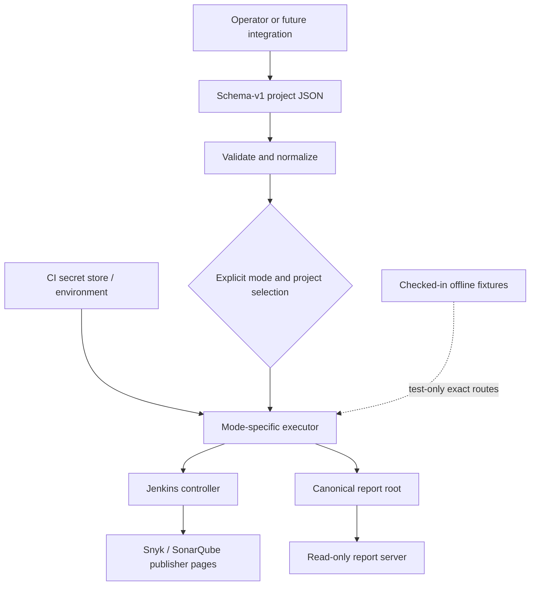
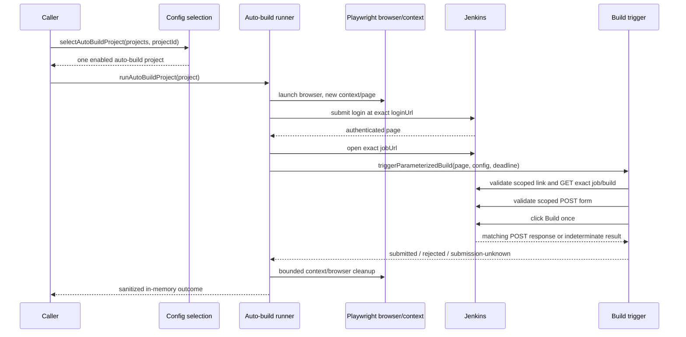

# System architecture

This is the component-level view of `auto-jobs` after Phase 2. The repository
has two intentionally separate execution paths:

- **Report:** authenticate, inspect one exact Jenkins job, capture bounded Snyk
  and SonarQube evidence, and publish immutable static reports.
- **Auto-build:** authenticate, inspect one exact Jenkins job, validate the
  parameterized-build controls, and submit one Jenkins form. It returns a
  safe in-memory outcome and does not capture or publish reports.

The [architecture](./architecture.md) document contains the field-level runtime
contract. See [multi-project configuration](./multi-project-configuration.md)
for JSON details and [release gates](./release-gates.md) for validation commands.

## Context and boundaries



The loader and selection helpers are pure configuration boundaries. Browser
launch, credentials, and network I/O begin only after a caller has selected an
executor. The report server reads an existing canonical report root; it is not
a build or report-generation API. No writable control-plane server is part of
the current Phase 2 implementation.

## Mode dispatch

A normalized project carries `runType: 'report' | 'auto-build'`. Missing input
normalizes to `report`; the field is project-only and cannot be set through
defaults or environment configuration. `enabled: false` always wins.

| Caller boundary | Input | Executor | Output/side effect |
| --- | --- | --- | --- |
| `selectReportProjects(projects)` | normalized config | `runFromConfig` → `runConfiguredProjects` | sequential report outcomes and aggregate artifacts |
| `selectAutoBuildProject(projects, projectId)` | normalized config plus exact ID | `runAutoBuildProject` | one build outcome; no report artifacts |

`selectReportProjects` returns all enabled report projects and fails when none
remain. `selectAutoBuildProject` returns exactly one enabled auto-build project
or fails closed for an empty/unknown ID, disabled project, or report project.
Neither helper performs I/O. `src/cli.ts` exposes only the report path through
`npm run report`, so a mixed configuration cannot trigger a build accidentally.

## Report data flow

```mermaid
flowchart LR
  File[Explicit --config file] --> Validate[Schema validation]
  Validate --> Normalize[Frozen normalized projects]
  Normalize --> ReportSelect[selectReportProjects]
  ReportSelect --> Browser[One configured browser]
  Browser --> Context[Fresh context per project]
  Context --> Login[submitJenkinsLogin]
  Login --> Job[openJenkinsJob exact jobUrl]
  Job --> Discover[Publisher link discovery]
  Discover --> Capture[Snyk / SonarQube capture]
  Capture --> NormalizeEvidence[Bounded normalization]
  NormalizeEvidence --> Stage[Staging lease]
  Stage --> Publish[Validated immutable report]
  Publish --> Aggregate[Aggregate index and data]
```



`src/runner.ts` keeps selected projects in configuration order, continues after
an individual failure, and publishes one aggregate. The report path owns the
artifact root lock, staging/report paths, manifests, cleanup, and aggregate
recovery. A fresh Playwright context and one project-local absolute deadline
is used for each report project while the browser process is shared.

## Auto-build data flow



The auto-build runner does not use `ArtifactPaths`, report capture, queue APIs,
build-number APIs, polling, cancellation, or retry logic. It clears mutable
secret copies during cleanup. A failure before a matching POST is represented
as `failed-before-submit`; once a matching POST is observed, indeterminate
completion is `submission-unknown` and must not be retried.

## Jenkins component contracts

### Authentication and identity

`src/jenkins/auth.ts` submits credentials only to the configured login action,
validates the authenticated URL and landmark, and opens the exact configured
job URL. `src/jenkins/url-identity.ts` provides exact job and job-action
identity checks. Action identity requires the same origin, credential-free URL,
normalized path `<jobUrl>/build`, matching decoded `job/` segments, no fragment,
and no unexpected query. Only the build-detail navigation may carry the exact
`?delay=0sec` query.

`jobUrl` is the sole branch identity. Nested jobs and repeatedly encoded
segments are decoded for comparison; sibling jobs, prefixes, alternate origins,
foreign actions, and path tricks fail closed.

### Scoped controls and submission

`src/jenkins/locators.ts` maps the configured selector contract to Playwright
locators and resolves hrefs relative to the current page without trusting them.
`src/jenkins/build-trigger-validation.ts` requires:

1. exactly one visible `#side-panel` and one visible configured **Build with
   Parameters** link;
2. a link href that is the exact configured job `/build` action;
3. exactly one visible `#bottom-sticker` and one visible configured **Build**
   button;
4. class tokens `jenkins-button`, `jenkins-button--primary`, and
   `jenkins-!-build-color`;
5. exactly one ancestor form with method `POST`; and
6. a form action that is the same exact configured job `/build` action.

`src/jenkins/build-trigger.ts` installs request and response observers before
the click. It accepts one matching POST only. A response status below 400 is
`submitted`; status 400 or higher is `rejected`; a matching request without a
determinate response is `submission-unknown`. Pre-POST validation/navigation
errors are sanitized `JenkinsFlowError` failures. The trigger returns no form
body, parameter, crumb, header, cookie, queue, build-number, or response-body
data.

## Resource and error boundaries

`src/browser-launcher.ts` is the shared browser-launch boundary. It selects
Chromium, Firefox, or WebKit and parses the supported environment options:
`PLAYWRIGHT_EXECUTABLE_PATH`, `PLAYWRIGHT_HEADLESS`, `PLAYWRIGHT_HEADED` or
`HEADED`, and `PLAYWRIGHT_SLOW_MO` or `PLAYWRIGHT_ACTION_DELAY`.

`WorkflowDeadline` is one immutable absolute time budget per project. Report
and auto-build workflows pass it through all browser operations. Resource
creation handles late results, and context/browser closure uses bounded
settlement cleanup. Cleanup failures must not convert a known auto-build result
into a retryable operation.

Diagnostics use the existing redaction helpers. URLs are sanitized before
persistence or display. Report failure artifacts retain a safe project/run
identity; auto-build results stay in memory and contain only bounded safe
fields.

## Persistence and serving

Only the report path writes artifacts. Each report run uses a validated project
ID and immutable run ID below the canonical report root:

```text
reports/
├── index.html
├── aggregate-data.json
├── assets/report.css
└── <project-id>/<run-id>/
    ├── index.html
    ├── data.json
    ├── manifest.json
    └── requested screenshots
```

`src/artifacts/` stages and validates writes, coordinates same-host report-root
leases, recovers aggregate publication, and performs bounded orphan cleanup.
`src/reporting/` escapes rendered values, validates links, sets CSP headers,
and serves only safe GET/HEAD files below the canonical root. The server is
read-only, unauthenticated, and loopback by default.

## Test architecture

- Configuration and selection tests exercise normalization, explicit mode
  gating, disabled projects, selector requirements, and legacy-key rejection.
- `tests/unit/jenkins-build-trigger.spec.ts` uses an in-process HTTP server to
  prove exact request order, scoped controls, form/action validation, one POST,
  HTTP response states, unknown-after-POST, and diagnostic redaction.
- `tests/unit/auto-build-runner.spec.ts` injects browser/workflow dependencies
  to prove submitted/rejected/unknown outcomes, mode/enabled fail-closed
  behavior, cleanup, and secret redaction.
- `tests/unit/sequential-runner.spec.ts` preserves shared launch options,
  sequential report behavior, and exclusion of auto-build projects from
  `runFromConfig`.
- Template E2E tests use exact default-deny routes and checked-in fixtures;
  they do not claim live Jenkins or vendor execution.

## Invariants for extensions

1. Keep report capture and auto-build submission as separate executors.
2. Require explicit project-level auto-build selection and confirmation at the
   caller boundary; never infer it from config shape or UI text.
3. Keep `jobUrl` as the only target identity and validate every action URL
   against it before navigation or submission.
4. Validate structure and visibility before clicks; never read hidden form
   parameters or persist request data.
5. Observe a possible side effect before classifying it and never retry after a
   matching POST.
6. Preserve one absolute deadline, bounded cleanup, secret redaction, and the
   existing canonical report-root/security policy.
