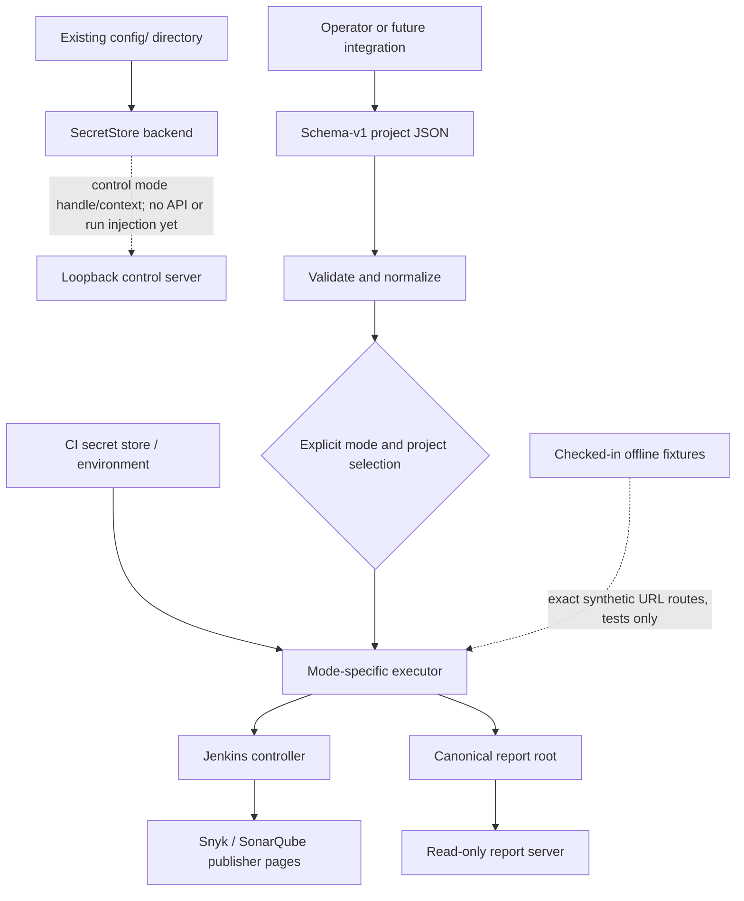
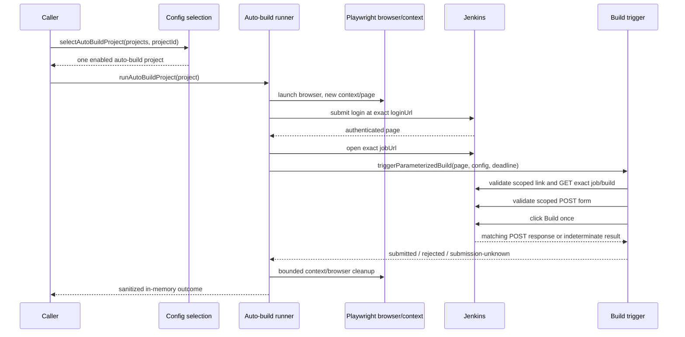

# System architecture

This is the component-level view of `auto-jobs` after Phase 3 and Phase 01 of
the dynamic-credentials plan. The repository has two intentionally separate
execution paths plus a local persistence seam:

- **Report:** authenticate, inspect one exact Jenkins job, capture bounded Snyk
  and SonarQube evidence, and publish immutable static reports.
- **Auto-build:** authenticate, inspect one exact Jenkins job, validate the
  parameterized-build controls, and submit one Jenkins form. It returns a
  safe in-memory outcome and does not capture or publish reports.
- **Offline fixture:** load the checked-in nine-file corpus and fulfill only
  exact synthetic URLs for deterministic report and auto-build tests.
- **SecretStore backend:** persist validated local credential values outside
  project JSON; Phase 01 wires the store into control mode without exposing a
  secret API or injecting values into runs yet.

The [architecture](./architecture.md) document contains the field-level runtime
contract. See [multi-project configuration](./multi-project-configuration.md)
for JSON and credential details and [release gates](./release-gates.md) for
validation commands.

## Context and boundaries



The loader and selection helpers are pure configuration boundaries. Browser
launch, credentials, and network I/O begin only after a caller has selected an
executor. In control mode, `createReportServer` creates both `ConfigStore` and
`SecretStore` from the configured `configRoot`; the latter fixes its target to
`secrets.local.json` under that canonical directory. Current executors still
resolve credentials from their supplied environment, so the Phase 01 store is
not an execution override. The report server reads an existing canonical report
root and is not a build or report-generation API. Control mode is loopback-only;
its secret-management HTTP API and run-environment injection are later phases.

## Mode dispatch

A normalized project carries `runType: 'report' | 'auto-build'`. Missing input
normalizes to `report`; the field is project-only and cannot be set through
defaults or environment configuration. `enabled: false` always wins.

| Caller boundary | Input | Executor | Output/side effect |
| --- | --- | --- | --- |
| `selectReportProjects(projects)` | normalized config | `runFromConfig` → `runConfiguredProjects` | sequential report outcomes and aggregate artifacts |
| `selectAutoBuildProject(projects, projectId)` | normalized config plus exact ID | `runAutoBuildProject` | one build outcome; no report artifacts |

`selectReportProjects` returns all enabled report projects and fails when none
remain. `selectAutoBuildProject` returns exactly one enabled auto-build project
or fails closed for an empty/unknown ID, disabled project, or report project.
Neither helper performs I/O. `src/cli.ts` exposes only the report path through
`npm run report`, so a mixed configuration cannot trigger a build accidentally.

## Report data flow

```mermaid
flowchart LR
  File[Explicit --config file] --> Validate[Schema validation]
  Validate --> Normalize[Frozen normalized projects]
  Normalize --> ReportSelect[selectReportProjects]
  ReportSelect --> Browser[One configured browser]
  Browser --> Context[Fresh context per project]
  Context --> Login[submitJenkinsLogin]
  Login --> Job[openJenkinsJob exact jobUrl]
  Job --> Discover[Publisher link discovery]
  Discover --> Capture[Snyk / SonarQube capture]
  Capture --> NormalizeEvidence[Bounded normalization]
  NormalizeEvidence --> Stage[Staging lease]
  Stage --> Publish[Validated immutable report]
  Publish --> Aggregate[Aggregate index and data]
```



`src/runner.ts` keeps selected projects in configuration order, continues after
an individual failure, and publishes one aggregate. The report path owns the
artifact root lock, staging/report paths, manifests, cleanup, and aggregate
recovery. A fresh Playwright context and one project-local absolute deadline
is used for each report project while the browser process is shared.

## Auto-build data flow



The auto-build runner does not use `ArtifactPaths`, report capture, queue APIs,
build-number APIs, polling, cancellation, or retry logic. It clears mutable
secret copies during cleanup. A failure before a matching POST is represented
as `failed-before-submit`; once a matching POST is observed, indeterminate
completion is `submission-unknown` and must not be retried.

## Jenkins component contracts

### Authentication and identity

`src/jenkins/auth.ts` submits credentials only to the configured login action,
validates the authenticated URL and landmark, and opens the exact configured
job URL. `src/jenkins/url-identity.ts` provides exact job and job-action
identity checks. Action identity requires the same origin, credential-free URL,
normalized path `<jobUrl>/build`, matching decoded `job/` segments, no fragment,
and no unexpected query. Only the build-detail navigation may carry the exact
`?delay=0sec` query.

`jobUrl` is the sole branch identity. Nested jobs and repeatedly encoded
segments are decoded for comparison; sibling jobs, prefixes, alternate origins,
foreign actions, and path tricks fail closed.

### Scoped controls and submission

`src/jenkins/locators.ts` maps the configured selector contract to Playwright
locators and resolves hrefs relative to the current page without trusting them.
`src/jenkins/build-trigger-validation.ts` requires:

1. exactly one visible `#side-panel` and one visible configured **Build with
   Parameters** link;
2. a link href that is the exact configured job `/build` action;
3. exactly one visible `#bottom-sticker` and one visible configured **Build**
   button;
4. class tokens `jenkins-button`, `jenkins-button--primary`, and
   `jenkins-!-build-color`;
5. exactly one ancestor form with method `POST`; and
6. a form action that is the same exact configured job `/build` action.

`src/jenkins/build-trigger.ts` installs request and response observers before
the click. It accepts one matching POST only. A response status below 400 is
`submitted`; status 400 or higher is `rejected`; a matching request without a
determinate response is `submission-unknown`. Pre-POST validation/navigation
errors are sanitized `JenkinsFlowError` failures. The trigger returns no form
body, parameter, crumb, header, cookie, queue, build-number, or response-body
data.

## Resource and error boundaries

`src/browser-launcher.ts` is the shared browser-launch boundary. It selects
Chromium, Firefox, or WebKit and parses the supported environment options:
`PLAYWRIGHT_EXECUTABLE_PATH`, `PLAYWRIGHT_HEADLESS`, `PLAYWRIGHT_HEADED` or
`HEADED`, and `PLAYWRIGHT_SLOW_MO` or `PLAYWRIGHT_ACTION_DELAY`.

`WorkflowDeadline` is one immutable absolute time budget per project. Report
and auto-build workflows pass it through all browser operations. Resource
creation handles late results, and context/browser closure uses bounded
settlement cleanup. Cleanup failures must not convert a known auto-build result
into a retryable operation.

Diagnostics use the existing redaction helpers. URLs are sanitized before
persistence or display. Report failure artifacts retain a safe project/run
identity; auto-build results stay in memory and contain only bounded safe
fields.

## Persistence and serving

Only the report path writes report artifacts. Each report run uses a validated
project ID and immutable run ID below the canonical report root:

```text
reports/
├── index.html
├── aggregate-data.json
├── assets/report.css
└── <project-id>/<run-id>/
    ├── index.html
    ├── data.json
    ├── manifest.json
    └── requested screenshots
```

`src/artifacts/` stages and validates writes, coordinates same-host report-root
leases, recovers aggregate publication, and performs bounded orphan cleanup.
`src/reporting/` escapes rendered values, validates links, sets CSP headers,
and serves only safe GET/HEAD files below the canonical root. The server is
read-only, unauthenticated, and loopback by default.

## Local secret-store subsystem

`src/reporting/report-server-secret-store.ts` is a persistence-only backend
for control-plane credentials. `createSecretStore(configRoot)` accepts an
existing real directory, resolves it to its canonical path, and derives one
fixed target: `secrets.local.json`. It rejects a missing/non-directory or
symlinked root; it never accepts a path or filename from a request.

The store contract is:

| Operation | Observable contract |
| --- | --- |
| `readSecrets()` | Reads a fresh validated map; missing or empty files return `{}` and the returned object is frozen. |
| `listSecretNames()` | Returns sorted, frozen key names without values. |
| `putSecret(name, value)` | Validates one environment-style name and string value, then read-modify-writes under the lock. |
| `putSecrets(entries)` | Validates all entries before applying a bulk read-modify-write. |
| `deleteSecret(name)` / `deleteSecrets(names)` | Validate names and remove existing keys; deleting absent keys is a no-op. |

Keys must match `/^[A-Za-z_][A-Za-z0-9_]{0,127}$/`; values remain strings and
are never coerced. The file and serialized payload are capped at
`MAX_SECRET_FILE_BYTES` (1 MiB). Updates use one in-memory write mutex so
concurrent callers preserve each other's changes. Serialization sorts keys
lexicographically and writes a sibling temporary file with exclusive creation,
mode `0o600`, `fsync`, close, and same-directory rename. A rename failure
removes the temporary file and leaves the prior target unchanged; write/sync
failures close the handle, while cleanup of a partially written temporary file
is best-effort. On Windows, mode bits are not an ACL boundary; protect the
config directory with appropriate user/CI ACLs.

`createReportServer` creates the store only in loopback control mode and
exposes it through `ReportServerHandle` and `ControlRouterContext`. The current
router has no `/api/secrets` dispatch, and current report/auto-build execution
still consumes its supplied environment. Secret API and run-environment
injection are separate follow-on phases.

## Offline template fixture subsystem

The fixture subsystem has a one-way dependency graph:

```text
types -> file-io/html -> sonarqube/build-validation -> loader/routes -> facade
```

| Module or asset | Contract |
| --- | --- |
| `template-fixture-types.ts` | Fixture, response, route recorder, file-identity, budget, artifact-link, and Sonar route types. |
| `template-fixture-file-io.ts` | Canonical root resolution and descriptor/no-follow reads with identity, symlink, 4 MiB per-file, and 16 MiB total checks. |
| `template-fixture-html.ts` | HTML tag/attribute parsing, URL policy, canonical/form/link rewrites, artifact selection, and exact URL comparison. |
| `template-fixture-sonarqube.ts` | Saved SonarQube origin/project identity checks and dashboard/issues link rewrites. |
| `template-fixture-build-validation.ts` | Unique `#side-panel` build-link discovery plus canonical, form/action, sticker, and button validation. |
| `template-fixture-loader.ts` | Reads nine files, derives build/report/Sonar destinations, rewrites selected links/actions, and assembles `TemplateReportFixture`. |
| `template-fixture-routes.ts` | Installs the catch-all Playwright route handler, fulfills exact responses, handles exact POST exceptions, and records sanitized misses. |
| `template-report-fixture.ts` | Public facade exporting the supported loader, route installer, response helper, types, origin, and total-size boundary. |
| `templates/jenkins-template/template-build.html` | Minimal saved-origin build detail page: one canonical URL, one `POST` form, one `#bottom-sticker`, and one classed `Build` button. |

The loader derives the build identity from the unique saved job-page
`Build with Parameters` anchor. It permits only the approved saved origin, the
same-job `/build` path, and the detail-page `delay=0sec` query. The build
template canonical must match that URL; its form action must be the same
`/build` path without query or fragment. Only the selected job href and
validated build form action are remapped to the synthetic origin.

The route map fulfills nine exact `GET`/`HEAD` fixture URLs. It also permits
the exact Jenkins login actions, the same-origin SonarQube `/sessions/new`
authentication path, and the exact build-action `POST`. The build action
returns `303 Location: <fixture.jobUrl>` without reading or reflecting form
data; the browser then requests the exact job page. Any other method or URL is
aborted and recorded with bounded method, origin, and pathname fields only.
SonarQube home serves the login page until the context-local login `POST` marks
that route authenticated.

## Test architecture

- Configuration and selection tests exercise normalization, explicit mode
  gating, disabled projects, selector requirements, and legacy-key rejection.
- `tests/unit/report-server-secret-store.spec.ts` uses isolated temporary
  config/report roots to prove key/value validation, empty/malformed/object
  handling, sorted and frozen snapshots, bulk updates/deletions, concurrent
  mutation serialization, redaction, and control-server wiring. It does not
  contact a live service.
- `tests/unit/jenkins-build-trigger.spec.ts` uses an in-process HTTP server to
  prove exact request order, scoped controls, form/action validation, one POST,
  HTTP response states, unknown-after-POST, and diagnostic redaction.
- `tests/unit/auto-build-runner.spec.ts` injects browser/workflow dependencies
  to prove submitted/rejected/unknown outcomes, mode/enabled fail-closed
  behavior, cleanup, and secret redaction.
- `tests/unit/sequential-runner.spec.ts` preserves shared launch options,
  sequential report behavior, and exclusion of auto-build projects from
  `runFromConfig`.
- Template unit and E2E tests use exact default-deny routes and checked-in
  fixtures; `template-build-fixture.spec.ts` proves build-page drift and
  redirect contracts, while `template-auto-build.spec.ts` exercises the
  production auto-build workflow with one build `POST`. They do not claim live
  Jenkins or vendor execution.

## Invariants for extensions

1. Keep report capture and auto-build submission as separate executors.
2. Require explicit project-level auto-build selection and confirmation at the
   caller boundary; never infer it from config shape or UI text.
3. Keep `jobUrl` as the only target identity and validate every action URL
   against it before navigation or submission.
4. Validate structure and visibility before clicks; never read hidden form
   parameters or persist request data.
5. Observe a possible side effect before classifying it and never retry after a
   matching POST.
6. Preserve one absolute deadline, bounded cleanup, secret redaction, and the
   existing canonical report-root/security policy.
7. Keep local secrets outside project JSON, restrict names and payload size,
   serialize sorted keys atomically, and never expose values in diagnostics or
   HTTP responses.
8. Treat Windows file-mode bits as advisory; rely on protected config-directory
   ACLs and keep secret API/run-environment integration behind its own phase.
