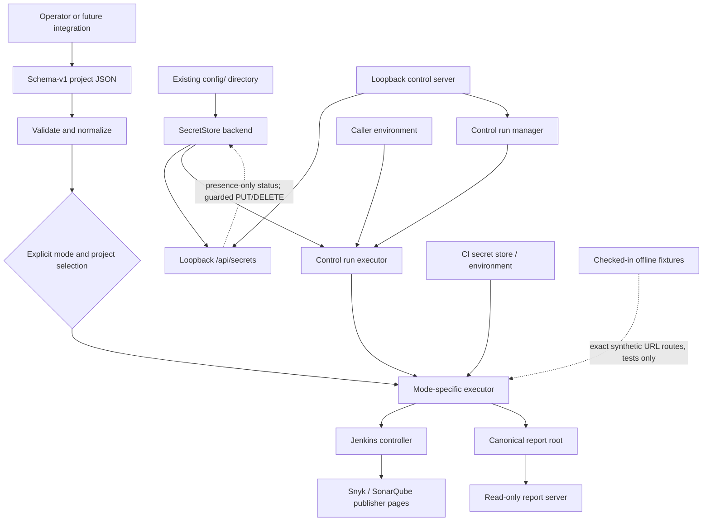
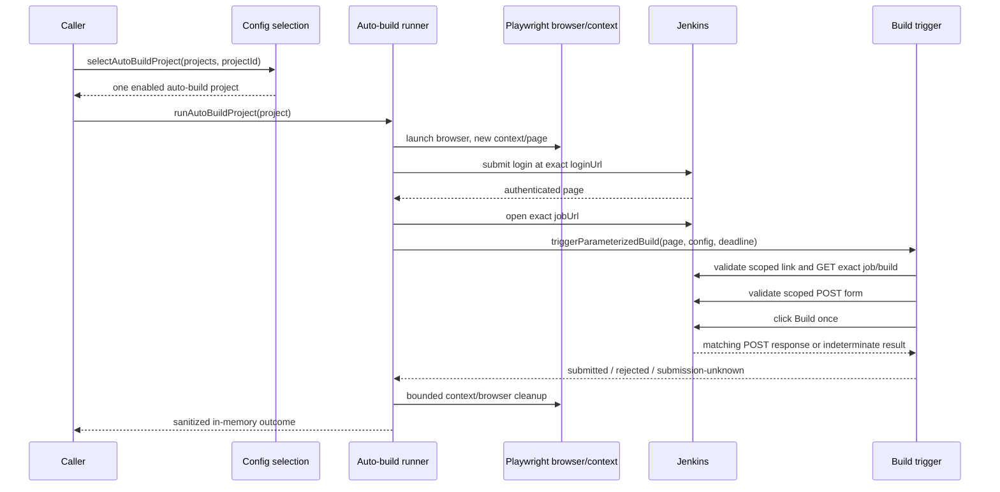
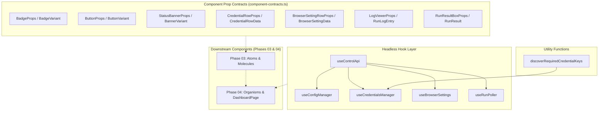
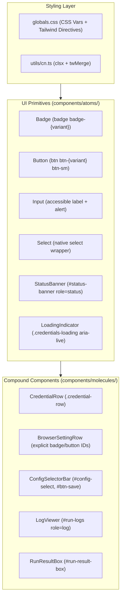

# System architecture

This is the component-level view of `auto-jobs` after Phase 3 and dynamic-
credentials Phases 01–05. The repository has two intentionally separate
execution paths plus a local persistence seam, a loopback control API/UI, a
control-run environment boundary, and deterministic Phase 05 verification:

- **Report:** authenticate, inspect one exact Jenkins job, capture bounded Snyk
  and SonarQube evidence, and publish immutable static reports.
- **Auto-build:** authenticate, inspect one exact Jenkins job, validate the
  parameterized-build controls, and submit one Jenkins form. It returns a
  safe in-memory outcome and does not capture or publish reports.
- **Offline fixture:** load the checked-in nine-file corpus and fulfill only
  exact synthetic URLs for deterministic report and auto-build tests.
- **SecretStore and secrets API:** persist validated local credential values
  outside project JSON and expose only boolean presence through guarded
  `/api/secrets` operations.
- **Control UI:** discover credential-variable names from the active
  configuration, show presence-only state, persist guarded replacements, and
  wipe password inputs on save, clear, or close.
- **Control-run executor:** snapshot stored values per run, merge them over
  the caller environment, pass the merged environment to the selected
  executor, and redact control-run output. Direct callers remain environment-
  driven.
- **Verification:** isolated SecretStore/API unit contracts and Chromium/WebKit
  control-page E2E scenarios prove dynamic credential persistence, injected
  execution, and zero leakage without contacting Jenkins.

The [architecture](./architecture.md) document contains the field-level runtime
contract. See [multi-project configuration](./multi-project-configuration.md)
for JSON, credential, and secrets API details and [release gates](./release-gates.md)
for validation commands.


## Context and boundaries



The loader and selection helpers are pure configuration boundaries. Browser
launch, credentials, and network I/O begin only after a caller has selected an
executor. Direct report and auto-build callers pass their environment to the
selected runner. In control mode, `createReportServer` creates both
`ConfigStore` and `SecretStore` from the configured `configRoot`; the latter
fixes its target to `secrets.local.json` under that canonical directory. The
loopback control router validates `Host` before dispatching every request, and
the secrets API returns only boolean presence data. Mutations additionally
require an accepted `Origin`, `Sec-Fetch-*` metadata, CSRF token, and JSON
content type.

`createRunManager` carries the optional `SecretStore` dependency into
`executeControlRun`. At execution start, the control executor reads one
snapshot and creates `{ ...env, ...storedSecrets }`; stored values override
same-named base values, and neither the caller environment nor `process.env`
is mutated. It normalizes the configuration and passes the new object as
`runtimeEnvironment` to either mode-specific executor.

## Control-run environment flow

`POST /api/run` supplies a config name/ETag, an explicit `runType`, and an
optional auto-build `projectId`; it does not carry secret values. The run
manager accepts one active run and dispatches asynchronously. The executor
then applies this sequence:

| Stage | Contract |
| --- | --- |
| Snapshot | Read the current `SecretStore` map once for this execution. |
| Merge | Build a fresh `NodeJS.ProcessEnv` from the supplied base environment, then overlay all stored entries; stored entries win on key collisions. |
| Normalize | Validate and normalize the config against the merged environment, so credential-variable references resolve from stored values when present. |
| Dispatch | Pass `runtimeEnvironment` to `runConfiguredProjects` for report mode or `runAutoBuildProject` for auto-build mode. |
| Redact | Use every non-empty stored value to redact control logs, report warnings, caught errors/stacks, and auto-build URL result fields before recording them. |

The file-mode report CLI and direct library calls keep their existing
caller-supplied environment behavior; this injection boundary belongs only to
control-run execution.

## Mode dispatch

A normalized project carries `runType: 'report' | 'auto-build'`. Missing input
normalizes to `report`; the field is project-only and cannot be set through
defaults or environment configuration. `enabled: false` always wins.

| Caller boundary | Input | Executor | Output/side effect |
| --- | --- | --- | --- |
| `selectReportProjects(projects)` | normalized config | `runFromConfig` → `runConfiguredProjects` | sequential report outcomes and aggregate artifacts |
| `selectAutoBuildProject(projects, projectId)` | normalized config plus exact ID | `runAutoBuildProject` | one build outcome; no report artifacts |

`selectReportProjects` returns all enabled report projects and fails when none
remain. `selectAutoBuildProject` returns exactly one enabled auto-build project
or fails closed for an empty/unknown ID, disabled project, or report project.
Neither helper performs I/O. `src/cli.ts` exposes only the report path through
`npm run report`, so a mixed configuration cannot trigger a build accidentally.

## Report data flow

```mermaid
flowchart LR
  File[Explicit --config file] --> Validate[Schema validation]
  Validate --> Normalize[Frozen normalized projects]
  Normalize --> ReportSelect[selectReportProjects]
  ReportSelect --> Browser[One configured browser]
  Browser --> Context[Fresh context per project]
  Context --> Login[submitJenkinsLogin]
  Login --> Job[openJenkinsJob exact jobUrl]
  Job --> Discover[Publisher link discovery]
  Discover --> Capture[Snyk / SonarQube capture]
  Capture --> NormalizeEvidence[Bounded normalization]
  NormalizeEvidence --> Stage[Staging lease]
  Stage --> Publish[Validated immutable report]
  Publish --> Aggregate[Aggregate index and data]
```



`src/runner.ts` keeps selected projects in configuration order, continues after
an individual failure, and publishes one aggregate. The report path owns the
artifact root lock, staging/report paths, manifests, cleanup, and aggregate
recovery. A fresh Playwright context and one project-local absolute deadline
is used for each report project while the browser process is shared.

## Auto-build data flow



The auto-build runner does not use `ArtifactPaths`, report capture, queue APIs,
build-number APIs, polling, cancellation, or retry logic. It clears mutable
secret copies during cleanup. A failure before a matching POST is represented
as `failed-before-submit`; once a matching POST is observed, indeterminate
completion is `submission-unknown` and must not be retried.

Control runs invoke this same runner with the merged `runtimeEnvironment`
created by `executeControlRun`; direct integrations can continue to provide
their own environment through `AutoBuildRunnerDependencies`.

## Jenkins component contracts

### Authentication and identity

`src/jenkins/auth.ts` submits credentials only to the configured login action,
validates the authenticated URL and landmark, and opens the exact configured
job URL. `src/jenkins/url-identity.ts` provides exact job and job-action
identity checks. Action identity requires the same origin, credential-free URL,
normalized path `<jobUrl>/build`, matching decoded `job/` segments, no fragment,
and no unexpected query. Only the build-detail navigation may carry the exact
`?delay=0sec` query.

`jobUrl` is the sole branch identity. Nested jobs and repeatedly encoded
segments are decoded for comparison; sibling jobs, prefixes, alternate origins,
foreign actions, and path tricks fail closed.

### Scoped controls and submission

`src/jenkins/locators.ts` maps the configured selector contract to Playwright
locators and resolves hrefs relative to the current page without trusting them.
`src/jenkins/build-trigger-validation.ts` requires:

1. exactly one visible `#side-panel` and one visible configured **Build with
   Parameters** link;
2. a link href that is the exact configured job `/build` action;
3. exactly one visible `#bottom-sticker` and one visible configured **Build**
   button;
4. class tokens `jenkins-button`, `jenkins-button--primary`, and
   `jenkins-!-build-color`;
5. exactly one ancestor form with method `POST`; and
6. a form action that is the same exact configured job `/build` action.

`src/jenkins/build-trigger.ts` installs request and response observers before
the click. It accepts one matching POST only. A response status below 400 is
`submitted`; status 400 or higher is `rejected`; a matching request without a
determinate response is `submission-unknown`. Pre-POST validation/navigation
errors are sanitized `JenkinsFlowError` failures. The trigger returns no form
body, parameter, crumb, header, cookie, queue, build-number, or response-body
data.

## Resource and error boundaries

`src/browser-launcher.ts` is the shared browser-launch boundary. It selects
Chromium, Firefox, or WebKit and parses the supported environment options:
`PLAYWRIGHT_EXECUTABLE_PATH`, `PLAYWRIGHT_HEADLESS`, `PLAYWRIGHT_HEADED` or
`HEADED`, and `PLAYWRIGHT_SLOW_MO` or `PLAYWRIGHT_ACTION_DELAY`.

`WorkflowDeadline` is one immutable absolute time budget per project. Report
and auto-build workflows pass it through all browser operations. Resource
creation handles late results, and context/browser closure uses bounded
settlement cleanup. Cleanup failures must not convert a known auto-build result
into a retryable operation.

Diagnostics use the existing redaction helpers. URLs are sanitized before
persistence or display. Report failure artifacts retain a safe project/run
identity; auto-build results stay in memory and contain only bounded safe
fields.
For control runs, `report-server-run-executor.ts` redacts all non-empty values
from the SecretStore snapshot before adding logs or persisting result
diagnostics. Auto-build URL fields (`jobUrl` and `buildPageUrl`) are redacted
as well; report links are generated from validated local relative paths.

## Persistence and serving

Only the report path writes report artifacts. Each report run uses a validated
project ID and immutable run ID below the canonical report root:

```text
reports/
├── index.html
├── aggregate-data.json
├── assets/report.css
└── <project-id>/<run-id>/
    ├── index.html
    ├── data.json
    ├── manifest.json
    └── requested screenshots
```

`src/artifacts/` stages and validates writes, coordinates same-host report-root
leases, recovers aggregate publication, and performs bounded orphan cleanup.
`src/reporting/` escapes rendered values, validates links, sets CSP headers,
and serves only safe GET/HEAD files below the canonical root. The server is
read-only, unauthenticated, and loopback by default.

## Local secret-store subsystem

`src/reporting/report-server-secret-store.ts` is a persistence-only backend
for control-plane credentials. `createSecretStore(configRoot)` accepts an
existing real directory, resolves it to its canonical path, and derives one
fixed target: `secrets.local.json`. It rejects a missing/non-directory or
symlinked root; it never accepts a path or filename from a request.

The store contract is:

| Operation | Observable contract |
| --- | --- |
| `readSecrets()` | Reads a fresh validated map; missing or empty files return `{}` and the returned object is frozen. |
| `listSecretNames()` | Returns sorted, frozen key names without values. |
| `putSecret(name, value)` | Validates one environment-style name and string value, then read-modify-writes under the lock. |
| `putSecrets(entries)` | Validates all entries before applying a bulk read-modify-write. |
| `deleteSecret(name)` / `deleteSecrets(names)` | Validate names and remove existing keys; deleting absent keys is a no-op. |

Keys must match `/^[A-Za-z_][A-Za-z0-9_]{0,127}$/` and must not be the
prototype names `__proto__`, `prototype`, or `constructor`; values remain
strings and are never coerced. The file and serialized payload are capped at
`MAX_SECRET_FILE_BYTES` (1 MiB). Updates use one in-memory write mutex so
concurrent callers preserve each other's changes. Serialization sorts keys
lexicographically and writes a sibling temporary file with exclusive creation,
mode `0o600`, `fsync`, close, and same-directory rename. A rename failure
removes the temporary file and leaves the prior target unchanged; write/sync
failures close the handle, while cleanup of a partially written temporary file
is best-effort. On Windows, mode bits are not an ACL boundary; protect the
config directory with appropriate user/CI ACLs.

`createReportServer` creates the store only in loopback control mode and
exposes it through `ReportServerHandle` and `ControlRouterContext`. The
control router dispatches `/api/secrets` to the dedicated
`report-server-control-secrets-api.ts` handler; `report-server-control-api.ts`
remains the config/run facade.

For a control run, `report-server-run-manager.ts` carries the optional store
to `report-server-run-executor.ts`. That executor reads one current snapshot,
merges it over the supplied environment without mutating `process.env`, and
passes `runtimeEnvironment` to report or auto-build execution. Secret values
are redacted from control logs, warnings, errors, and auto-build result URLs
before the run record is persisted. The direct report CLI and library runners
still consume their caller-supplied environment.

The Phase 05 SecretStore lifecycle suite adds focused checks for empty reads,
atomic file replacement and temporary-file cleanup, platform permission
handling, invalid/reserved keys, value-type error redaction, concurrent
updates, and bulk deletion. The API operation suite and control-page E2E
scenarios are described in the test architecture below.

### Control secrets API and security gates

The secrets handler is intentionally separate from
`report-server-control-api.ts`, which keeps the config/run handlers and
re-exports `handleSecretsApi` as the control API facade. `handleControlRequest`
performs the Host check before any route dispatch. All JSON responses use
`Cache-Control: no-store` and the control CSP/security header set.

| Request | Gate and input | Response |
| --- | --- | --- |
| `GET /api/secrets` | Exact bound Host; optional comma-separated `keys` query, each validated | `200 { "secrets": { "<name>": true } }`; filtered names are `true` or `false` |
| `PUT /api/secrets` | Host, Origin, Fetch Metadata, CSRF, JSON content type, and bounded JSON body | `200` full presence map after patch |
| `DELETE /api/secrets?name=NAME` | Same mutation gates; valid name query | `200` full presence map after deletion |
| `DELETE /api/secrets` | Same gates; JSON `{ "name": "NAME" }` or `{ "names": ["NAME"] }` | `200` full presence map after deletion |

PUT accepts either `{ "name": "NAME", "value": "VALUE" }` or a non-empty
`{ "secrets": { "NAME": "VALUE" } }` object. A null value in the object, or
`action: "delete"` in the single-entry form, deletes instead of storing.
Values never appear in success or error responses. Invalid names/values and
malformed bodies return `400`; invalid mutation gates return `403`, a
non-JSON mutation body returns `415`, an unavailable store returns `503`, and
unsupported methods return `405` with `Allow: GET, PUT, DELETE`.

### Control UI, Vite build pipeline, and credential dialog

The loopback control dashboard at `/` is built using Vite (`vite.control.config.ts`),
compiling React components and Tailwind CSS into `.runner-build/reporting/control-page/`
as `index.html`, `assets/control-page.css`, and `assets/control-page.js`. Rollup output
configures single-bundle JS/CSS and disables CSS code-splitting to adhere strictly to
`CONTROL_CSP` (`default-src 'none'`, `script-src 'self'`, `style-src 'self'`).

`report-server-control-page.ts` reads the Vite-built assets from
`.runner-build/reporting/control-page/`, dynamically substituting the server's per-instance
CSRF token into the `__CSRF_TOKEN_PLACEHOLDER__` in `index.html`. Assets are served by
`report-server-control.ts` at `/assets/control-page.css` and `/assets/control-page.js` with
strict security headers and `Cache-Control: no-store`.

The dashboard UI includes a `Credentials` action and modal dialog. The UI reads the
instance token from the `meta[name="csrf-token"]` element; `apiFetch` adds it as
`x-csrf-token` to every state-mutating `POST`, `PUT`, and `DELETE`.

Opening the dialog derives the required environment-variable names from the
currently loaded configuration. Project credential references take precedence
over defaults (including normalized `credentialVariables` references); when
references are omitted, the UI uses `JENKINS_USERNAME` and
`JENKINS_PASSWORD`. Names are deduplicated and sorted before the request. The
dialog then calls `GET /api/secrets?keys=...`, which is Host-checked and
returns only `true`/`false` presence values. Each key is rendered as a
**Configured** or **Missing** badge with a blank `type="password"` input. A
configured key also gets a per-row **Clear** action.

The operator workflow is:

1. Click **Credentials**; the dialog shows a loading state while presence is
   fetched, or a bounded error message when the request fails.
2. Enter one or more replacement values. Blank inputs mean “keep the existing
   value”; the browser collects only non-empty, trimmed fields.
3. Click **Save Credentials**. The UI sends
   `PUT /api/secrets` with a JSON `{ "secrets": { ... } }` patch. The server
   applies the Host, same-origin Origin, Fetch Metadata, timing-safe CSRF,
   JSON-content-type, and body-size gates, persists the patch atomically, and
   returns a presence map. On success the changed inputs are immediately
cleared, their badges become **Configured**, and **Clear** actions are added.
4. Click a row's **Clear** action to send a CSRF-protected,
   bodyless `DELETE /api/secrets?name=...`. A successful deletion clears that
   input, changes its badge to **Missing**, and removes the row action.
5. Cancel or otherwise close the dialog. Its `close` handler clears every
   credential input and the modal status message, so unsaved values do not
   remain in the DOM. Reopening performs a fresh presence-only lookup.

Secret values are transient in the password control while being edited and in
the one mutation request body. They are never used as labels, status text,
URLs, or HTML; API success/error payloads contain no values. Save, clear, and
close wipe input values, while persistence and later control runs use the
server-side SecretStore/redaction boundary described below. This keeps the
modal's observable state limited to variable names, presence badges, and
bounded operation messages.

```mermaid
sequenceDiagram
  participant Operator
  participant UI as Control page
  participant API as Loopback secrets API
  participant Store as SecretStore
  Operator->>UI: Open Credentials
  UI->>API: GET /api/secrets?keys=...
  API->>Store: Read names/presence
  Store-->>API: Boolean presence map
  API-->>UI: Presence only
  Operator->>UI: Enter non-empty values
  UI->>API: PUT /api/secrets + CSRF + JSON
  API->>Store: Validate and atomic update
  Store-->>API: Updated presence
  API-->>UI: Presence only
  UI->>UI: Wipe submitted inputs; update badges
  Operator->>UI: Clear or close
  UI->>API: DELETE /api/secrets?name=... or wipe locally
```

The browser-facing contract is covered by
`tests/e2e/control-page.spec.ts`: it checks modal accessibility, dynamic key
discovery, Missing/Configured transitions, save/clear/reopen state, injected
credential execution, input wiping, and absence of test secrets in page HTML
and run logs. The isolated E2E fixture runs the three scenarios in both
Chromium and WebKit, for six checks total, and does not contact Jenkins.

### Control UI headless hook architecture and component contracts (Phase 02)

The Control Dashboard frontend in `src/reporting/control-page/` is structured around headless React hooks and strict component contracts, isolating business logic, API communication, and state lifecycles from presentational UI rendering.



#### Headless Hook Layer (`src/reporting/control-page/hooks/`)

1. **`useControlApi` (`useControlApi.ts`)**:
   - Reads the CSRF token from `<meta name="csrf-token">` once at mount using `getCsrfTokenFromDom()`.
   - Exposes `apiFetch(url, options)`: automatically appends `x-csrf-token` headers to state-mutating requests (`POST`, `PUT`, `DELETE`) directed to same-origin or relative endpoints while omitting them on `GET`.
   - Exposes `requestJson<T>(url, options)`: typed JSON wrapper that parses structured `ApiErrorResponse` payloads and throws `ControlApiError` containing the HTTP status code and optional error code.

2. **`useConfigManager` (`useConfigManager.ts`)**:
   - Manages configuration file listing, retrieval, active document selection, and in-memory project updates.
   - Enforces HTTP concurrency guards: captures the `ETag` header from `GET /api/config?name=...` and attaches `If-Match: <etag>` during `PUT /api/config`. Detects `409 Conflict` and `412 Precondition Failed` to prevent lost updates.
   - Synchronizes structured document edits with the raw JSON textarea view, tracking validation state (`jsonValidationMsg`) and `isDirty` flags to gate execution actions.

3. **`useCredentialsManager` (`useCredentialsManager.ts`)**:
   - Discovers required credential variable names dynamically from the active configuration using `discoverRequiredCredentialKeys(doc)`.
   - Queries secret presence via `GET /api/secrets?keys=...` to populate `credentialRows: CredentialRowData[]` without exposing secret values.
   - Saves modified values via `PUT /api/secrets` with safe key sanitation (`/^[A-Za-z_][A-Za-z0-9_]{0,127}$/`), and removes individual keys via `DELETE /api/secrets?name=...`.

4. **`useBrowserSettings` (`useBrowserSettings.ts`)**:
   - Manages global browser execution overrides: `PLAYWRIGHT_HEADLESS` and `PLAYWRIGHT_EXECUTABLE_PATH`.
   - Operates independently from project credentials, checking presence via `GET /api/secrets?keys=PLAYWRIGHT_HEADLESS,PLAYWRIGHT_EXECUTABLE_PATH` and tracking boolean states `headlessConfigured` and `execPathConfigured`.
   - Clears values via `DELETE /api/secrets?name=...`.

5. **`useRunPoller` (`useRunPoller.ts`)**:
   - Controls report generation and auto-build execution lifecycles.
   - Initiates runs via `POST /api/run` expecting `202 Accepted` (or `200 OK`) and parses the returned run identifier.
   - Polls `GET /api/run?id=<runId>` at 1,000ms intervals with exponential backoff on transient network errors (up to 5 consecutive errors).
   - Fast-fails on fatal 4xx errors (excluding 408/429) and ceases polling when reaching terminal statuses (`succeeded`, `failed`, `submission-unknown`).
   - Handles leak-free unmount and cancellation via `AbortController` and timer resets.

#### Component Prop Contracts (`src/reporting/control-page/types/component-contracts.ts`)

Provides strongly-typed prop interfaces for Phase 03 component implementers (atoms and molecules) and Phase 04 page assembly:
- **UI Primitives**:
  - `BadgeProps`: consumes `BadgeVariant` (`'idle' | 'queued' | 'running' | 'succeeded' | 'failed' | 'unknown' | 'configured' | 'missing' | 'not-set'`).
  - `ButtonProps`: consumes `ButtonVariant` (`'primary' | 'secondary' | 'danger' | 'outline'`) and `ButtonSize` (`'sm' | 'md' | 'lg'`).
  - `StatusBannerProps`: consumes `BannerVariant` (`'info' | 'success' | 'error'`) and display message.
- **Row & Item Presenters**:
  - `CredentialRowProps`: takes `CredentialRowData` (`{ key: string, isConfigured: boolean }`) with an optional `onClear` callback.
  - `BrowserSettingRowProps`: takes `BrowserSettingData` (`{ key: BrowserSettingKey, isConfigured: boolean, currentValue?: string }`) with an optional `onClear` callback.
- **Execution & Diagnostics**:
  - `LogViewerProps`: receives `RunLogEntry[]` and `isLoading` flag.
  - `RunResultBoxProps`: receives `RunResult | null` containing report URLs, build links, or failure diagnostics.

#### Atomic Design Implementation and Contract Fidelity (Phase 03)

Phase 03 implements accessible atomic design UI primitives and compound molecules conforming strictly to `types/component-contracts.ts` and legacy DOM contracts:



1. **Atomic UI Primitives ([`components/atoms/`](file:///G:/ws/sharing/auto-jobs/src/reporting/control-page/components/atoms/))**:
   - [`Badge`](file:///G:/ws/sharing/auto-jobs/src/reporting/control-page/components/atoms/Badge.tsx#L31): Renders `<span className="badge badge-{variant}">`. Maps status variants (`idle`, `queued`, `running`, `succeeded`, `failed`, `unknown`, `submission-unknown`), credential states (`configured`, `missing`), and browser setting states (`not-set` -> `badge-missing` class with `"Not Set"` text).
   - [`Button`](file:///G:/ws/sharing/auto-jobs/src/reporting/control-page/components/atoms/Button.tsx#L5): Renders accessible button elements with variant classes (`btn-primary`, `btn-secondary`, `btn-danger`, `btn-outline`), size modifier (`btn-sm`), disabled/loading spinner states, and `data-*` attribute forwarding.
   - [`Input`](file:///G:/ws/sharing/auto-jobs/src/reporting/control-page/components/atoms/Input.tsx#L5): Accessible form input with `htmlFor` label linkage, `role="alert"` / `aria-invalid="true"` error announcements, and secure defaults (`autoComplete="off"`, `spellCheck={false}`).
   - [`Select`](file:///G:/ws/sharing/auto-jobs/src/reporting/control-page/components/atoms/Select.tsx#L5): Native `<select>` wrapper supporting options arrays or child elements, field labels, and `aria-label`.
   - [`StatusBanner`](file:///G:/ws/sharing/auto-jobs/src/reporting/control-page/components/atoms/StatusBanner.tsx#L5): Notification alert `<div id="status-banner" role="status" aria-live="polite">` with `info`, `success`, and `error` styling, hidden via `.hidden` when inactive.
   - [`LoadingIndicator`](file:///G:/ws/sharing/auto-jobs/src/reporting/control-page/components/atoms/LoadingIndicator.tsx#L5): Accessible status indicator (`aria-live="polite"`) with `.credentials-loading` styling and visibility toggling.

2. **Compound Molecules ([`components/molecules/`](file:///G:/ws/sharing/auto-jobs/src/reporting/control-page/components/molecules/))**:
   - [`CredentialRow`](file:///G:/ws/sharing/auto-jobs/src/reporting/control-page/components/molecules/CredentialRow.tsx#L8): Renders credential configuration rows: `.credential-row` container, `.credential-field` label with dynamic `for="secret-input-${key}"` and `Badge`, and `.credential-input-group` containing password `<input id="secret-input-${key}" class="credential-input" autocomplete="off">`. When configured, exposes clear button `<button class="btn btn-secondary btn-sm btn-clear-credential" data-key="{key}">Clear</button>`.
   - [`BrowserSettingRow`](file:///G:/ws/sharing/auto-jobs/src/reporting/control-page/components/molecules/BrowserSettingRow.tsx#L28): Renders browser setting controls with contract-specified element IDs: `#badge-browser-headless`, `#browser-headless-select`, `#btn-clear-browser-headless` for headless mode; `#badge-browser-executable-path`, `#browser-executable-path-input`, `#btn-clear-browser-executable-path` for browser binary path.
   - [`ConfigSelectorBar`](file:///G:/ws/sharing/auto-jobs/src/reporting/control-page/components/molecules/ConfigSelectorBar.tsx#L7): Renders configuration selector (`<select id="config-select">`), reload action (`#btn-reload`), save action (`#btn-save`, disabled unless `isDirty`), and dialog open buttons (`#btn-credentials`, `#btn-browser-settings`).
   - [`LogViewer`](file:///G:/ws/sharing/auto-jobs/src/reporting/control-page/components/molecules/LogViewer.tsx#L23): Streaming run log viewer `<pre id="run-logs" role="log" aria-live="polite" class="log-pre">`, formatting string logs or timestamped `RunLogEntry[]` entries and auto-scrolling to newest output.
   - [`RunResultBox`](file:///G:/ws/sharing/auto-jobs/src/reporting/control-page/components/molecules/RunResultBox.tsx#L5): Execution result panel `<div id="run-result-box" class="run-result-box">`, displaying report links matching `/reports/`, Jenkins build links, and error diagnostics (`.run-error-msg`).

3. **Contract Fidelity Guarantees**:
   - Exact DOM ID and CSS class preservation satisfies Playwright E2E locators (`tests/e2e/control-page.spec.ts`) without requiring test changes.
   - Preserves `<textarea id="raw-json-textarea">` as a native textarea for Playwright `.fill()` and `.textContent` operations.
   - Enforces zero plaintext credential leakage: password masking, `autoComplete="off"`, and input value clearing on save, clear, or dialog close.
   - Verified by 21 unit tests in `tests/unit/control-atomic-components.spec.ts`.

### Control-run redaction boundary

SecretStore values are never sent in the `/api/run` request or returned by the
secrets API. The control executor retains only the non-empty snapshot values
needed for redaction while the run is in progress. It applies redaction to
`addLog` messages, report warnings, caught error messages and stacks, and
auto-build `jobUrl`/`buildPageUrl` fields. The underlying auto-build runner
also clears its mutable resolved username/password copy during cleanup.

## Offline template fixture subsystem

The fixture subsystem has a one-way dependency graph:

```text
types -> file-io/html -> sonarqube/build-validation -> loader/routes -> facade
```

| Module or asset | Contract |
| --- | --- |
| `template-fixture-types.ts` | Fixture, response, route recorder, file-identity, budget, artifact-link, and Sonar route types. |
| `template-fixture-file-io.ts` | Canonical root resolution and descriptor/no-follow reads with identity, symlink, 4 MiB per-file, and 16 MiB total checks. |
| `template-fixture-html.ts` | HTML tag/attribute parsing, URL policy, canonical/form/link rewrites, artifact selection, and exact URL comparison. |
| `template-fixture-sonarqube.ts` | Saved SonarQube origin/project identity checks and dashboard/issues link rewrites. |
| `template-fixture-build-validation.ts` | Unique `#side-panel` build-link discovery plus canonical, form/action, sticker, and button validation. |
| `template-fixture-loader.ts` | Reads nine files, derives build/report/Sonar destinations, rewrites selected links/actions, and assembles `TemplateReportFixture`. |
| `template-fixture-routes.ts` | Installs the catch-all Playwright route handler, fulfills exact responses, handles exact POST exceptions, and records sanitized misses. |
| `template-report-fixture.ts` | Public facade exporting the supported loader, route installer, response helper, types, origin, and total-size boundary. |
| `templates/jenkins-template/template-build.html` | Minimal saved-origin build detail page: one canonical URL, one `POST` form, one `#bottom-sticker`, and one classed `Build` button. |

The loader derives the build identity from the unique saved job-page
`Build with Parameters` anchor. It permits only the approved saved origin, the
same-job `/build` path, and the detail-page `delay=0sec` query. The build
template canonical must match that URL; its form action must be the same
`/build` path without query or fragment. Only the selected job href and
validated build form action are remapped to the synthetic origin.

The route map fulfills nine exact `GET`/`HEAD` fixture URLs. It also permits
the exact Jenkins login actions, the same-origin SonarQube `/sessions/new`
authentication path, and the exact build-action `POST`. The build action
returns `303 Location: <fixture.jobUrl>` without reading or reflecting form
data; the browser then requests the exact job page. Any other method or URL is
aborted and recorded with bounded method, origin, and pathname fields only.
SonarQube home serves the login page until the context-local login `POST` marks
that route authenticated.

## Test architecture

- Configuration and selection tests exercise normalization, explicit mode
  gating, disabled projects, selector requirements, and legacy-key rejection.
- `tests/unit/report-server-secret-store.spec.ts` uses isolated temporary
  config/report roots to prove key/value validation, empty/malformed/object
  handling, sorted and frozen snapshots, bulk updates/deletions, concurrent
  mutation serialization, redaction, and control-server wiring. It does not
  contact a live service.
- `tests/unit/control-secret-store.spec.ts` adds seven isolated lifecycle
  checks for missing/empty reads, atomic writes and temporary-file cleanup,
  POSIX/Windows file handling, invalid and reserved keys, non-string value
  redaction, concurrent writes, and deletion/bulk operations.
- `tests/unit/control-run-executor-secrets.spec.ts` uses isolated stores and
  injected report/auto-build executors to prove per-run SecretStore injection,
  stored-over-base precedence, non-mutation of the base environment, and
  redaction of logs, warnings, errors, and manager-level results. Its shared
  config/record/result helpers live in
  `tests/unit/control-run-executor-fixture.ts`.
- `tests/unit/jenkins-build-trigger.spec.ts` uses an in-process HTTP server to
  prove exact request order, scoped controls, form/action validation, one POST,
  HTTP response states, unknown-after-POST, and diagnostic redaction.
- `tests/unit/auto-build-runner.spec.ts` injects browser/workflow dependencies
  to prove submitted/rejected/unknown outcomes, mode/enabled fail-closed
  behavior, cleanup, and secret redaction.
- `tests/unit/sequential-runner.spec.ts` preserves shared launch options,
  sequential report behavior, and exclusion of auto-build projects from
  `runFromConfig`.
- `tests/unit/control-secrets-api.spec.ts` exercises ten operation cases:
  empty/full/filtered presence maps, guarded single and batch PUT updates,
  null/action deletion, query and body DELETE forms, persistence, and no
  plaintext response.
- `tests/unit/control-secrets-security.spec.ts` exercises plaintext redaction,
  Host/Origin/Fetch Metadata/CSRF gates, key/value/body validation,
  content-type rejection, unsupported methods, and the unavailable-store
  response through the modular handler.
- Template unit and E2E tests use exact default-deny routes and checked-in
  fixtures; `template-build-fixture.spec.ts` proves build-page drift and
  redirect contracts, while `template-auto-build.spec.ts` exercises the
  production auto-build workflow with one build `POST`. They do not claim live
  Jenkins or vendor execution.

## Invariants for extensions

1. Keep report capture and auto-build submission as separate executors.
2. Require explicit project-level auto-build selection and confirmation at the
   caller boundary; never infer it from config shape or UI text.
3. Keep `jobUrl` as the only target identity and validate every action URL
   against it before navigation or submission.
4. Validate structure and visibility before clicks; never read hidden form
   parameters or persist request data.
5. Observe a possible side effect before classifying it and never retry after a
   matching POST.
6. Preserve one absolute deadline, bounded cleanup, secret redaction, and the
   existing canonical report-root/security policy.
7. Keep local secrets outside project JSON, reject reserved prototype keys,
   restrict names and payload size, serialize sorted keys atomically, and
   never expose values in diagnostics or HTTP responses.
8. Keep control mutations behind exact Host/Origin, accepted Fetch Metadata,
   timing-safe CSRF, and JSON-size/content-type gates; return presence booleans
   rather than values.
9. For control runs, read one SecretStore snapshot, overlay it on a fresh
   environment object without mutating `process.env`, pass it as
   `runtimeEnvironment`, and redact every stored value from control output.
10. Treat Windows file-mode bits as advisory; rely on protected
    config-directory ACLs.
