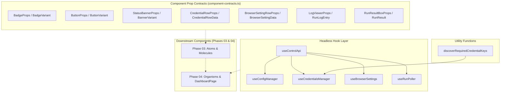
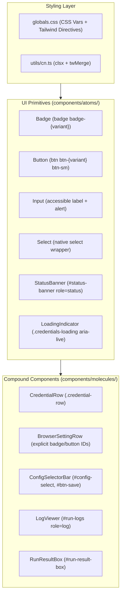

# System architecture

This component-level view covers bounded report workers, Jenkins auto-build
Stage View monitoring, and dynamic credentials. It describes the shipped
execution paths, local SecretStore, loopback control API/UI, and deterministic
verification:

- **Report:** authenticate, inspect one exact Jenkins job, capture bounded Snyk
  and SonarQube evidence, and publish immutable static reports.
- **Auto-build:** run one selected or all enabled `auto-build` projects in a
  bounded pool; optionally wait for new Stage View runs and return safe in-memory
  outcomes with build and stage details. It does not publish reports.
- **Offline fixture:** load the checked-in nine-file corpus and fulfill only
  exact synthetic URLs for deterministic report and auto-build tests.
- **SecretStore and secrets API:** persist validated local credential values
  outside project JSON and expose only boolean presence through guarded
  `/api/secrets` operations.
- **Project report deletion:** guarded loopback
  `DELETE /api/reports/projects/:projectId` uses the report-root lock;
  contention returns `409` and the aggregate rebuilds from survivors.
- **Control UI:** edit schema-v1 settings and manage credentials. The action bar
  exposes all-enabled report/build actions and one shared saved Workers
  selector; builds start immediately without a per-card button or confirmation
  dialog. Results show ordered project outcomes or the legacy scalar fallback.
- **Control-run executor:** snapshot stored values per run, merge them over
  the caller environment, pass the merged environment to the selected
  executor, and redact control-run output. Direct callers remain environment-
  driven.
- **Verification:** isolated contracts cover report deletion, credentials, and
  auto-build; Chromium/WebKit Control UI scenarios run without Jenkins.

The [architecture](./architecture.md) document contains the field-level runtime
contract. See [multi-project configuration](./multi-project-configuration.md)
for JSON, credential, and secrets API details and [release gates](./release-gates.md)
for validation commands.


## Context and boundaries

```mermaid
flowchart TB
  Operator[Operator or future integration] --> ConfigFile[Schema-v1 project JSON]
  ConfigRoot[Existing config/ directory] --> SecretStore[SecretStore backend]
  SecretStore --> SecretsApi[Loopback /api/secrets]
  Control[Loopback control server] --> SecretsApi
  SecretsApi -. presence-only status; guarded PUT/DELETE .-> SecretStore
  Control --> ReportsApi[Loopback DELETE /api/reports/projects/:projectId]
  ReportsApi --> DeleteReports[Safe project removal + aggregate rebuild]
  DeleteReports -. guarded mutation; report-root lock .-> ReportRoot
  Control --> RunManager[Control run manager]
  RunManager --> ControlExecutor[Control run executor]
  ConfigFile --> Loader[Validate and normalize]
  Loader --> Selector{Explicit mode and project selection}
  BaseEnv[Caller environment] --> ControlExecutor
  SecretStore --> ControlExecutor
  Secrets[CI secret store / environment] --> Executor
  Selector --> Executor[Mode-specific executor]
  ControlExecutor --> Executor
  Jenkins[Jenkins controller] --> ReportSources[Snyk / SonarQube publisher pages]
  Executor --> Jenkins
  Executor --> ReportRoot[Canonical report root]
  ReportRoot --> ReadOnlyServer[Read-only report server / reports index]
  Control -. direct navigation /reports/index.html .-> ReadOnlyServer
  Templates[Checked-in offline fixtures] -. exact synthetic URL routes, tests only .-> Executor
```

The loader and selection helpers are pure configuration boundaries. Browser
launch, credentials, and network I/O begin only after a caller has selected an
executor. Direct report and auto-build callers pass their environment to the
selected runner. In control mode, `createReportServer` creates both
`ConfigStore` and `SecretStore` from the configured `configRoot`; the latter
fixes its target to `secrets.local.json` under that canonical directory.
The loopback control router validates `Host` before dispatch. The secrets API
returns only boolean presence data; project-report deletion is control-only.
Mutation handlers require same-origin `Origin` and CSRF and reject unsupported
`Sec-Fetch-*` values; any supplied JSON body must use the JSON content type.

`createRunManager` carries the optional `SecretStore` dependency into
`executeControlRun`. At execution start, the control executor reads one
snapshot and creates `{ ...env, ...storedSecrets }`; stored values override
same-named base values, and neither the caller environment nor `process.env`
is mutated. It normalizes the configuration and passes the new object as
`runtimeEnvironment` to either mode-specific executor.

## Control-run environment flow

A report `POST /api/run` requires `configName`, `configEtag`, and `runType`;
auto-build accepts an optional `projectId`. No request carries `workerCount`
or secret values; the API rejects `workerCount` with `422 INVALID_WORKER_COUNT`
before `startRun`. The run manager admits one active run and dispatches
asynchronously; the executor then:

| Stage | Contract |
| --- | --- |
| Snapshot | Read the current `SecretStore` map once for this execution. |
| Merge | Build a fresh `NodeJS.ProcessEnv` from the supplied base environment, then overlay all stored entries; stored entries win on key collisions. |
| ETag check | Read the saved config and require its ETag to match `configEtag` before using the document. |
| Normalize | Validate and normalize the matched config against the merged environment, so credential-variable references resolve from stored values when present. |
| Report dispatch | Pass selected report projects and `{ runtimeEnvironment, workerCount: configEntry.document.reportWorkers ?? 1 }` to `reportExecutor` only. |
| Auto-build dispatch | Optional `projectId`: select one project if supplied, otherwise all enabled auto-build projects. Run `executeAutoBuildWorkerPool` with saved `reportWorkers ?? 1` and merged environment. |
| Redact | Use every non-empty stored value to redact control logs, report warnings, caught errors/stacks, and auto-build URL result fields before recording them. |

Auto-build returns ordered `result.buildProjects` rows, including for
one-project runs. Status succeeds only if every `exitCode === 0`; worker
exceptions become `submission-unknown` while siblings continue. The Control
Page renders identity, status/result, optional build number/link, stages, and
errors per row; older scalar results keep their fallback.

`DashboardPage` binds the `ExecutionSection` **Workers** selector
(`#select-workers`) to the active document's `updateReportWorkers` transition.
It updates top-level `reportWorkers` and raw JSON, marks the document dirty, and
requires ETag-protected Save before either run action enables. The saved 1–4
count applies to both pools and is never sent as request-level `workerCount`.

**Generate Reports (All Enabled)** (`#btn-run-reports`) triggers report mode;
**Trigger Auto Build (All Enabled)** (`#btn-run-auto-build`) sends
`runType: 'auto-build'` without `projectId`, selecting all enabled auto-build
projects. Both actions are disabled without a document, while the document is
dirty, or while a run is queued/running. Valid raw-JSON Apply updates the same
schema-validated model; invalid input leaves the applied model unchanged.

For auto-builds, `waitForCompletion` remains persisted by `ConfigProjectEditor`
and applies through the saved project/default setting; there is no per-run
modal override. The report runner ignores this option.


The file-mode report CLI and direct library calls keep their existing
caller-supplied environment behavior; this injection boundary belongs only to
control-run execution.

## Mode dispatch

A normalized project carries `runType: 'report' | 'auto-build'`. Missing input
normalizes to `report`; the field is project-only and cannot be set through
defaults or environment configuration. `enabled: false` always wins.

| Caller boundary | Input | Executor | Output/side effect |
| --- | --- | --- | --- |
| `selectReportProjects(projects)` | normalized config | `runFromConfig` → `runConfiguredProjects` | bounded report outcomes and aggregate artifacts |
| Control auto-build `POST /api/run` | Optional ID and saved document | Config selection plus bounded worker pool | Ordered `buildProjects` outcomes; no report artifacts |

`selectReportProjects` returns all enabled report projects; `selectAutoBuildProjects`
returns all enabled auto-build projects. `selectAutoBuildProject` resolves one
exact enabled project or fails closed for an empty/unknown ID, disabled project,
or report project. Selectors are pure. The control API uses the list selector
when `projectId` is omitted; `src/cli.ts` remains report-only.

## Report data flow

```mermaid
flowchart LR
  File[Explicit --config file] --> Validate[Schema validation]
  Validate --> Normalize[Frozen normalized projects]
  Normalize --> ReportSelect[selectReportProjects]
  ReportSelect --> Browser[One configured browser]
  Browser --> WorkerPool[At most four report workers]
  WorkerPool --> Context[Fresh context and deadline per project]
  Context --> Login[submitJenkinsLogin]
  Login --> Job[openJenkinsJob exact jobUrl]
  Job --> Discover[Publisher link discovery]
  Discover --> Capture[Snyk / SonarQube capture]
  Capture --> NormalizeEvidence[Bounded normalization]
  NormalizeEvidence --> Stage[Staging lease]
  Stage --> Publish[Validated immutable report]
  Publish --> Aggregate[Aggregate index and data]
```



`loadProjectConfigWithDocument` reads and validates one file, returning the
document with normalized projects; `loadProjectConfig` keeps its
normalized-array contract. `runFromConfig` uses the document's top-level
`reportWorkers` for file-mode reports (default one, maximum four). The pool
claims project indices synchronously and stores outcomes in matching slots,
preserving selected configuration order while continuing after project
failures. Each project receives a fresh context and deadline in one browser.
The report-root lock spans recovery, worker settlement, browser close, cleanup,
manifest discovery, and aggregate publication. Direct `workerCount` values are
validated before artifact initialization or browser launch. Control report runs
use the saved count from the ETag-matched document. Auto-build uses a separate
pool with the same bound; it remains outside the report worker pool.

## Auto-build data flow

```mermaid
sequenceDiagram
  participant Caller
  participant Control as Run manager/executor
  participant Select as Config selection
  participant Pool as Auto-build worker pool
  participant Runner as Auto-build runner
  participant Browser as Playwright browser/context
  participant Jenkins
  participant Trigger as Build trigger

  Caller->>Control: POST /api/run (optional projectId)
  Control-->>Caller: 202 { id, status }
  Control->>Select: resolve one ID or all enabled auto-build projects
  Select-->>Control: selected project(s) in configuration order
  Control->>Pool: executeAutoBuildWorkerPool(projects, saved reportWorkers)
  Pool->>Runner: run projects concurrently up to saved worker bound
  Runner->>Browser: launch fresh browser/context per project
  Runner->>Jenkins: submit login at exact loginUrl
  Jenkins-->>Runner: authenticated page
  Runner->>Jenkins: open exact jobUrl
  Runner->>Trigger: triggerParameterizedBuild(page, config, deadline)
  opt waitForCompletion enabled
    Trigger->>Jenkins: snapshot latest Stage View run ID
  end
  Trigger->>Jenkins: validate build link/form and submit once
  Jenkins-->>Trigger: matching POST response or indeterminate result
  alt accepted response and waiting enabled
    Trigger->>Jenkins: return to jobUrl and poll Stage View
    Jenkins-->>Trigger: build number, terminal result, stage status/duration
    Trigger-->>Runner: project outcome and exitCode
  else waiting disabled, rejected, or indeterminate
    Trigger-->>Runner: project outcome and exitCode
  end
  Runner->>Browser: bounded context/browser cleanup
  Runner-->>Pool: sanitized project outcome
  Pool-->>Control: configuration-ordered buildProjects
  Control->>Control: status succeeds iff every exitCode is zero
  Caller->>Control: GET /api/run?id=<id>
  Control-->>Caller: terminal run with result.buildProjects
  ```

The runner does not use `ArtifactPaths`, report capture, Jenkins queue or
build-number APIs, cancellation, or retries. With waiting enabled, it polls
Stage View on the job page; a successful `SUCCESS` run becomes `succeeded`,
while `FAILED`, `UNSTABLE`, and `ABORTED` become `failed`. Timeout outcomes
retain any build details already observed. Pre-POST failures are represented
as `failed-before-submit`; an indeterminate matching POST is
`submission-unknown` and must not be retried.

`build-trigger.ts` captures the baseline run ID; `stage-view.ts` owns
new-run selection, polling, reloads, and progress messages.
`stage-view-parser.ts` reads the `#pipeline-box` table, mapping run and stage
statuses, header names, and optional durations; `stage-view-types.ts` defines
`StageViewRun`, `StageViewStage`, and terminal status contracts. Control runs
stream progress messages to the run log.

Control runs invoke this runner with the merged `runtimeEnvironment` created
by `executeControlRun`; direct integrations can provide their own environment
through `AutoBuildRunnerDependencies`.

## Jenkins component contracts

### Authentication and identity

`src/jenkins/auth.ts` submits credentials only to the configured login action,
validates the authenticated URL and landmark, and opens the exact configured
job URL. `src/jenkins/url-identity.ts` provides exact job and job-action
identity checks. Action identity requires the same origin, credential-free URL,
normalized path `<jobUrl>/build`, matching decoded `job/` segments, no fragment,
and no unexpected query. Only the build-detail navigation may carry the exact
`?delay=0sec` query.

`jobUrl` is the sole branch identity. Nested jobs and repeatedly encoded
segments are decoded for comparison; sibling jobs, prefixes, alternate origins,
foreign actions, and path tricks fail closed.

### Scoped controls and submission

`src/jenkins/locators.ts` maps the configured selector contract to Playwright
locators and resolves hrefs relative to the current page without trusting them.
`src/jenkins/build-trigger-validation.ts` requires:

1. exactly one visible `#side-panel` and one visible configured **Build with
   Parameters** link;
2. a link href that is the exact configured job `/build` action;
3. exactly one visible `#bottom-sticker` and one visible configured **Build**
   button;
4. class tokens `jenkins-button`, `jenkins-button--primary`, and
   `jenkins-!-build-color`;
5. exactly one ancestor form with method `POST`; and
6. a form action that is the same exact configured job `/build` action.

`src/jenkins/build-trigger.ts` installs request and response observers before
the click. A matching POST response at or above HTTP 400 is `rejected`; an
observed POST without a determinate response is `submission-unknown`. With
waiting disabled, a response below 400 returns `submitted`; with waiting
enabled, the trigger monitors the new Stage View run. Pre-POST validation or
navigation errors are sanitized `JenkinsFlowError` failures. The trigger does
not expose form bodies, parameters, crumbs, headers, cookies, or response
bodies.

### Stage View completion observation

`src/jenkins/build-trigger.ts` snapshots the latest `runId` before build
navigation when waiting is enabled. After an accepted POST, it follows the
redirect to the job page, falling back to direct `jobUrl` navigation if needed.
`src/jenkins/stage-view.ts` selects a newer run (or a fresh in-progress run if
no baseline exists), polls under the shared `WorkflowDeadline`, and emits
progress when run or stage state changes. It finishes for `SUCCESS`, `FAILED`,
`UNSTABLE`, or `ABORTED`; a timeout returns partial run details when available.

`src/jenkins/stage-view-parser.ts` reads the `#pipeline-box` table, stage
headers, row/cell class statuses, build number, and optional cell duration.
`src/jenkins/stage-view-types.ts` defines run identity, the terminal/in-progress/
unknown status union, and each stage's name, status, and duration. The resulting
auto-build data carries `buildNumber`, `buildResult`, and `stages`; the Control
Page result card renders the build number, result badge, and stage summaries.


## Resource and error boundaries

`src/browser-launcher.ts` is the shared browser-launch boundary. It selects
Chromium, Firefox, or WebKit and parses the supported environment options:
`PLAYWRIGHT_EXECUTABLE_PATH`, `PLAYWRIGHT_HEADLESS`, `PLAYWRIGHT_HEADED` or
`HEADED`, and `PLAYWRIGHT_SLOW_MO` or `PLAYWRIGHT_ACTION_DELAY`.

`WorkflowDeadline` is one immutable absolute time budget per project. Report
and auto-build workflows pass it through all browser operations. Resource
creation handles late results, and context/browser closure uses bounded
settlement cleanup. Cleanup failures must not convert a known auto-build result
into a retryable operation.

Diagnostics use the existing redaction helpers. URLs are sanitized before
persistence or display. Report failure artifacts retain a safe project/run
identity; auto-build results stay in memory and contain only bounded safe
fields.
For control runs, `report-server-run-executor.ts` redacts all non-empty values
from the SecretStore snapshot before adding logs or persisting result
diagnostics. Auto-build URL fields (`jobUrl` and `buildPageUrl`) are redacted
as well; report links are generated from validated local relative paths.

## Persistence and serving

Only the report path writes report artifacts. Each report run uses a validated
project ID and immutable run ID below the canonical report root:

```text
reports/
├── index.html
├── aggregate-data.json
├── assets/report.css
└── <project-id>/<run-id>/
    ├── index.html
    ├── data.json
    ├── manifest.json
    └── requested screenshots
```

`src/artifacts/` stages and validates writes, coordinates same-host report-root
leases, recovers aggregate publication, and performs bounded orphan cleanup.
`src/reporting/` escapes rendered values, validates links, sets CSP headers,
and serves only safe GET/HEAD files below the canonical root. The server is
read-only, unauthenticated, and loopback by default.
`src/artifacts/aggregate-index-builder.ts` is the pure projection layer: it
combines validated discovery with current outcomes, keeping current outcomes
in order and retaining historical-only projects.
`ManifestDiscoveryResult.incomplete` signals that a manifest or discovery
budget was reached. The runner skips publication and the builder rejects an
incomplete discovery result.

Aggregate validation permits 5,050 project rows (up to 5,000 historical IDs
plus 50 configured projects); schema-v1 input remains limited to 50 projects.
An empty `projects` array is valid and renders as an empty index.
`writeAggregateDataPair` checks each staged file before replacement: both
`aggregate-data.json` and `index.html` must be at most `MAX_STATIC_FILE_BYTES`
(16 MiB). An oversized file rejects publication and preserves the previous pair.
See [report pipeline](./report-pipeline.md) for the detailed index and
recovery contract.

## Local secret-store subsystem

`src/reporting/report-server-secret-store.ts` is a persistence-only backend
for control-plane credentials. `createSecretStore(configRoot)` accepts an
existing real directory, resolves it to its canonical path, and derives one
fixed target: `secrets.local.json`. It rejects a missing/non-directory or
symlinked root; it never accepts a path or filename from a request.

The store contract is:

| Operation | Observable contract |
| --- | --- |
| `readSecrets()` | Reads a fresh validated map; missing or empty files return `{}` and the returned object is frozen. |
| `listSecretNames()` | Returns sorted, frozen key names without values. |
| `putSecret(name, value)` | Validates one environment-style name and string value, then read-modify-writes under the lock. |
| `putSecrets(entries)` | Validates all entries before applying a bulk read-modify-write. |
| `deleteSecret(name)` / `deleteSecrets(names)` | Validate names and remove existing keys; deleting absent keys is a no-op. |

Keys must match `/^[A-Za-z_][A-Za-z0-9_]{0,127}$/` and must not be the
prototype names `__proto__`, `prototype`, or `constructor`; values remain
strings and are never coerced. The file and serialized payload are capped at
`MAX_SECRET_FILE_BYTES` (1 MiB). Updates use one in-memory write mutex so
concurrent callers preserve each other's changes. Serialization sorts keys
lexicographically and writes a sibling temporary file with exclusive creation,
mode `0o600`, `fsync`, close, and same-directory rename. A rename failure
removes the temporary file and leaves the prior target unchanged; write/sync
failures close the handle, while cleanup of a partially written temporary file
is best-effort. On Windows, mode bits are not an ACL boundary; protect the
config directory with appropriate user/CI ACLs.

`createReportServer` creates the store only in loopback control mode and
exposes it through `ReportServerHandle` and `ControlRouterContext`. The
control router dispatches `/api/secrets` to the dedicated
`report-server-control-secrets-api.ts` handler; `report-server-control-api.ts`
remains the config/run facade.

For a control run, `report-server-run-manager.ts` carries the optional store
to `report-server-run-executor.ts`. That executor reads one current snapshot,
merges it over the supplied environment without mutating `process.env`, and
passes `runtimeEnvironment` to report or auto-build execution. Secret values
are redacted from control logs, warnings, errors, and auto-build result URLs
before the run record is persisted. The direct report CLI and library runners
still consume their caller-supplied environment.

The Phase 05 SecretStore lifecycle suite adds focused checks for empty reads,
atomic file replacement and temporary-file cleanup, platform permission
handling, invalid/reserved keys, value-type error redaction, concurrent
updates, and bulk deletion. The API operation suite and control-page E2E
scenarios are described in the test architecture below.

### Control secrets API and security gates

The secrets handler is intentionally separate from
`report-server-control-api.ts`, which keeps the config/run handlers and
re-exports `handleSecretsApi` as the control API facade. `handleControlRequest`
performs the Host check before any route dispatch. All JSON responses use
`Cache-Control: no-store` and the control CSP/security header set.

| Request | Gate and input | Response |
| --- | --- | --- |
| `GET /api/secrets` | Exact bound Host; optional comma-separated `keys` query, each validated | `200 { "secrets": { "<name>": true } }`; filtered names are `true` or `false` |
| `PUT /api/secrets` | Host, Origin, Fetch Metadata, CSRF, JSON content type, and bounded JSON body | `200` full presence map after patch |
| `DELETE /api/secrets?name=NAME` | Same mutation gates; valid name query | `200` full presence map after deletion |
| `DELETE /api/secrets` | Same gates; JSON `{ "name": "NAME" }` or `{ "names": ["NAME"] }` | `200` full presence map after deletion |

PUT accepts either `{ "name": "NAME", "value": "VALUE" }` or a non-empty
`{ "secrets": { "NAME": "VALUE" } }` object. A null value in the object, or
`action: "delete"` in the single-entry form, deletes instead of storing.
Values never appear in success or error responses. Invalid names/values and
malformed bodies return `400`; invalid mutation gates return `403`, a
non-JSON mutation body returns `415`, an unavailable store returns `503`, and
unsupported methods return `405` with `Allow: GET, PUT, DELETE`.

### Control UI, Vite build pipeline, and credential dialog

The loopback control dashboard at `/` is built using Vite (`vite.control.config.ts`),
compiling React components and Tailwind CSS into `.runner-build/reporting/control-page/`
as `index.html`, `assets/control-page.css`, and `assets/control-page.js`. Rollup output
configures single-bundle JS/CSS and disables CSS code-splitting to adhere strictly to
`CONTROL_CSP` (`default-src 'none'`, `script-src 'self'`, `style-src 'self'`). Legacy
imperative files (`control-page.js`, `control-page.html`, `control-page.css`) have been
completely deleted, leaving only modern React assets produced by Vite.

`report-server-control-page.ts` reads the Vite-built assets from
`.runner-build/reporting/control-page/`, dynamically substituting the server's per-instance
CSRF token into the `__CSRF_TOKEN_PLACEHOLDER__` in `index.html`. Assets are served by
`report-server-control.ts` at `/assets/control-page.css` and `/assets/control-page.js` with
strict security headers and `Cache-Control: no-store`.

The dashboard UI includes a `Credentials` action and modal dialog. The UI reads the
instance token from the `meta[name="csrf-token"]` element; `apiFetch` adds it as
`x-csrf-token` to every state-mutating `POST`, `PUT`, and `DELETE`.

Opening the dialog derives the required environment-variable names from the
currently loaded configuration. Project credential references take precedence
over defaults (including normalized `credentialVariables` references); when
references are omitted, the UI uses `JENKINS_USERNAME` and
`JENKINS_PASSWORD`. Names are deduplicated and sorted before the request. The
dialog then calls `GET /api/secrets?keys=...`, which is Host-checked and
returns only `true`/`false` presence values. Each key is rendered as a
**Configured** or **Missing** badge with a blank `type="password"` input. A
configured key also gets a per-row **Clear** action.

The operator workflow is:

1. Click **Credentials**; the dialog shows a loading state while presence is
   fetched, or a bounded error message when the request fails.
2. Enter one or more replacement values. Blank inputs mean “keep the existing
   value”; the browser collects only non-empty, trimmed fields.
3. Click **Save Credentials**. The UI sends
   `PUT /api/secrets` with a JSON `{ "secrets": { ... } }` patch. The server
   applies the Host, same-origin Origin, Fetch Metadata, timing-safe CSRF,
   JSON-content-type, and body-size gates, persists the patch atomically, and
   returns a presence map. On success the changed inputs are immediately
cleared, their badges become **Configured**, and **Clear** actions are added.
4. Click a row's **Clear** action to send a CSRF-protected,
   bodyless `DELETE /api/secrets?name=...`. A successful deletion clears that
   input, changes its badge to **Missing**, and removes the row action.
5. Cancel or otherwise close the dialog. Its `close` handler clears every
   credential input and the modal status message, so unsaved values do not
   remain in the DOM. Reopening performs a fresh presence-only lookup.

Secret values are transient in the password control while being edited and in
the one mutation request body. They are never used as labels, status text,
URLs, or HTML; API success/error payloads contain no values. Save, clear, and
close wipe input values, while persistence and later control runs use the
server-side SecretStore/redaction boundary described below. This keeps the
modal's observable state limited to variable names, presence badges, and
bounded operation messages.

```mermaid
sequenceDiagram
  participant Operator
  participant UI as Control page
  participant API as Loopback secrets API
  participant Store as SecretStore
  Operator->>UI: Open Credentials
  UI->>API: GET /api/secrets?keys=...
  API->>Store: Read names/presence
  Store-->>API: Boolean presence map
  API-->>UI: Presence only
  Operator->>UI: Enter non-empty values
  UI->>API: PUT /api/secrets + CSRF + JSON
  API->>Store: Validate and atomic update
  Store-->>API: Updated presence
  API-->>UI: Presence only
  UI->>UI: Wipe submitted inputs; update badges
  Operator->>UI: Clear or close
  UI->>API: DELETE /api/secrets?name=... or wipe locally
```

The browser-facing contract in `tests/e2e/control-page.spec.ts` covers
credential discovery, presence, save/clear/reopen, input wiping, and absence of
test secrets from page HTML and run logs. It also covers report-worker
selection, raw-JSON sync, dirty/save gating, persistence, request payloads, and
crafted-request rejection. Chromium/WebKit scenarios use local fixtures and
do not contact Jenkins.

### Control UI headless hook architecture and component contracts (Phase 02)

The Control Dashboard frontend in `src/reporting/control-page/` is structured around headless React hooks and strict component contracts, isolating business logic, API communication, and state lifecycles from presentational UI rendering.



#### Headless Hook Layer (`src/reporting/control-page/hooks/`)

1. **`useControlApi` (`useControlApi.ts`)**:
   - Reads the CSRF token from `<meta name="csrf-token">` once at mount using `getCsrfTokenFromDom()`.
   - Exposes `apiFetch(url, options)`: automatically appends `x-csrf-token` headers to state-mutating requests (`POST`, `PUT`, `DELETE`) directed to same-origin or relative endpoints while omitting them on `GET`.
   - Exposes `requestJson<T>(url, options)`: typed JSON wrapper that parses structured `ApiErrorResponse` payloads and throws `ControlApiError` containing the HTTP status code and optional error code.

2. **`useConfigManager` (`useConfigManager.ts`)**:
   - Manages configuration file listing, retrieval, active document selection, and in-memory project updates.
   - Enforces HTTP concurrency guards: captures the `ETag` header from `GET /api/config?name=...` and attaches `If-Match: <etag>` during `PUT /api/config`. Detects `409 Conflict` and `412 Precondition Failed` to prevent lost updates.
   - After a successful load, stores the filename in `localStorage` under
     `jenkins_control_active_config` and mirrors it in `?config=<name>` with
     `history.replaceState`, preserving the pathname, other query parameters, and hash.
   - On list load, selects the first available match in this order:
     `queryCandidate` > `storedCandidate` > first available config. With no
     configs, it clears the stored and URL selection.
   - `UseConfigManagerResult` exposes `activeConfigName` and load operations, but
     not `setActiveConfigName`; that setter remains internal to the hook.
   - Synchronizes structured document edits with the raw JSON textarea view, tracking validation state (`jsonValidationMsg`) and `isDirty` flags to gate execution actions.

3. **`useCredentialsManager` (`useCredentialsManager.ts`)**:
   - Discovers required credential variable names dynamically from the active configuration using `discoverRequiredCredentialKeys(doc)`.
   - Queries secret presence via `GET /api/secrets?keys=...` to populate `credentialRows: CredentialRowData[]` without exposing secret values.
   - Saves modified values via `PUT /api/secrets` with safe key sanitation (`/^[A-Za-z_][A-Za-z0-9_]{0,127}$/`), and removes individual keys via `DELETE /api/secrets?name=...`.

4. **`useBrowserSettings` (`useBrowserSettings.ts`)**:
   - Manages global browser execution overrides: `PLAYWRIGHT_HEADLESS` and `PLAYWRIGHT_EXECUTABLE_PATH`.
   - Operates independently from project credentials, checking presence via `GET /api/secrets?keys=PLAYWRIGHT_HEADLESS,PLAYWRIGHT_EXECUTABLE_PATH` and tracking boolean states `headlessConfigured` and `execPathConfigured`.
   - Clears values via `DELETE /api/secrets?name=...`.

5. **`useRunPoller` (`useRunPoller.ts`)**:
   - Controls report generation and auto-build execution lifecycles.
   - Initiates runs via `POST /api/run` expecting `202 Accepted` (or `200 OK`) and parses the returned run identifier.
   - Polls `GET /api/run?id=<runId>` at 1,000ms intervals with exponential backoff on transient network errors (up to 5 consecutive errors).
   - Fast-fails on fatal 4xx errors (excluding 408/429) and ceases polling when reaching terminal statuses (`succeeded`, `failed`, `submission-unknown`).
   - Handles leak-free unmount and cancellation via `AbortController` and timer resets.

#### Component Prop Contracts (`src/reporting/control-page/types/component-contracts.ts`)

Provides strongly-typed prop interfaces for Phase 03 component implementers (atoms and molecules) and Phase 04 page assembly:
- **UI Primitives**:
  - `BadgeProps`: consumes `BadgeVariant` (`'idle' | 'queued' | 'running' | 'succeeded' | 'failed' | 'unknown' | 'configured' | 'missing' | 'not-set'`).
  - `ButtonProps`: consumes `ButtonVariant` (`'primary' | 'secondary' | 'danger' | 'outline'`) and `ButtonSize` (`'sm' | 'md' | 'lg'`).
  - `StatusBannerProps`: consumes `BannerVariant` (`'info' | 'success' | 'error'`) and display message.
- **Row & Item Presenters**:
  - `CredentialRowProps`: takes `CredentialRowData` (`{ key: string, isConfigured: boolean }`) with an optional `onClear` callback.
  - `BrowserSettingRowProps`: takes `BrowserSettingData` (`{ key: BrowserSettingKey, isConfigured: boolean, currentValue?: string }`) with an optional `onClear` callback.
- **Execution & Diagnostics**:
  - `LogViewerProps`: receives `RunLogEntry[]` and `isLoading` flag.
  - `RunResultBoxProps`: receives `RunResult | null` containing report URLs, build links, or failure diagnostics.

#### Atomic Design Implementation and Contract Fidelity (Phase 03)

Phase 03 implements accessible atomic design UI primitives and compound molecules conforming strictly to `types/component-contracts.ts` and legacy DOM contracts:



1. **Atomic UI Primitives ([`components/atoms/`](file:///G:/ws/sharing/auto-jobs/src/reporting/control-page/components/atoms/))**:
   - [`Badge`](file:///G:/ws/sharing/auto-jobs/src/reporting/control-page/components/atoms/Badge.tsx#L31): Renders `<span className="badge badge-{variant}">`. Maps status variants (`idle`, `queued`, `running`, `succeeded`, `failed`, `unknown`, `submission-unknown`), credential states (`configured`, `missing`), and browser setting states (`not-set` -> `badge-missing` class with `"Not Set"` text).
   - [`Button`](file:///G:/ws/sharing/auto-jobs/src/reporting/control-page/components/atoms/Button.tsx#L5): Renders accessible button elements with variant classes (`btn-primary`, `btn-secondary`, `btn-danger`, `btn-outline`), size modifier (`btn-sm`), disabled/loading spinner states, and `data-*` attribute forwarding.
   - [`Input`](file:///G:/ws/sharing/auto-jobs/src/reporting/control-page/components/atoms/Input.tsx#L5): Accessible form input with `htmlFor` label linkage, `role="alert"` / `aria-invalid="true"` error announcements, and secure defaults (`autoComplete="off"`, `spellCheck={false}`).
   - [`Select`](file:///G:/ws/sharing/auto-jobs/src/reporting/control-page/components/atoms/Select.tsx#L5): Native `<select>` wrapper supporting options arrays or child elements, field labels, and `aria-label`.
   - [`StatusBanner`](file:///G:/ws/sharing/auto-jobs/src/reporting/control-page/components/atoms/StatusBanner.tsx#L5): Notification alert `<div id="status-banner" role="status" aria-live="polite">` with `info`, `success`, and `error` styling, hidden via `.hidden` when inactive.
   - [`LoadingIndicator`](file:///G:/ws/sharing/auto-jobs/src/reporting/control-page/components/atoms/LoadingIndicator.tsx#L5): Accessible status indicator (`aria-live="polite"`) with `.credentials-loading` styling and visibility toggling.

2. **Compound Molecules ([`components/molecules/`](file:///G:/ws/sharing/auto-jobs/src/reporting/control-page/components/molecules/))**:
   - [`CredentialRow`](file:///G:/ws/sharing/auto-jobs/src/reporting/control-page/components/molecules/CredentialRow.tsx#L8): Renders credential configuration rows: `.credential-row` container, `.credential-field` label with dynamic `for="secret-input-${key}"` and `Badge`, and `.credential-input-group` containing password `<input id="secret-input-${key}" class="credential-input" autocomplete="off">`. When configured, exposes clear button `<button class="btn btn-secondary btn-sm btn-clear-credential" data-key="{key}">Clear</button>`.
   - [`BrowserSettingRow`](file:///G:/ws/sharing/auto-jobs/src/reporting/control-page/components/molecules/BrowserSettingRow.tsx#L28): Renders browser setting controls with contract-specified element IDs: `#badge-browser-headless`, `#browser-headless-select`, `#btn-clear-browser-headless` for headless mode; `#badge-browser-executable-path`, `#browser-executable-path-input`, `#btn-clear-browser-executable-path` for browser binary path.
   - [`ConfigSelectorBar`](file:///G:/ws/sharing/auto-jobs/src/reporting/control-page/components/molecules/ConfigSelectorBar.tsx#L7): Renders configuration selector (`<select id="config-select">`), reload action (`#btn-reload`), save action (`#btn-save`, disabled unless `isDirty`), and dialog open buttons (`#btn-credentials`, `#btn-browser-settings`).
   - [`LogViewer`](file:///G:/ws/sharing/auto-jobs/src/reporting/control-page/components/molecules/LogViewer.tsx#L23): Streaming run log viewer `<pre id="run-logs" role="log" aria-live="polite" class="log-pre">`, formatting string logs or timestamped `RunLogEntry[]` entries and auto-scrolling to newest output.
   - [`RunResultBox`](file:///G:/ws/sharing/auto-jobs/src/reporting/control-page/components/molecules/RunResultBox.tsx#L5): Execution result panel `#run-result-box` for report results, ordered multi-project builds, scalar fallback, and errors.
   - [`BuildProjectOutcomeRow`](../src/reporting/control-page/components/molecules/build-project-outcome-row.tsx): Per-project identity/status, optional build link/number, stages, and errors.

3. **Contract Fidelity Guarantees**:
   - **DOM contracts**: Retained IDs/classes remain stable; removed dialog and per-card build controls are not part of the current UI contract.
   - Preserves `<textarea id="raw-json-textarea">` as a native textarea for Playwright `.fill()` and `.textContent` operations.
   - Enforces zero plaintext credential leakage: password masking, `autoComplete="off"`, and input value clearing on save, clear, or dialog close.
   - Updated component tests cover both all-enabled action buttons, the shared
     Workers options/disabled states, and ordered multi-project plus scalar results.

#### React Application Assembly and Legacy Cleanup (Phases 04 - 06)

1. **Compound Organisms and Page Assembly ([`components/organisms/`](file:///G:/ws/sharing/auto-jobs/src/reporting/control-page/components/organisms/))**:
   - Assembles current organisms into dashboard subsystems: `HeaderBar`, `ProjectsGrid`, `ProjectCard`, `ExecutionSection`, `RunStatusCard`, `RawJsonSection`, `CredentialsDialog`, and `BrowserSettingsDialog`.
   - Layout template ([`DashboardLayout.tsx`](file:///G:/ws/sharing/auto-jobs/src/reporting/control-page/components/templates/DashboardLayout.tsx)) encapsulates accessible skip links (`.skip-link`), status notifications, and container constraints.
   - Page and Application Root ([`DashboardPage.tsx`](file:///G:/ws/sharing/auto-jobs/src/reporting/control-page/pages/DashboardPage.tsx), [`App.tsx`](file:///G:/ws/sharing/auto-jobs/src/reporting/control-page/App.tsx), [`ErrorBoundary.tsx`](file:///G:/ws/sharing/auto-jobs/src/reporting/control-page/components/ErrorBoundary.tsx)) wire headless hooks (`useControlApi`, `useConfigManager`, `useCredentialsManager`, `useBrowserSettings`, `useRunPoller`) into a unified unidirectional data flow.

2. **Phase 06 Legacy Cleanup**:
   - Removed legacy imperative DOM scripting and styling files: `src/reporting/control-page/control-page.js`, `control-page.html`, and `control-page.css`.
   - The loopback dashboard is now 100% powered by the modern React application bundled by Vite (`vite.control.config.ts`) into `.runner-build/reporting/control-page/` (`index.html`, `assets/control-page.css`, and `assets/control-page.js`).
   - `scripts/copy-report-assets.mjs` exclusively stages `report.css`; no legacy control files are copied.
   - Complete build, typecheck, unit, and E2E suites operate strictly against Vite-compiled React assets with 100% test contract preservation.

### Control-run redaction boundary

SecretStore values are never sent in the `/api/run` request or returned by the
secrets API. The control executor retains only the non-empty snapshot values
needed for redaction while the run is in progress. It applies redaction to
`addLog` messages, report warnings, caught error messages and stacks, and
auto-build `jobUrl`/`buildPageUrl` fields. The underlying auto-build runner
also clears its mutable resolved username/password copy during cleanup.

## Offline template fixture subsystem

The fixture subsystem has a one-way dependency graph:

```text
types -> file-io/html -> sonarqube/build-validation -> loader/routes -> facade
```

| Module or asset | Contract |
| --- | --- |
| `template-fixture-types.ts` | Fixture, response, route recorder, file-identity, budget, artifact-link, and Sonar route types. |
| `template-fixture-file-io.ts` | Canonical root resolution and descriptor/no-follow reads with identity, symlink, 4 MiB per-file, and 16 MiB total checks. |
| `template-fixture-html.ts` | HTML tag/attribute parsing, URL policy, canonical/form/link rewrites, artifact selection, and exact URL comparison. |
| `template-fixture-sonarqube.ts` | Saved SonarQube origin/project identity checks and dashboard/issues link rewrites. |
| `template-fixture-build-validation.ts` | Unique `#side-panel` build-link discovery plus canonical, form/action, sticker, and button validation. |
| `template-fixture-loader.ts` | Reads nine files, derives build/report/Sonar destinations, rewrites selected links/actions, and assembles `TemplateReportFixture`. |
| `template-fixture-routes.ts` | Installs the catch-all Playwright route handler, fulfills exact responses, handles exact POST exceptions, and records sanitized misses. |
| `template-server.ts` | Standalone native HTTP server serving Developer Hub index page (`/`, `/index.html`), 9 fixture endpoints, POST redirects, SonarQube auth guard, and graceful shutdown on port 4174. |
| `template-server-cli.ts` | CLI entrypoint, argument parsing (`--host`, `--port`), and signal handling for the standalone template mock HTTP server. |
| `template-report-fixture.ts` | Public facade exporting the supported loader, route installer, HTTP server creator, response helper, types, origin, and total-size boundary. |
| `templates/jenkins-template/template-build.html` | Minimal saved-origin build detail page: one canonical URL, one `POST` form, one `#bottom-sticker`, and one classed `Build` button. |

The loader derives the build identity from the unique saved job-page
`Build with Parameters` anchor. It permits only the approved saved origin, the
same-job `/build` path, and the detail-page `delay=0sec` query. The build
template canonical must match that URL; its form action must be the same
`/build` path without query or fragment. Only the selected job href and
validated build form action are remapped to the synthetic origin.

The route map fulfills nine exact `GET`/`HEAD` fixture URLs. It also permits
the exact Jenkins login actions, the same-origin SonarQube `/sessions/new`
authentication path, and the exact build-action `POST`. The build action
returns `303 Location: <fixture.jobUrl>` without reading or reflecting form
data; the browser then requests the exact job page. Any other method or URL is
aborted and recorded with bounded method, origin, and pathname fields only.
SonarQube home serves the login page until the context-local login `POST` marks
that route authenticated.

On [`template-server.ts`](file:///G:/ws/sharing/auto-jobs/src/templates/template-server.ts), requests to `GET /` or `GET /index.html` (and `HEAD`) serve the Developer Hub index page rendered by [`buildDeveloperHubHtml`](file:///G:/ws/sharing/auto-jobs/src/templates/template-server.ts#L78). The Developer Hub provides a dark-themed UI listing all 9 mock endpoints with service category badges (`Jenkins`, `Snyk`, `SonarQube`) and descriptions, enforcing strict security headers (`Content-Security-Policy: default-src 'none'; style-src 'unsafe-inline'`, `X-Frame-Options: DENY`, `X-Content-Type-Options: nosniff`) and URL scheme validation.

## Test architecture

- Configuration and selection tests exercise normalization, explicit mode
  gating, disabled projects, selector requirements, and legacy-key rejection.
- `tests/unit/report-server-secret-store.spec.ts` uses isolated temporary
  config/report roots to prove key/value validation, empty/malformed/object
  handling, sorted and frozen snapshots, bulk updates/deletions, concurrent
  mutation serialization, redaction, and control-server wiring. It does not
  contact a live service.
- `tests/unit/control-secret-store.spec.ts` adds seven isolated lifecycle
  checks for missing/empty reads, atomic writes and temporary-file cleanup,
  POSIX/Windows file handling, invalid and reserved keys, non-string value
  redaction, concurrent writes, and deletion/bulk operations.
- `tests/unit/control-run-executor-secrets.spec.ts` uses isolated stores and
  injected report/auto-build executors to prove per-run SecretStore injection,
  stored-over-base precedence, non-mutation of the base environment, and
  redaction of logs, warnings, errors, and manager-level results. Its shared
  config/record/result helpers live in
  `tests/unit/control-run-executor-fixture.ts`.
- `tests/unit/jenkins-build-trigger.spec.ts` uses an in-process HTTP server to
  prove exact request order, scoped controls, form/action validation, one POST,
  HTTP response states, unknown-after-POST, and diagnostic redaction.
- `tests/unit/auto-build-runner.spec.ts` injects browser/workflow dependencies
  to prove submitted/rejected/unknown outcomes, mode/enabled fail-closed
  behavior, cleanup, and secret redaction.
- `tests/unit/sequential-runner.spec.ts` preserves shared launch options,
  sequential report behavior, and exclusion of auto-build projects from
  `runFromConfig`.
- `tests/unit/control-secrets-api.spec.ts` exercises ten operation cases:
  empty/full/filtered presence maps, guarded single and batch PUT updates,
  null/action deletion, query and body DELETE forms, persistence, and no
  plaintext response.
- `tests/unit/control-secrets-security.spec.ts` exercises plaintext redaction,
  Host/Origin/Fetch Metadata/CSRF gates, key/value/body validation,
  content-type rejection, unsupported methods, and the unavailable-store
  response through the modular handler.
- Template unit and E2E tests use exact default-deny routes and checked-in
  fixtures; `template-build-fixture.spec.ts` proves build-page drift and
  redirect contracts, `template-auto-build.spec.ts` exercises the production
  auto-build workflow with one build `POST`, and `template-server-integration.spec.ts`
  verifies standalone HTTP mock server Developer Hub flows, URL-encoding
  preservation, session auth guarding, concurrent Control Server execution,
  schema-v1 report collection, and auto-build submission. They do not claim live
  Jenkins or vendor execution.

## Invariants for extensions

1. Keep report capture and auto-build submission as separate executors.
2. Require deliberate auto-build intent at the caller boundary: a direct call
   names one project; the Control Page action targets all enabled auto-build projects.
3. Keep `jobUrl` as the only target identity and validate every action URL
   against it before navigation or submission.
4. Validate structure and visibility before clicks; never read hidden form
   parameters or persist request data.
5. Observe a possible side effect before classifying it and never retry after a
   matching POST.
6. Preserve one absolute deadline, bounded cleanup, secret redaction, and the
   existing canonical report-root/security policy.
7. Keep local secrets outside project JSON, reject reserved prototype keys,
   restrict names and payload size, serialize sorted keys atomically, and
   never expose values in diagnostics or HTTP responses.
8. Keep control mutations behind exact Host/Origin, accepted Fetch Metadata,
   timing-safe CSRF, and JSON-size/content-type gates; return presence booleans
   rather than values.
9. For control runs, read one SecretStore snapshot, overlay it on a fresh
   environment object without mutating `process.env`, pass it as
   `runtimeEnvironment`, and redact every stored value from control output.
10. Treat Windows file-mode bits as advisory; rely on protected
    config-directory ACLs.
