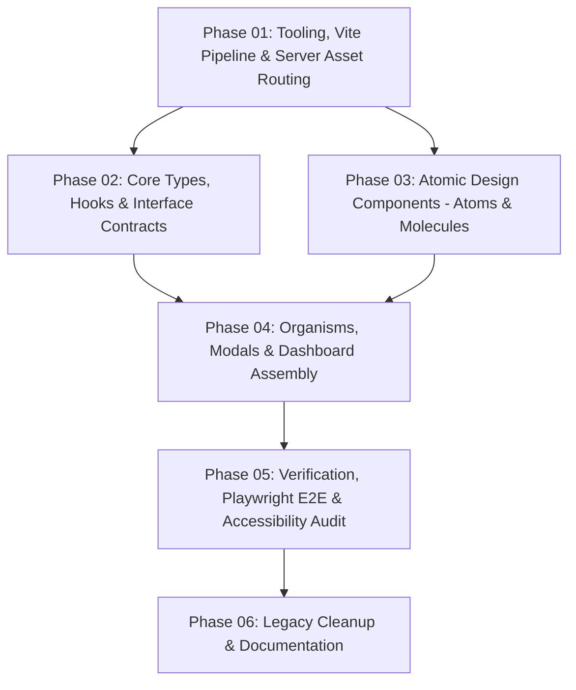

# Control Page React Refactor with Atomic Design

## Executive Summary
Refactor the legacy imperative JavaScript control page (`src/reporting/control-page/control-page.js` ~780 lines, `control-page.html`, `control-page.css`) into a modern, accessible React application structured via Atomic Design principles. The architecture preserves 100% contract fidelity with backend APIs, Content Security Policy (`CONTROL_CSP`), and Playwright E2E / Axe accessibility test suites (`tests/e2e/control-page.spec.ts` — 4 test scenarios × 2 browsers = 8 runs).

> **Key constraint**: Zero modifications to `tests/e2e/control-page.spec.ts` or server API handlers. Every DOM ID, CSS class, data-attribute, ARIA role, and text value asserted by the E2E suite must be reproduced exactly.

## Dependency Graph & Execution Strategy

- **Phase 01**: Vite build configuration, package dependencies (React, Radix, Tailwind), asset bundling targeting `.runner-build/reporting/control-page`, server endpoint routing for built assets, and `tsconfig.json` JSX configuration.
- **Phase 02**: Data interfaces, TypeScript component prop contracts, and React hooks (`useControlApi`, `useConfigManager`, `useCredentialsManager`, `useBrowserSettings`, `useRunPoller`). Includes `discoverRequiredCredentialKeys()` utility.
- **Phase 03**: Atoms (`Badge`, `Button`, `Input`, `Select`, `StatusBanner`, `LoadingIndicator`) and Molecules (`CredentialRow`, `BrowserSettingRow`, `ConfigSelectorBar`, `LogViewer`, `RunResultBox`). Uses plain `<textarea>` for JSON editing (not CodeMirror) to preserve E2E test compatibility.
- **Phase 04**: Organisms (`HeaderBar`, `ProjectCard`, `ProjectsGrid`, `RawJsonSection`, `ExecutionSection`, `RunStatusCard`, `BuildConfirmDialog`, `CredentialsDialog`, `BrowserSettingsDialog`), `DashboardLayout`, `ErrorBoundary`, and `DashboardPage`.
- **Phase 05**: End-to-end test execution (`npm run test:control` — 4 tests × Chromium + WebKit), accessibility compliance (`@axe-core/playwright`), type check, and release verification.
- **Phase 06**: Remove legacy files (`control-page.js`, `control-page.html`, `control-page.css`), update `copy-report-assets.mjs`, and verify clean build.

## File Ownership Matrix

| Phase | Exclusively Owned Files |
|---|---|
| **Phase 01** | `package.json`, `vite.control.config.ts`, `tailwind.config.ts`, `postcss.config.js`, `tsconfig.json` (jsx addition), `tsconfig.build.json` (exclude addition), `scripts/copy-report-assets.mjs`, `src/reporting/report-server-control-page.ts` |
| **Phase 02** | `src/reporting/control-page/types/index.ts`, `src/reporting/control-page/types/component-contracts.ts`, `src/reporting/control-page/hooks/useControlApi.ts`, `src/reporting/control-page/hooks/useConfigManager.ts`, `src/reporting/control-page/hooks/useCredentialsManager.ts`, `src/reporting/control-page/hooks/useBrowserSettings.ts`, `src/reporting/control-page/hooks/useRunPoller.ts`, `src/reporting/control-page/utils/discoverCredentialKeys.ts` |
| **Phase 03** | `src/reporting/control-page/styles/globals.css`, `src/reporting/control-page/components/atoms/*`, `src/reporting/control-page/components/molecules/*` |
| **Phase 04** | `src/reporting/control-page/components/organisms/*`, `src/reporting/control-page/components/templates/*`, `src/reporting/control-page/components/ErrorBoundary.tsx`, `src/reporting/control-page/pages/*`, `src/reporting/control-page/index.html`, `src/reporting/control-page/main.tsx`, `src/reporting/control-page/App.tsx` |
| **Phase 05** | `tests/e2e/control-page.spec.ts` (test harness validation & regressions — read-only) |
| **Phase 06** | Deletion of `src/reporting/control-page/control-page.js`, `control-page.html`, `control-page.css`; update `scripts/copy-report-assets.mjs` |

## Implementation Phases

| # | Phase | Status | Completion | File |
|---|---|---|---|---|
| 01 | Tooling, Vite Pipeline & Server Asset Routing | **DONE** | 2026-09-04 | [phase-01-tooling-vite-pipeline-server-asset-routing.md](phase-01-tooling-vite-pipeline-server-asset-routing.md) |
| 02 | Core Types, Hooks & Interface Contracts | **DONE** | 2026-09-04 | [phase-02-types-and-custom-hooks.md](phase-02-types-and-custom-hooks.md) |
| 03 | Atomic Design Components (Atoms & Molecules) | Pending | — | [phase-03-atoms-and-molecules.md](phase-03-atoms-and-molecules.md) |
| 04 | Organisms, Modals & Dashboard Assembly | Pending | — | [phase-04-organisms-and-page-assembly.md](phase-04-organisms-and-page-assembly.md) |
| 05 | Verification, Playwright E2E & Accessibility Audit | Pending | — | [phase-05-verification-and-release-audit.md](phase-05-verification-and-release-audit.md) |
| 06 | Legacy Cleanup & Documentation | Pending | — | [phase-06-legacy-cleanup.md](phase-06-legacy-cleanup.md) |

Phase 01 completion: **DONE** — 2026-09-04
Phase 02 completion: **DONE** — 2026-09-04

## Next Steps
- Proceed to [Phase 03: Atomic Design Components (Atoms & Molecules)](phase-03-atoms-and-molecules.md).
