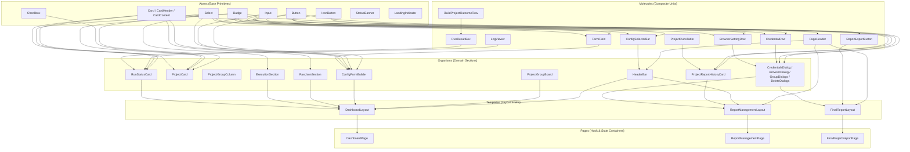
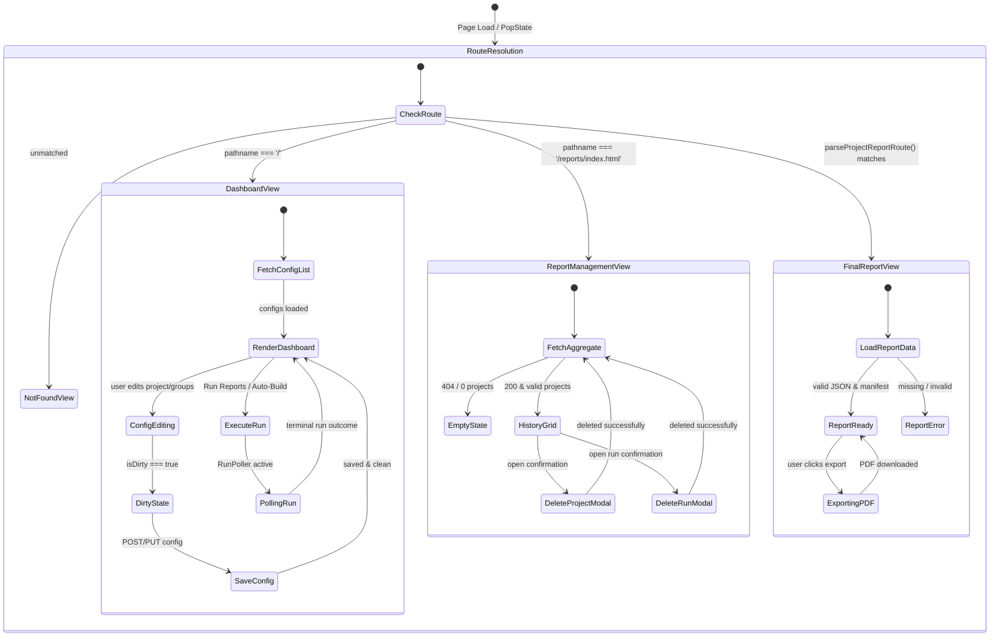

# Architecture Design: Control Page UI Atomic Redesign

## 1. System Overview & Atomic Hierarchy

The Control Page UI frontend (`src/reporting/control-page/`) is restructured into a strict five-tier Atomic Design hierarchy:
- **Atoms**: Pure, stateless primitives with no domain logic (Button, Input, Select, Checkbox, Badge, Card, IconButton, StatusBanner, LoadingIndicator).
- **Molecules**: Combinations of atoms fulfilling a cohesive functional micro-interaction (FormField, PageHeader, ConfigSelectorBar, CredentialRow, BrowserSettingRow, LogViewer, RunResultBox, BuildProjectOutcomeRow, ProjectRunsTable, ReportExportButton).
- **Organisms**: Complex domain-specific feature sections assembling molecules and atoms (HeaderBar, ProjectCard, ProjectGroupColumn, ProjectGroupBoard, ProjectsGrid, ConfigFormBuilder, RawJsonSection, ExecutionSection, RunStatusCard, ProjectReportHistoryCard, Dialogs).
- **Templates**: Page-level layout grids and content slots without live business state (DashboardLayout, ReportManagementLayout, FinalReportLayout).
- **Pages**: Top-level route containers binding hooks and API state to templates (DashboardPage, ReportManagementPage, FinalProjectReportPage).

## 2. Page Navigation & Route Lifecycle State Machine

## 3. Component Dataflow & Contract Preservation

```mermaid
flowchart LR
  subgraph DataLayer["Data Layer & State Hooks"]
    uCM[useConfigManager]
    uCrM[useCredentialsManager]
    uBS[useBrowserSettings]
    uRP[useRunPoller]
    uDR[useDeleteReports]
    uDRun[useDeleteRun]
    uPR[useProjectReport]
  end

  subgraph PresentationLayer["Presentation Layer (Atomic Components)"]
    TL[Templates: DashboardLayout / ReportManagementLayout / FinalReportLayout]
    OG[Organisms: HeaderBar / ProjectGroupBoard / ConfigFormBuilder / Dialogs]
    ML[Molecules: FormField / OutcomeRow / Table / Viewer]
    AT[Atoms: Button / Input / Select / Checkbox / Badge / Card]
  end

  subgraph TestVerification["E2E Contract Preservation"]
    Axe[Axe WCAG AA 0 Violations]
    IDs[DOM IDs: #btn-save, #select-workers, #run-logs, etc.]
    Resp[1280px & 375px No Horizontal Scroll]
  end

  DataLayer --> PresentationLayer
  PresentationLayer --> TestVerification
```

## 4. Modern Refined Light Design Tokens

### Color Palette
- Canvas Background: `bg-slate-50` (`#f8fafc`)
- Card & Surface: `bg-white` (`#ffffff`)
- Primary Border: `border-slate-200` (`#e2e8f0`)
- Strong Border: `border-slate-300` (`#cbd5e1`)
- Focus Ring: `ring-sky-500` (`#0ea5e9`), offset 2px
- Text Primary: `text-slate-900` (`#0f172a`) - Contrast 16.5:1 on White
- Text Secondary: `text-slate-700` (`#334155`) - Contrast 10.2:1 on White
- Text Muted: `text-slate-500` (`#64748b`) - Contrast 4.6:1 on White
- Primary Action: `bg-sky-600 hover:bg-sky-700 text-white`
- Success State: `bg-emerald-50 text-emerald-800 border-emerald-200`
- Queued / Partial State: `bg-amber-50 text-amber-800 border-amber-200`
- Failed / Danger State: `bg-rose-50 text-rose-800 border-rose-200`

### Typography & Spacing
- Font Stack: `system-ui, -apple-system, "Segoe UI", Roboto, "Helvetica Neue", sans-serif`
- Code / Monospace: `ui-monospace, SFMono-Regular, Menlo, Monaco, Consolas, monospace`
- Container Max-Width: `max-w-[1200px] mx-auto px-4`
- Card Padding: `p-5` (standard container), `p-3.5` (compact project cards)
- Radius: `rounded-lg` (8px for containers/cards), `rounded-md` (6px for controls), `rounded-full` (for status badges)

## 5. Architectural Invariants
1. **Zero E2E Regression**: All 1,135 lines of `control-page.spec.ts` and 710 lines of `control-report-management.spec.ts` must pass unchanged without modifying test files.
2. **Accessible by Default**: Every new atom (`Checkbox`, `Card`, `IconButton`) must ship with proper ARIA attributes, semantic markup, and keyboard focus states.
3. **Template Separation**: Pages must not contain styling or structural HTML; all layout logic resides in `components/templates/`.
4. **Bundle & Performance**: Vite single bundle configuration in `vite.control.config.ts` must build cleanly under CSP (no inline scripts/styles).

## 6. Confirmed Architectural Decisions (Validation Interview)

1. **Radix UI Headless Primitives**: Atom primitives (`Card`, `Button`) implement the Radix `Slot` pattern (`@radix-ui/react-slot`), and modals leverage `@radix-ui/react-dialog` for unstyled accessibility behaviors, ARIA roles, and keyboard focus trap.
2. **Contained 1200px Board Layout**: The Project Groups Board (`#projects-list`) remains strictly inside the centered `max-w-[1200px]` container. When group columns exceed the available container width, horizontal scrolling occurs strictly *inside* the board region; the browser window body has zero horizontal overflow.
3. **Selective High-Utility Icons**: High-value actions incorporate Lucide SVG icons (`lucide-react`: copy logs, download/export PDF, external link, modal close, clear secrets, trigger run) while preserving text labels and data attributes.
4. **Strict WCAG AA 4.5:1 Contrast Baseline**: All color pairings (Slate text on Canvas/Cards, semantic status badges, border outlines) strictly meet or exceed 4.5:1 text contrast and 3:1 UI border contrast, guaranteeing 0 Axe accessibility violations.
