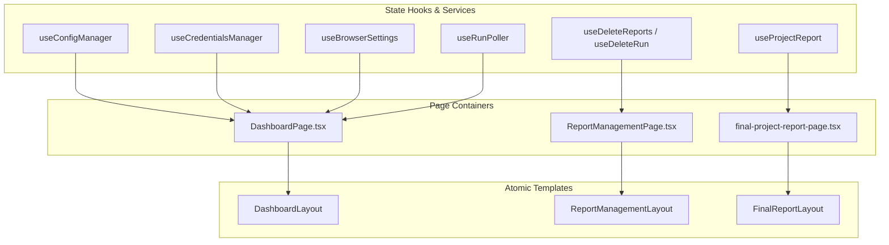

# Phase 04: Page Integration, E2E Verification & Release Audit

## Context Links
- Parent Plan: [Implementation Plan](./plan.md)
- Access Overview: [cmd-plan.md](./cmd-plan.md)
- Prior Phases: [Phase 01: Atoms](./phase-01-design-system-tokens-and-atoms.md) · [Phase 02: Molecules](./phase-02-molecules-and-form-composition.md) · [Phase 03: Organisms & Templates](./phase-03-organisms-and-layout-templates.md)
- Architecture Design: [Architecture Design](./architecture-design.md)
- Codebase Standards: [docs/code-standards.md](../../docs/code-standards.md) · [docs/codebase-summary.md](../../docs/codebase-summary.md) · [docs/release-gates.md](../../docs/release-gates.md)

## Overview
- Date: 2026-09-27
- Description: Connect page containers (`DashboardPage`, `ReportManagementPage`, `FinalProjectReportPage`, `App.tsx`) cleanly to the Atomic templates, execute full Playwright E2E verification suites (`npm run test:control`), audit Axe WCAG AA compliance across desktop/mobile/modals, and update documentation.
- Priority: P2
- Implementation Status: DONE (2026-09-27; code, verification, and documentation complete)
- Review Status: Complete

## Key Insights
- After Phase 03 extracts templates, page files become pure state coordinators: binding custom hooks (`useConfigManager`, `useCredentialsManager`, `useBrowserSettings`, `useRunPoller`, `useDeleteReports`, `useDeleteRun`, `useProjectReport`) and passing handlers into template slots.
- Verification must exercise all test cases in `tests/e2e/control-page.spec.ts` (1,135 lines) and `tests/e2e/control-report-management.spec.ts` (710 lines) covering full CRUD, execution, credential injection, deep linking, clone draft, group board, and deletion.
- Axe WCAG AA automated audits run inside the test suite and require zero violations across desktop, mobile, open dialogs, and individual controls.
- Validation Confirmed: E2E and Axe audits must assert the contained 1200px board layout (internal `#projects-list` scroll with zero page window overflow), Radix UI dialog focus traps, and strict WCAG AA 4.5:1 contrast across all components.
- Functional:
  - Wire `DashboardPage.tsx` into `DashboardLayout`.
  - Wire `ReportManagementPage.tsx` into `ReportManagementLayout`.
  - Wire `final-project-report-page.tsx` into `FinalReportLayout`.
  - Refactor `NotFoundView` in `App.tsx` using atom `Card` and `Button`.
  - Ensure deep-linked navigation, URL parameter syncing (`?config=name`), and anchor scrolling remain 100% functional.
- Non-Functional:
  - Complete verification suite pass: `npm run typecheck`, `npm run build`, `npm run test:control`.
  - Strict Axe accessibility validation: zero violations across desktop (1280px), mobile (375px), and open dialog states.
  - Contained layout verification: confirm `#projects-list` scrolls horizontally within 1200px container while window body has zero horizontal scroll.
  - Zero test modifications: existing tests must pass completely unchanged.
  - Documentation updates: update `docs/architecture.md`, `docs/codebase-summary.md`, and `docs/report-pipeline.md` reflecting the new Atomic Design structure.

## Architecture
Page containers purely connect business state hooks to template presentation slots:

## Related Code Files
- Modify:
  - `src/reporting/control-page/App.tsx` (modernize NotFoundView)
  - `src/reporting/control-page/pages/DashboardPage.tsx` (pure template wiring)
  - `src/reporting/control-page/pages/ReportManagementPage.tsx` (wire into ReportManagementLayout)
  - `src/reporting/control-page/pages/final-project-report-page.tsx` (wire into FinalReportLayout)
  - `docs/codebase-summary.md` (document Atomic Design refactor)
  - `docs/architecture.md` (update presentation layer documentation)
  - `docs/report-pipeline.md` (update viewer structure notes)

## Implementation Steps
1. Refactor `DashboardPage.tsx` to cleanly delegate layout to `DashboardLayout`.
2. Refactor `ReportManagementPage.tsx` to cleanly delegate layout to `ReportManagementLayout`.
3. Refactor `final-project-report-page.tsx` to cleanly delegate layout to `FinalReportLayout`.
4. Modernize `NotFoundView` in `App.tsx` with atom `Card` and `Button`.
5. Execute `npm run typecheck` to verify strict TypeScript adherence.
6. Execute `npm run build` to verify Vite bundle compilation and CSP asset generation.
7. Execute `npm run test:control` to run the full Playwright E2E suite across both test files.
8. Verify Axe accessibility audit passes with 0 violations across desktop, mobile, and modal states.
9. Perform visual smoke check via `npm run serve:control`.
10. Update repository documentation in `docs/`.

## Todo List
- [x] Connect `DashboardPage.tsx` to `DashboardLayout`
- [x] Connect `ReportManagementPage.tsx` to `ReportManagementLayout`
- [x] Connect `final-project-report-page.tsx` to `FinalReportLayout`
- [x] Modernize `NotFoundView` in `App.tsx`
- [x] Run `npm run typecheck`
- [x] Run `npm run build`
- [x] Run `npm run test:control` (E2E & Axe audits)
- [x] Verify desktop (1280px) & mobile (375px) responsiveness with zero window horizontal overflow
- [x] Verify Radix UI dialog focus traps and escape key dismissal
- [x] Update documentation files

## Success Criteria
- 100% of tests in `tests/e2e/control-page.spec.ts` pass.
- 100% of tests in `tests/e2e/control-report-management.spec.ts` pass.
- Axe accessibility audits report 0 violations across all suites.
- Vite build succeeds without warnings or bundle bloat.
- All 3 page views demonstrate cohesive Modern Refined Light aesthetics.

## Risk Assessment
- Risk: Subtle regression in dynamic route parsing or hash-link anchor scrolling.
  - Mitigation: `final-project-report-page` retains exact route parsing and `scrollIntoView` effects.
- Risk: E2E timing or timeout failures due to animation delays.
  - Mitigation: Ensure all transitions are <= 200ms and `@media (prefers-reduced-motion: reduce)` disables animations.

## Security Considerations
- CSRF token injection in `report-server-control-page.ts` remains intact.
- Strict CSP without `unsafe-inline` styles or scripts preserved.
- Local secrets remain masked and zero leakage confirmed by E2E assertion.

## Completion Notes
- Phase completed 2026-09-27. See [test report](../reports/TesterRunPhase04-260927-1809-phase-04-page-integration-and-verification.md) and [code review](../reports/code-review-260927-1813-phase-04-page-integration-and-verification.md). Follow-up: clean reruns passed after two initial flakes; Vite emitted a >500 kB chunk warning.
