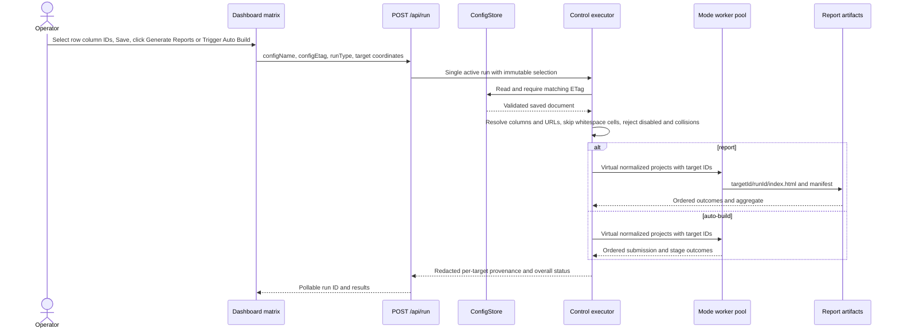

# Proposed architecture — not implemented

[Plan](./plan.md) · [Backend research](./research/researcher-01-backend-schema-exec.md) · [Frontend research](./research/researcher-02-frontend-matrix-ui.md) · [Current architecture](../../docs/architecture.md) · [Code standards](../../docs/code-standards.md)

## Boundary and decisions

One persisted schema-v1 document remains the source of truth. Extend its validated shape; do not rewrite existing files on GET. On load and raw-JSON Apply, expand legacy `jobUrl` into a **lossless in-memory** default column and selected cell; persist the expanded form only after a user Save guarded by `If-Match`. Keep `jobUrl` as the deterministic primary nonblank cell URL on save for updated CLI/library consumers. The Control Page picks `report` or `auto-build` once at Execute time; configured per-project `runType` remains stored and authoritative for direct CLI/library legacy paths, but does not gate matrix-mode runs. There is no per-column run type.

Old binaries with strict unknown-key rejection cannot consume newly saved `jobColumns`/`jobs` fields even with `schemaVersion: 1` and `jobUrl`. Updated repository CLI/tool consumers can; document this rollback limit plainly and back up configs before rollout. Do not pretend a mirror field alone makes old binaries compatible. No new service, storage table, sidecar, endpoint, or browser runner.

## Data contract

| Location | Planned shape | Invariant |
| --- | --- | --- |
| Root | `schemaVersion: 1`, `projects`, optional `jobColumns: [{id,name}]`, plus unchanged `projectGroups`, `defaults`, `reportWorkers` | Shared, ordered headings; legacy omission means default column. |
| Project | Existing fields unchanged; `jobs: Record<columnId, string>` and `selectedJobColumns: string[]` required when root `jobColumns` exists; absent together in legacy V1; required `jobUrl` always | `jobs` has exactly declared column keys in expanded documents; cell values may be empty. Selected IDs are unique and declared. |
| Legacy projection | `{id: 'default', name: 'Job URL'}`, `jobs.default = project.jobUrl`, `selectedJobColumns = ['default']` for wholly legacy documents only | Preserve explicit empty selection on expanded rows; reject partially expanded documents rather than invent values. |
| Primary mirror | First nonblank URL in shared column order; project `jobUrl` mirrors it after edits | No valid saved row may have zero nonblank URLs while the scalar remains required. Empty cells may be selected and skipped. Do not leave stale `jobUrl` pointing at a removed link. |
| Run request | Existing `configName`, `configEtag`, `runType`, optional `targets: [{projectId,columnId}]` | For matrix Execute, send ordered selected coordinate IDs, not user-supplied URLs, resolved against saved ETag-matched document. Retain old request form without `targets` for existing API callers, using existing behavior. |
| Execution target | `{projectId, projectName, columnId, columnName, jobUrl, targetId}` internal immutable snapshot | `targetId = projectId + '--' + columnId`; one target per selected nonblank enabled cell, document row/column order. |

Validate column IDs with lowercase safe characters, max **16** characters (`^[a-z0-9][a-z0-9-]{0,15}$`); existing project IDs max 63, so synthesized ID max 81 and conforms to `src/artifacts/artifact-identity.ts` `SAFE_ID`. Column names follow the existing bounded nonblank 200-character name rule. Limit to 50 columns (50 projects × 50 columns; enforce 1 MiB file/body limit and bounded request cardinality). Reject duplicate column IDs, invalid/missing/extra job keys, dangling/duplicate selections, unsafe or cross-context nonblank URL cells, and mismatch between mirror and first nonblank URL. Reject unrecognized fields rather than broad passthrough; preserve **all existing recognized** root/project/default fields when producing a new document. Legacy documents validate without forcing a write; input with partial matrix fields must be explicitly completed on upgrade or rejected, never silently repaired. During individual cell editing, draft validation may fail; Save/Execute remain gated until resolved. Empty URL cells are permitted; no row without a nonblank primary may be saved, including disabled rows, because old `jobUrl` remains required.

Promotion when deleting/blanking the primary cell: choose next nonblank column by heading order, update `jobUrl` atomically; if none, leave draft invalid and show repair message before Save. Explicit column removal confirms deletion of all its row URLs and selections, then recalculates mirrors; never silently drop populated cells. Last column cannot be removed until a replacement exists. Rename changes heading name only; never changes ID or any URL. Project ID change changes the coordinate used by future runs, but does not move/delete historical artifact directories; warn in UI. Check generated target IDs for collisions against each other and **all current real project IDs** before dispatch; reject with actionable error. Historical artifact directories sharing an unrelated existing identity need additional collision preflight or documented migration before publication; never overwrite/reinterpret unrelated history.

## Component hierarchy (Atomic Design)

| Tier | Planned responsibility |
| --- | --- |
| Atoms | Reuse `Input`, `Checkbox`, `Button`, `Select`, `IconButton`, `StatusBanner`; retain semantic focus/error behavior. |
| Molecules | `job-column-header` (rename/remove); `project-job-cell` (labeled URL); `project-job-selection` (row-specific multiple checkbox choices); `matrix-row-settings` (existing advanced project fields, including login URL, enabled, wait, browser, credentials references, selectors, timeout; not a second project form). Saved group fields remain in raw JSON, without group UI. |
| Organisms | `projects-job-matrix` owns one table, shared headers, row ID/name/cells/selection, add/clone/remove, column CRUD; `ExecutionSection` keeps explicit Generate Reports and Trigger Auto Build buttons plus saved Workers; standalone defaults settings and `RawJsonSection` remain reachable. |
| Template | `DashboardLayout` removes redundant project/form slots in favor of one matrix slot, plus actions, raw JSON, run results and dialogs. |
| Page | `DashboardPage` binds `useConfigManager`/`useConfigDocumentEditor`, `useRunPoller`, credentials/browser settings; no separate lossy `ProjectCardData` mapping. |

```mermaid
flowchart LR
  Store[ConfigStore schema v1 file] -->|validated GET and ETag| Manager[useConfigManager]
  Manager -->|upgrade legacy in memory| Editor[useConfigDocumentEditor]
  Editor --> Matrix[ProjectsJobMatrix]
  Editor --> JSON[RawJsonSection]
  Matrix -->|pure immutable transitions| Editor
  Editor -->|validate and If-Match PUT| Store
  Matrix -->|selected coordinate IDs| Execute[Generate Reports or Trigger Auto Build]
  Execute -->|POST /api/run, ETag, button mode, targets| API[Control run API]
  API --> RunManager[Single-active run manager]
  RunManager --> Resolve[Read saved file, match ETag, normalize, resolve targets]
  Resolve -->|report virtual targets| ReportPool[Bounded report worker pool]
  Resolve -->|auto-build virtual targets| BuildPool[Bounded build worker pool]
  ReportPool --> Artifacts[Isolated target ID report paths and aggregate]
  BuildPool --> Outcomes[Ordered per-target results]
```

Use semantic `<table>` with labeled inputs/header IDs, horizontal scroll confined to matrix, sticky ID/name and headings where feasible without obscuring focus. Native keyboard traversal, visible focus/errors, screen-reader labels including project and column names, clear blank-selected indication. Do not use a virtualized grid or create second project form. Keep defaults editor accessible as settings, row advanced fields reachable through row settings, and group definitions/member IDs preserved but edited only through validated raw JSON; keep clone behavior without `ConfigFormBuilder`.

## Matrix state machine

```mermaid
stateDiagram-v2
  [*] --> NoDocument
  NoDocument --> Clean: Valid GET then in-memory upgrade
  Clean --> Dirty: Cell, row, column, selection, or settings edit
  Dirty --> InvalidDraft: Validation fails
  InvalidDraft --> Dirty: Repair edit
  Dirty --> Saving: Valid Save with If-Match
  Saving --> Clean: Server document and new ETag acknowledged
  Saving --> Conflict: 409 or 412
  Conflict --> Dirty: Preserve local draft and show reload choice
  Clean --> Running: Execute saved selection and mode
  Running --> Clean: Finished or failed run
  Clean --> Clean: No-op edit
  Clean --> Dirty: Valid raw JSON Apply
  Dirty --> Clean: Reload or config switch; discard confirmed
  InvalidDraft --> Clean: Reload or config switch; discard confirmed
```

Raw Apply of valid JSON is **Dirty**, increments `replacementRevision`; invalid Apply does not change applied model. Save acknowledgement does **not** increment revision. Migration on GET is an in-memory projection, not dirty by itself; unedited V1 remains untouched until an explicit edit/save. On conflict never silently overwrite local changes. Selection persisted per row: column changes and selections mark dirty and must be saved before Execute; run mode is transient and never saved.

## Execution and provenance

Resolve after matching ETag on server: dedupe/reject duplicate target coordinates, fail on unknown/disabled coordinate, skip whitespace-only selected URL, reject empty executable batch with a specific 422 response. Never take runnable URLs from request. Normalize each virtual project's existing per-project/default settings using the **existing** validator and URL/base-path policy, and override only `id`, `name`, `jobUrl`, `runType` for the chosen mode. Preserve login, origins, selectors, credentials references, browser, timeouts, wait settings, enabled, artifactDir; require report root matches control root. The report pool owns root lock/staging/publishing; each selected pair writes `<reportRoot>/<targetId>/<runId>/` and aggregate groups by target ID. The build pool bounds by saved `reportWorkers`, indexes outcomes in request-derived document order, and never retries after possible POST. Keep old no-target API selection behavior for legacy consumers. For matrix reports/builds, store `{projectId,projectName,columnId,columnName,jobUrl,targetId}` with bounded sanitized result entries; report-side per-target outcomes need a typed result view (not only one reportUrl). Extend manifest/aggregate provenance **through their existing validated contracts** where necessary, or use a strict reversible/validated target-ID mapping plus display name; ensure report viewer can show project and column and deletion routes still target virtual ID. Preserve existing historical manifests and aggregate compatibility; do not loosen validation or orphan prior runs. Cap stored result cardinality and log lengths; avoid raw secret values in logs, result URLs, errors, and browser artifacts.

## Preservation and release invariants

1. `GET` never rewrites V1 bytes or ETag. After legacy load, first Save is a guarded write; a no-edit reload remains a no-op.
2. Matrix transitions spread unchanged root/project/default objects; old `projectGroups`, `groupId`, `defaults`, advanced settings, saved Workers, and legacy `runType` survive save and raw Apply.
3. V1 with one `jobUrl` yields exactly one default column and one selected cell per row; save/reload preserves that URL and legacy mirror. Explicit [] stays empty.
4. Selected blanks skip; nonselected nonblank URLs never execute; no enabled target means no successful empty run. The clicked report/build button applies its mode to every dispatched target.
5. Report directory and aggregate key use validated virtual ID; outcome/UI/provenance identify both original project and column. Historical report IDs remain discoverable.
6. Single-active run, ETag check, 1 MiB request limit, CSRF/Host/Origin gates, SecretStore snapshot/redaction, saved concurrency, same-origin URLs, and report-root locking stay in force.
7. Each materially changed production TS module remains under 200 lines; strict TS and kebab-case for new filenames. Replace board/form tests and docs rather than retain a parallel surface.

## Real remaining decisions

- Historical artifact identity collision policy: whether to reject a target whose virtual ID matches an existing unrelated historical project artifact (recommended) or require a one-time operator-guided archive/rename; decide after confirming artifact discovery APIs and current production data. Never merge unrelated histories automatically.
- Are there external older binary consumers beyond the updated repository CLI? Their strict validators reject additional fields despite `jobUrl`; compatibility with those binaries requires an explicitly requested separate export strategy, not a promise of transparent old-binary support.
